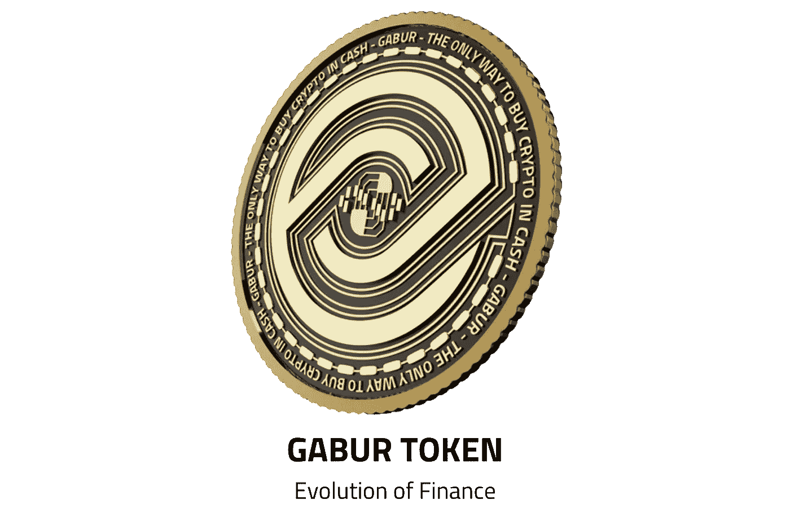

# 什么是加布尔令牌？

> 原文：<https://medium.com/coinmonks/what-is-gabur-token-98fa1f6a1eee?source=collection_archive---------29----------------------->

> **加布尔令牌；金融的演变**

Gabur Token 是 Easy Exchange Pro 加密货币兑换市场的原生 Token。

> www.easyexchangepro.com

## **加布尔代币描述**

*   实用程序令牌名称:GABUR
*   象征:GBR
*   加布尔代币总供应量:5.5 亿
*   加布尔代币不能涨价
*   GABUR 令牌将按照 BSC 标准在 BEP20 网络上本地运行。
*   焚烧代币:1.65 亿枚加布代币将被焚烧
*   价格:每张公开发行的代币面值在 0.09 美元到 0.18 美元之间，分三个阶段发行
*   代币公开销售:1.375 亿英镑
*   代币公开销售(三个阶段，为期三周)
*   公开发售起止日期:2022 年 3 月 27 日至 2022 年 4 月 16 日
*   接受购买加布尔代币的货币:USDT、TRX、BTC、XRP、美元和欧元

> **加布尔令牌合约地址:**0x 0 bb E4 ebc 8 a 16 c 759 ea 82d 0950 f 29 aad 3 e 3f 10070
> 
> [**白皮书**](https://easyexchangepro.com/assets/Whitepaper.pdf)
> 
> [**安全审计**](https://easyexchangepro.com/assets/Gabur_Audit_Report.pdf)
> 
> [**IOS 应用链接**](https://apps.apple.com/in/app/easy-exchange-pro/id1620538502)
> 
> [**(Google Play)安卓应用链接**](https://play.google.com/store/apps/details?id=com.application.easyexchangrpro)
> 
> [**安卓 APK 链接**](https://easyexchangepro.com/assets/EasyExchangePro.apk)

> 加入 Coinmonks [电报频道](https://t.me/coincodecap)和 [Youtube 频道](https://www.youtube.com/c/coinmonks/videos)了解加密交易和投资

# 另外，阅读

*   [最佳加密交换平台](https://coincodecap.com/best-crypto-swap-platforms) | [最佳加密交易所](https://coincodecap.com/crypto-exchange)
*   [购买比特币印度](/coinmonks/buy-bitcoin-in-india-feb50ddfef94) | [Pionex 评论](/coinmonks/pionex-review-exchange-with-crypto-trading-bot-1e459d0191ea) | [加密交易机器人](/coinmonks/crypto-trading-bot-c2ffce8acb2a)
*   [n rave 零点回顾](/coinmonks/ngrave-zero-review-c465cf8307fc) | [Phemex 回顾](/coinmonks/phemex-review-4cfba0b49e28) | [PrimeXBT 回顾](/coinmonks/primexbt-review-88e0815be858)
*   最佳[区块链分析](https://bitquery.io/blog/best-blockchain-analysis-tools-and-software)工具| [赚比特币](/coinmonks/earn-bitcoin-6e8bd3c592d9)
*   [Cloudbet 赌场评论](https://coincodecap.com/cloudbet-casino-review) | [点火赌场评论](https://coincodecap.com/ignition-casino-review)
*   [加密套利](/coinmonks/crypto-arbitrage-guide-how-to-make-money-as-a-beginner-62bfe5c868f6)指南| [如何做空比特币](/coinmonks/how-to-short-bitcoin-568a2d0b4ae5)