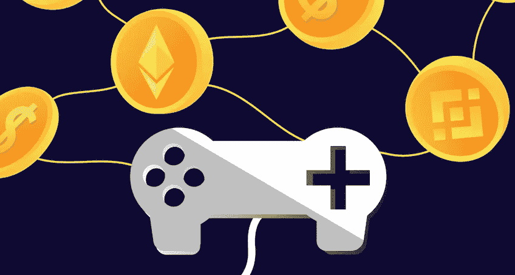

# GameFi 是什么？

> 原文：<https://medium.com/coinmonks/what-is-gamefi-84e4e6cdb0b2?source=collection_archive---------5----------------------->

GameFi 是游戏和区块链业务中的一个新概念。

熟悉付费玩在线游戏的传统视频游戏玩家被吸引到[区块链](/@patoman07/what-is-blockchain-ed09dcc8438b)视频游戏，在那里他们的时间和工作可能会得到补偿。

## GameFi 是什么？

GameFi 这个术语的灵感来自于术语 [DeFi](/@patoman07/what-is-defi-21703c6070fd) ，代表游戏金融。

GameFi 指的是基于游戏的加密世界中的金融交易。

术语“玩到赚”(P2E)在 GameFi 之外使用，可以被认为是 GameFi 的同义词。然而，P2E 和 GameFi 并没有相同的内涵。

虽然 P2E 指的是通过玩视频游戏赚钱，但 GameFi 包含的内容要多得多。GameFi 不仅是通过玩游戏赚钱的系统，还有游戏平台上的金融交易和系统。

更清楚的解释 GameFi，还有[跑马](/@patoman07/what-is-crypto-staking-a36158a99e73)，产量养殖等。存在于 [DeFi](/@patoman07/what-is-defi-21703c6070fd) 流程中。我们可以说是将金融交易和 [NFTs](/@patoman07/what-is-a-non-fungible-token-nft-cab468e77503) 融入到游戏行业。

GameFi，就其最流行的含义而言，指的是[带有金钱激励的去中心化应用(dapp)](/@patoman07/what-is-a-dapp-47dc40675c7f)。这些通常是[代币](/cryptostars/what-is-a-crypto-token-8a3f07e2421f)作为完成游戏相关活动的奖励，如赢得战斗、挖掘有价值的材料或培育数字作物。

理解 GameFi 不是一个赌博网站是至关重要的。为了赚取现金，作为这个发展中行业一部分的游戏需要玩家使用技巧和策略的组合。虽然运气在这些游戏中起着作用，但它不是决定谁赢或谁有资格获得金钱补偿的最重要因素。

## GameFi 游戏是如何工作的？

在这些游戏中，所有的物体都被描绘成 [NFT](/@patoman07/what-is-a-non-fungible-token-nft-cab468e77503) 。考虑土地，化身，装备，武器和金条。一旦玩家通过游戏找到并积累了这些商品，他们可以在数字市场上与他人进行交易以获得不同的[NFT](/@patoman07/what-is-a-non-fungible-token-nft-cab468e77503)或出售它们以获得加密货币。

根据游戏的不同，玩家可以通过花时间升级和升级他们的角色，在他们的财产上建造其他玩家付费使用的货币化结构，或参加锦标赛来提高他们的收入潜力。

所有的[NFT](/@patoman07/what-is-a-non-fungible-token-nft-cab468e77503)和加密货币交易数据都保存在一个公共的[区块链](/@patoman07/what-is-blockchain-ed09dcc8438b)上，以跟踪每个参与者拥有的东西。

今天，GameFi 有多种口味。因此，游戏玩家从游戏中获得现金的方式各不相同。然而，有几个关键因素值得考虑。为了将这种活动货币化，许多当今最受欢迎的区块链游戏结合了以下特点。

*   **玩即赚:**在某些区块链游戏中，玩家因完成游戏目标而获得金钱奖励。在这些游戏中奖励的金钱通常来自于保存在[智能合约](/@patoman07/what-is-a-smart-contract-f2db1acbc892)中的本地[代币](/cryptostars/what-is-a-crypto-token-8a3f07e2421f)。
*   **资产所有权:**有限数字资产所有权的概念是当今许多区块链游戏的核心。独一无二资产的数字化所有权开启了以前无法想象的商业潜力。所有者可以像销售实物资产一样，将他们的数字资产货币化。

## **底线**

GameFi 概念优于现有的在线游戏。

正如[区块链](/@patoman07/what-is-blockchain-ed09dcc8438b)和 [NFT](/@patoman07/what-is-a-non-fungible-token-nft-cab468e77503) 游戏所暗示的那样，先玩后赚的机制将最终成为广泛采用加密技术的通行证。因此，这种指数趋势没有减弱的迹象也就不足为奇了。

如果目前的趋势继续下去，GameFi 和 NFTs 将成为 DeFi 的集结地。

由于公众兴趣的上升和资金的注入，这项新业务的前景是无限的。

> 加入 Coinmonks [电报频道](https://t.me/coincodecap)和 [Youtube 频道](https://www.youtube.com/c/coinmonks/videos)了解加密交易和投资

## 另外，阅读

*   [3 商业评论](/coinmonks/3commas-review-an-excellent-crypto-trading-bot-2020-1313a58bec92) | [Pionex 评论](https://blog.coincodecap.com/pionex-review-exchange-with-crypto-trading-bot) | [Coinrule 评论](/coinmonks/coinrule-review-2021-a-beginner-friendly-crypto-trading-bot-daf0504848ba)
*   [莱杰 vs n rave](/coinmonks/ledger-vs-ngrave-zero-7e40f0c1d694)|[莱杰 nano s vs x](/coinmonks/ledger-nano-s-vs-x-battery-hardware-price-storage-59a6663fe3b0) | [币安评论](/coinmonks/binance-review-ee10d3bf3b6e)
*   [Bybit Exchange 审查](/coinmonks/bybit-exchange-review-dbd570019b71) | [Bityard 审查](https://blog.coincodecap.com/bityard-reivew) | [Jet-Bot 审查](https://blog.coincodecap.com/jet-bot-review)
*   [3 commas vs crypto hopper](/coinmonks/3commas-vs-pionex-vs-cryptohopper-best-crypto-bot-6a98d2baa203)|[赚取加密利息](/coinmonks/earn-crypto-interest-b10b810fdda3)
*   最好的比特币[硬件钱包](/coinmonks/hardware-wallets-dfa1211730c6) | [BitBox02 回顾](/coinmonks/bitbox02-review-your-swiss-bitcoin-hardware-wallet-c36c88fff29)
*   [BlockFi vs 摄氏度](/coinmonks/blockfi-vs-celsius-vs-hodlnaut-8a1cc8c26630) | [Hodlnaut 审核](/coinmonks/hodlnaut-review-best-way-to-hodl-is-to-earn-interest-on-your-bitcoin-6658a8c19edf) | [KuCoin 审核](https://blog.coincodecap.com/kucoin-review)