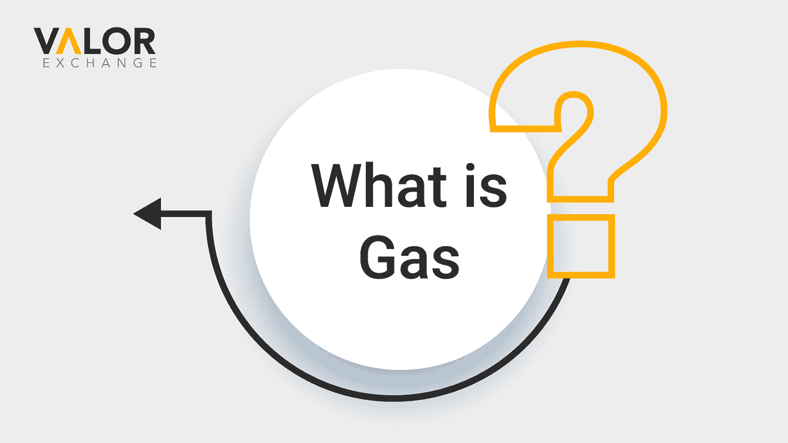
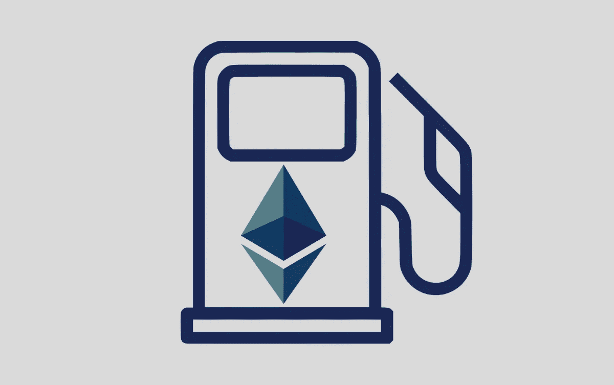

# 什么是气体？——初学者指南。

> 原文：<https://medium.com/coinmonks/what-is-gas-a-beginners-guide-1c9dea72fc30?source=collection_archive---------58----------------------->

“气体”一词源于以太坊区块链。它指的是你需要支付的以太量来与以太坊网络互动。这包括在区块链网络上买卖甚至铸造代币的任何事情。想买个 Nft？从你的钱包里转移密码？嗯，你需要付汽油费。

所有这些支付通常都是使用区块链的本地加密货币 eth 完成的。

自 2015 年成立以来，天然气费用一直是区块链网络的自然组成部分。每个区块链网络都有一个共识机制，这可能是工作的证明，也可能是利益的证明。以太坊和比特币都是在工作共识证明下运行的。然而，随着以太坊升级到以太坊 2.0，以太坊将切换到股权共识证明。

天然气费用于补偿在区块链验证交易的加密矿工。它们使交易能够被处理和验证，但是这是一个昂贵的任务。这些矿工使用昂贵的系统来帮助保持区块链的安全，费用是他们的补偿。

**为什么要收油费？**

以太坊区块链是分散的，这意味着没有首席执行官在某个地方控制它或资助它内部的活动。没有人为使用区块链的设备、电力或时间付费。汽油费是对所有这些事情的补偿。

Photo credit: Shutterstock

**什么是气体极限？**

汽油限额是你在一次交易中愿意使用的最大汽油量。如果金额低于你指定的，你会得到补偿。然而，如果你为交易支付的汽油费太低，你的交易可能不会被处理。

**有没有办法不用付油钱？**

汽油费是以太坊区块链系统固有的一部分，不能完全逃避。但是在 [ValorExchange](https://account.valorexchange.com/signup) 上，你可以在平台上进行无数次转账，绝对免费。您还可以通过我们的免费加密帐户，轻按手指进行支付、储蓄等等。