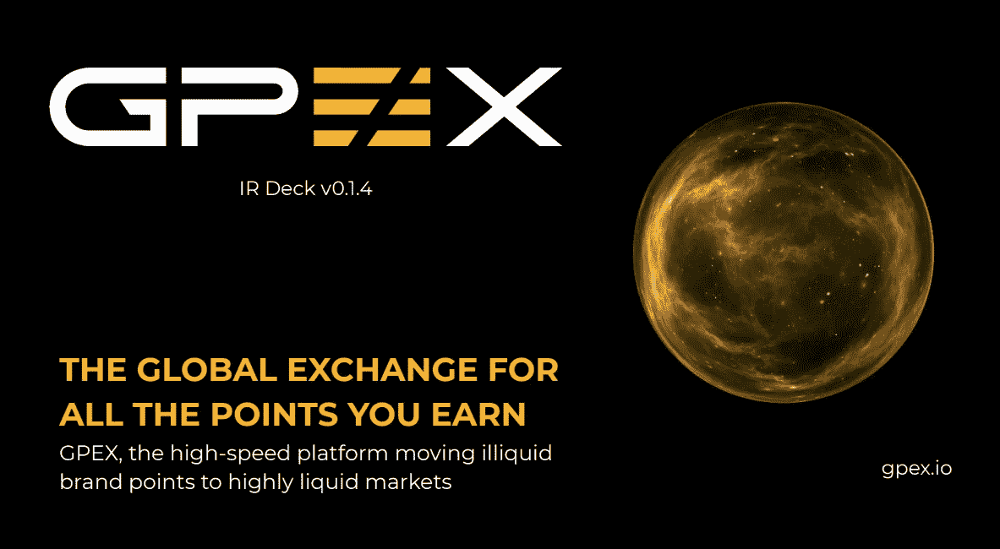
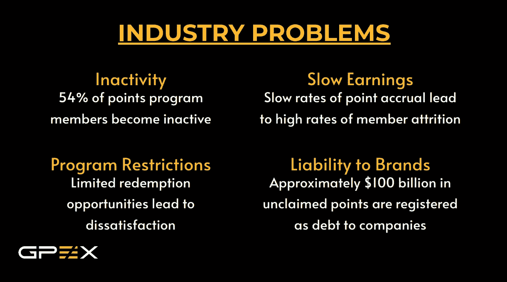
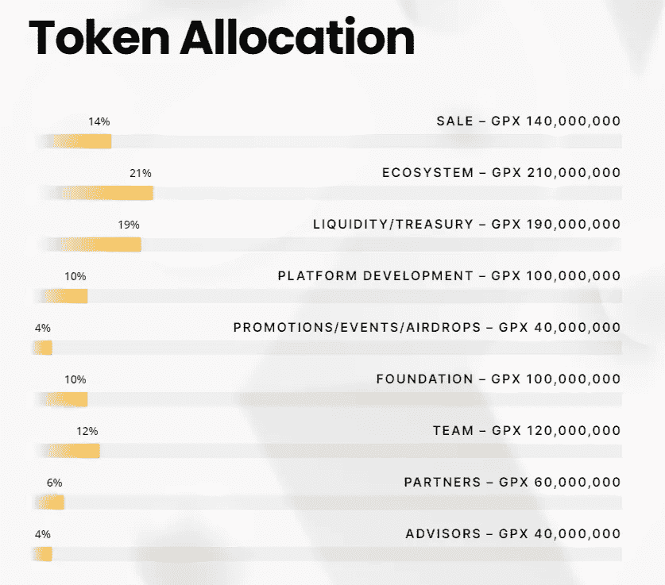

# 什么是 GPEX (GPX)？

> 原文：<https://medium.com/coinmonks/what-is-gpex-gpx-d404f1c267ce?source=collection_archive---------44----------------------->

GPEX 无疑跑赢了市场，当其他一切都在对抗比特币时，它的表现是市场的 2-3 倍。

# 这是什么？

它的目标其实很简单，它计划让你出售的东西，如信用卡积分，航空里程和游戏中的项目，为真正的钱。简而言之，这些东西你用别的方法是卖不出去的。

这是令人惊讶的，因为许多人被困在他们无法兑换的积分中，但对公司来说也是一个很好的激励因素，因为这些积分目前被记为债务，他们可能想摆脱它们。

老实说，如果可行的话，这是一件很酷的事情，那么它到底是如何工作的呢？

GPEX 只是试图与尽可能多的公司合作，并希望随着发展获得越来越多的关注。

这些积分系统是一种非常受欢迎的营销技术，但它们的问题是，许多人被他们无法使用的积分所困，因此无法从中获得金钱。这个总“积分”市场目前价值 1860 亿英镑，并且每年以 6%的速度增长。因此，如果 GPEX 最终成功了，他们就有了一个巨大的市场。

据估计，28%的奖励积分从未被使用过。

基于这个数字，这将导致消费者总共损失 520.8 亿美元。现在想象一下，GPEX 与足够多的公司合作，这样只有 5%的损失资金可以使用，那么这将产生 26 亿美元的收入。

# 令牌组学

白皮书没有提供关于通货膨胀的严格数值，但我们知道这将是一个通货膨胀的象征，随着时间的推移会放缓。

代币的分布非常分散，在我看来有点太分散了，只有非常少量的代币可以在交易所出售，这对我来说是一个小小的危险信号。

# 组

团队非常有经验，他们中的大多数曾经在另一家 Blockhain 公司一起工作过。他们都有使用加密/区块链的经验。

# 结论

这是一个非常酷的想法，如果他们最终成功了，那么他们手中就有一座金矿。很多人在某个平台有很多积分，但由于积分规则，他们无法兑换。

这是一个巨大的市场，他们根本没有竞争对手，所以现在的问题是他们能与多少公司合作。

然而，目前该平台仍未发布。计划持续到 2022 年第三季度。所以就我个人而言，我不会在那之前投资，因为我们还不知道它的执行情况如何。

我会跟踪他们，当他们发布平台的时间到来时，我会再次研究这个项目，并决定它是否值得作为一个更具投机性的投资。