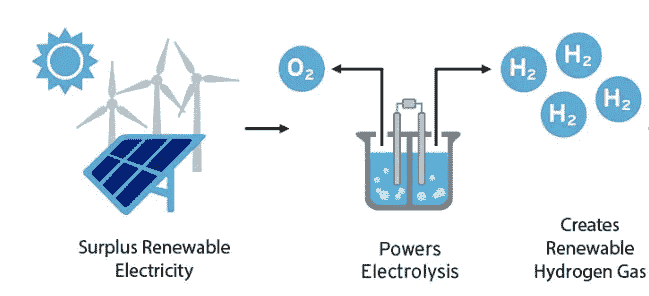

# 什么是绿色氢，为什么它很重要？

> 原文：<https://medium.com/coinmonks/what-is-green-hydrogen-and-why-is-it-important-b2a516eb01f2?source=collection_archive---------33----------------------->

绿色氢是未来可持续能源的重要资源。这是一种清洁的可再生燃料，可用于汽车、家庭和企业。在这篇博文中，我们将讨论什么是绿色氢，它是如何制造的，以及为什么它对可持续发展的未来很重要。

绿氢是一种通过电解水产生的氢。这个过程使用可再生能源，如太阳能和风能，将水分子分解成氢气和氧气。由此产生的氢气可以用作汽车、家庭和企业的清洁可再生燃料。

使用绿色氢作为燃料来源有很多好处。首先，它燃烧时不产生排放物。这意味着它是一种清洁环保的燃料选择。此外，绿色氢可以用来发电。这使得它成为电动汽车或备用电源系统的理想燃料选择。最后，绿色氢是一种可再生资源。与化石燃料不同，化石燃料是有限的资源，最终会耗尽，绿色氢可以无限生产。

绿色氢是未来可持续能源的重要组成部分。这是一种清洁的可再生燃料，可用于汽车、家庭和企业。在这篇博文中，我们讨论了什么是绿色氢，它是如何制造的，以及为什么它对可持续发展的未来很重要。我们希望这篇文章有助于增加你对绿色氢及其重要性的理解。

你认为绿色氢是一种有前途的能源吗？为什么或为什么不？请在下面的评论中告诉我们你的想法！

如果你觉得这篇博文很有趣，一定要分享给你的朋友和家人！请务必查看我们关于可持续能源主题的其他博客帖子！

感谢阅读！

谁读了这篇文章也读了[绿色氢:燃料的未来](/@hydrogencoin/green-hydrogen-the-fuel-of-the-future-cc7e3f18e179)

 [## Hydrogencoin -基于 Solana 区块链的 DeFi 基金

### Hydrogencoin.io 是全球首个绿色氢的 DeFi 基金

氢币. io](http://hydrogencoin.io/) 

> 加入 Coinmonks [电报频道](https://t.me/coincodecap)和 [Youtube 频道](https://www.youtube.com/c/coinmonks/videos)了解加密交易和投资

# 另外，阅读

*   [加密货币储蓄账户](/coinmonks/cryptocurrency-savings-accounts-be3bc0feffbf) | [加密交易机器人](https://coincodecap.com/best-crypto-trading-bots)
*   [BigONE 交易所评论](/coinmonks/bigone-exchange-review-64705d85a1d4) | [CEX。IO 审查](https://coincodecap.com/cex-io-review) | [Swapzone 审查](/coinmonks/swapzone-review-crypto-exchange-data-aggregator-e0ad78e55ed7)
*   [最佳比特币保证金交易](/coinmonks/bitcoin-margin-trading-exchange-bcbfcbf7b8e3) | [比特币保证金交易](https://coincodecap.com/bityard-margin-trading)
*   [加密保证金交易交易所](/coinmonks/crypto-margin-trading-exchanges-428b1f7ad108) | [赚取比特币](/coinmonks/earn-bitcoin-6e8bd3c592d9)
*   [WazirX vs CoinDCX vs bit bns](/coinmonks/wazirx-vs-coindcx-vs-bitbns-149f4f19a2f1)|[block fi vs coin loan vs Nexo](/coinmonks/blockfi-vs-coinloan-vs-nexo-cb624635230d)
*   [BlockFi 信用卡](https://coincodecap.com/blockfi-credit-card) | [如何在币安购买比特币](https://coincodecap.com/buy-bitcoin-binance)