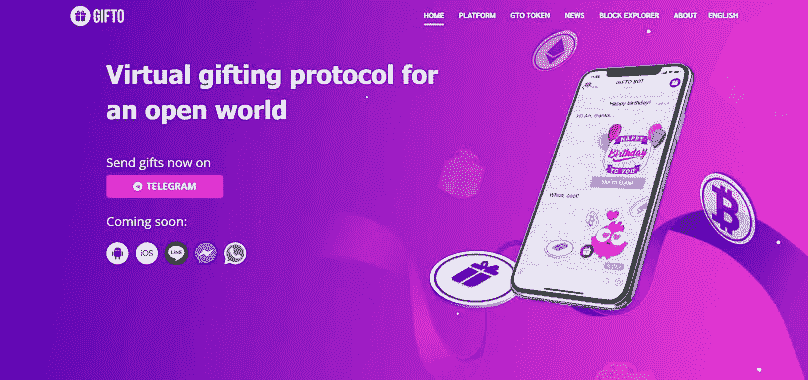
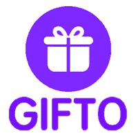
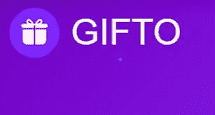

# 什么是 Gto 币——Gto 币是好的投资吗？

> 原文：<https://medium.com/coinmonks/what-is-gto-coin-is-gto-coin-a-good-investment-fce9e27fce5b?source=collection_archive---------29----------------------->

Gto Coin 在币安的 launchpad 上正式推出，之后它已经获得了一些优秀的投资者，他们也被称为“钻石手”。与此同时，Gto 在过去的 24 小时内获得了巨大的交易量，在撰写本文时交易量达到了 2.22 亿美元。

Gto 的兑换速度更快，降低了礼品购物和与 Paypal 合作项目的网络费用，并获得了基础设施证书，他们一直希望与他们的社区分享整个过程。

令人惊讶的是，该团队已经为生态系统建设投资了 1 亿美元，他们承诺建立一个具有快速交易速度的活跃生态系统，该团队相信随着他们在项目中的投资，他们将变得更有价值。

# 什么是 Gto 币？

[Gto 币](https://gifto.io)是 2017 年亮相的首批应用代币之一。它在币安 launchpad 上推出，此后发布了许多创新，包括面向大众市场的最大加密钱包、活跃用户最高的区块链游戏和其他大众消费应用程序。Gifto Chain and Wallet 由全球技术、运营、合作伙伴和社区贡献者开发。

他们与 ACE Exchange，币安 Launchpad，Nebulas，Beowulf 合作，他们打算在未来与大公司合作，同时任何人都可以通过链接发送虚拟礼物和加密货币

很多人喜欢这个项目，因为它旨在成为世界上最大的区块链礼品平台，他们期待着与志同道合的公司合作。

**另请查看:** [Hyperverse 投资点评:Hyperverse 是一个好的投资平台吗？](https://link.medium.com/zJGZju7LTob)

# Gto 币是好的投资吗？

Gto 的价格是健康的，但与 ATH 相比有所下降，Gto 的价格为 0.07 美元，ATH 为 1 美元，市值为 5500 万美元以上，它仍在市场上获得看涨运动。

同时，只要团队有很多事情要做，这可能是一个很好的投资，他们目前正在投资和建设项目，以加快交易，这将使项目对其社区更有价值。

The term 宣布，他们已经投资 1 亿美元来建立和升级类似于 solona 的生态系统，令人惊讶的是，他们聘请了以前在 solona 生态系统中工作过的最佳体验开发团队。

**又读:**[block fi——block fi 是如何工作的？](https://link.medium.com/nojp0GdMTob)

# 结论

该项目背后的团队目前正在努力使该项目取得成功，并使其脱颖而出，成为第一个最大的区块链礼品平台。

同时，本文不是任何投资建议，在对硬币/项目进行任何投资之前，请确保您对加密货币有很少的标准知识。

加入我们的电报社区，获取加密新闻、加密宝石，支持&加密教程；

电报链接:【https://t.me/+6ek5FpdVW89jNjE0 

> *加入 Coinmonks* [*电报频道*](https://t.me/coincodecap) *和* [*Youtube 频道*](https://www.youtube.com/c/coinmonks/videos) *了解加密交易和投资*

# 另外，阅读

*   [有哪些交易信号？](https://coincodecap.com/trading-signal) | [Bitstamp vs 比特币基地](https://coincodecap.com/bitstamp-coinbase) | [买索拉纳](https://coincodecap.com/buy-solana)
*   [ProfitFarmers 回顾](https://coincodecap.com/profitfarmers-review) | [如何使用 Cornix Trading Bot](https://coincodecap.com/cornix-trading-bot)
*   [十大最佳加密货币博客](https://coincodecap.com/best-cryptocurrency-blogs) | [YouHodler 评论](https://coincodecap.com/youhodler-review)
*   [my constant Review](https://coincodecap.com/myconstant-review)|[8 款最佳摇摆交易机器人](https://coincodecap.com/best-swing-trading-bots)
*   [MXC 交易所评论](/coinmonks/mxc-exchange-review-3af0ec1cba8c) | [Pionex vs 币安](https://coincodecap.com/pionex-vs-binance) | [Pionex 套利机器人](https://coincodecap.com/pionex-arbitrage-bot)