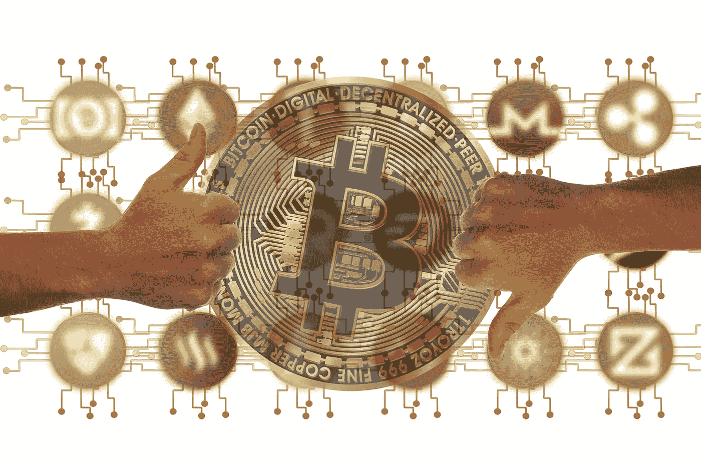
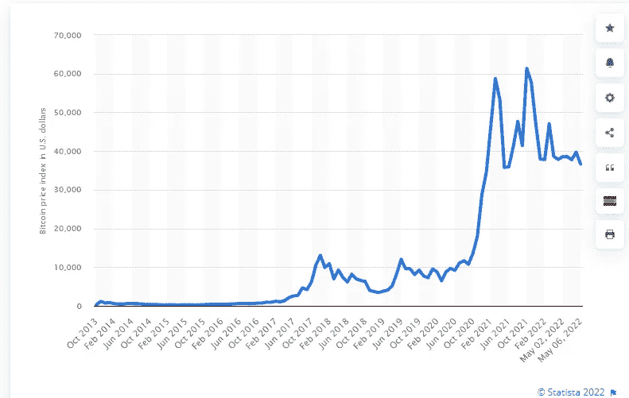

# 比特币现在发生了什么？

> 原文：<https://medium.com/coinmonks/what-is-happening-with-bitcoin-right-now-46608e76a392?source=collection_archive---------24----------------------->

加密值最近在下降，让我们了解一下原因。

投资比特币赚了很多钱，但也损失了很多钱。人们投资主要是基于感觉，而不是对区块链技术的真正理解。

最近，由于比特币的衰落，许多人开始恐慌。

首先，我们之前来过这里，所以让我们来看看比特币历史上的一些崩溃。

2011 年，当比特币从 2 美元涨到 32 美元以上时，它达到了顶峰。随后，数百个账户被黑，价值数百万美元的比特币被盗。一枚比特币的价值跌至 1 便士。我们下降了 99%。

2012 年，70 万比特币被人利用庞氏骗局盗取。-56%.

2013 年 4 月，每比特币的价格从 266 美元降至 50 美元左右，之后又回到 100 美元。同样在 2013 年 12 月，中国禁止比特币，比特币一夜之间贬值 50%。

2017 年负 84% | 2018 年。2017 年是比特币的好年景。价值达到了 20.000 美元，并被宣布为高时间记录。在投资者撤出他们的收益后，价格降到了 12.000 美元。

2020 年 3 月是疫情开始的一年，比特币在 2 天内损失了一半的价值。2 月份跌至 10.000 美元，3 月份跌至 4000 美元。

2021 年 5 月。还记得比特币达到单枚硬币 64000 美元的时候吗？然后在一周之内，1 万亿美元的价值从加密市场中撤出。原因很明显。

Source [statista.com](https://www.statista.com/statistics/326707/bitcoin-price-index/)

为什么人们应该停止恐慌？

上个月美国的通货膨胀率是 8.6%，所以如果市场回来时通货膨胀率低于 8.6%，那将是积极的，也会推动市场上涨。我们很快就会看到比特币的反弹，只是时间和耐心的问题。正是因为这些原因，投资应该是长期的。

//一个旁注，就是昨天(5 月 8 日)crypto 的第三个大钱包捡到了 1000 个比特币。这意味着“鲸鱼”仍在购买蘸酱。

> 加入 Coinmonks [电报频道](https://t.me/coincodecap)和 [Youtube 频道](https://www.youtube.com/c/coinmonks/videos)了解加密交易和投资

# 另外，阅读

*   [MXC 交易所评论](/coinmonks/mxc-exchange-review-3af0ec1cba8c) | [Pionex vs 币安](https://coincodecap.com/pionex-vs-binance) | [Pionex 套利机器人](https://coincodecap.com/pionex-arbitrage-bot)
*   [如何在印度购买比特币？](/coinmonks/buy-bitcoin-in-india-feb50ddfef94) | [WazirX 审查](/coinmonks/wazirx-review-5c811b074f5b)
*   [Unocoin 评论](https://coincodecap.com/unocoin-review) | [最佳加密赌注硬币](https://coincodecap.com/best-crypto-staking-coins)
*   [如何使用 MetaMask Wallet 获取 KCC 地址？](https://coincodecap.com/kcc-address-metamask)
*   [如何获得自己的。XYZ 领域？](https://coincodecap.com/xyz-domain)
*   [最佳加密交换平台](https://coincodecap.com/best-crypto-swap-platforms) | [最佳加密交易所](https://coincodecap.com/crypto-exchange)