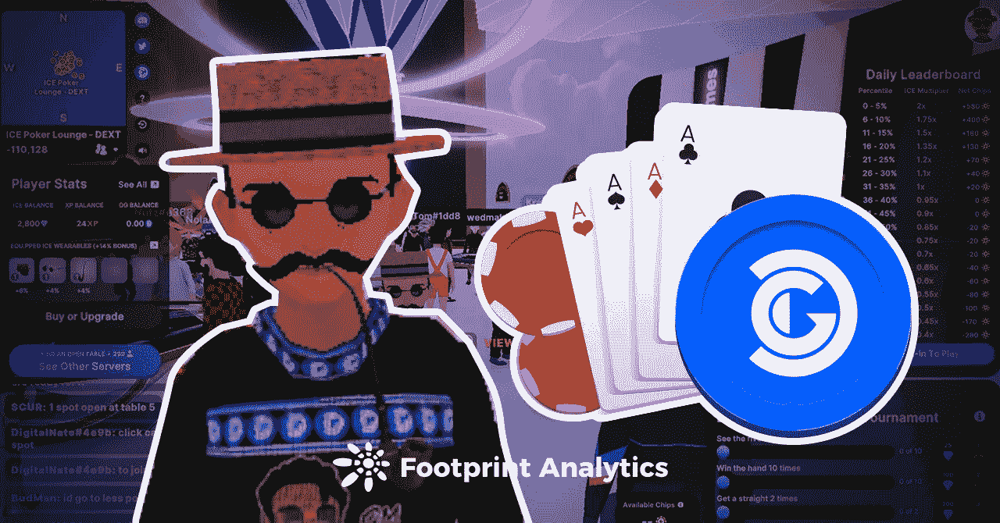

# 什么是冰上扑克，一种支持分散式游戏的游戏？

> 原文：<https://medium.com/coinmonks/what-is-ice-poker-the-game-underpinning-decentral-games-491f9ba6596e?source=collection_archive---------14----------------------->

分散游戏公司的扑克室给元宇宙带来了一项新的用途。

2022 年 3 月

数据来源:[足迹分析分散游戏仪表板](https://www.footprint.network/guest/dashboard/address-analysis-of-game-fi-project-decentral-games-fp-e35cd0cd-31ea-4383-9fca-3f2335a39fb4?gamefi_name=decentral-games&channel=ENG-225#secret=580750285A4E321AABDCDA3477550CA6)

人们对元宇宙的兴趣持续上升，[足迹分析](https://www.footprint.network/?channel=ENG-225)数据显示，元宇宙项目获得了区块链行业第三大投资，仅次于[游戏](https://www.footprint.network/guest/dashboard/dashboard-for-game-fi-industry-fp-f7d88ee8-9341-49ae-b497-088bee7ec038?date=past60days&channel=ENG-225#secret=2E95108712AF5CB1949BCFBB804F139C)和工具。

分散式游戏就是这些项目中的一个，自去年 12 月以来，在获得几轮[融资](https://www.footprint.network/guest/dashboard/follow-financing-project-fp-3aff6ad6-7cd3-4bf8-9923-a99ad34682a2?channel=ENG-225#secret=AAE7A5CA5895901858EF02F0D8C90EEC)的同时，该项目显著增长，其中包括来自[分散式游戏](https://www.footprint.network/guest/dashboard/decentraland-dashbosard-fp-4da47c18-2d94-4ae7-a3e0-168680c0d88b?channel=ENG-225#secret=4C46BE494370AA46C2A2C8E6724DAB1C)的战略投资。它还获得了来自 BSC、数字货币集团、Polygon、Arca Funds 和 Hashkey 等行业领导者的战略投资。

# 什么是冰扑克？

分散游戏公司的冰上扑克于 2021 年 10 月推出。该游戏允许玩家通过在排行榜上排名来赚取代币。

该团队认为，开放的元宇宙将是互联网的下一次演变，分散游戏旨在让任何人都能从玩扑克等熟悉的游戏中赚钱。

*Decentral Games*

怎么玩

玩家需要购买或被授权至少一个可穿戴 NFT 来开始他们的旅程。

玩家每天根据自己拥有的 NFT 数量获得筹码，完成不同等级的日常挑战将获得 ICE 代币和 XP。玩家可以通过增加可穿戴的 NFT 赚取高达 1.4 倍的奖励乘数。

每日排行榜也将影响奖励的乘数，奖励将基于玩家在排行榜中的排名并乘以绩效乘数。

前 40%的用户将获得 1 到 2 的性能乘数，后 60%的用户将获得小于 1 的乘数。这意味着底层用户会损失一部分 ICE，底层 96%的用户当天只会收到 0.05 倍的 ICE，损失 95%的收入。

为了赚取更多的冰，玩家还可以燃烧冰和 XP 来升级 NFTs，以增加高达 35-45%的冰奖励。

# 玩家角色

在 ICE 中，玩家有不同的角色:

*   玩家所有者

玩家可以通过 minting 或者在 OpenSea 购买可穿戴 NFT。目前，OpenSea 上 NFTs 的底价是 1.215 ETH，这相当于在玩游戏之前至少需要 3700 美元。

玩家可以直接使用自己的 NFT 来赚取寒冰奖励，通过升级自己的 NFT 和在游戏中的排名来赚取寒冰奖励。

*   授权玩家

对于分散土地上的许多人来说，国家森林公园的初始成本太高了。幸运的是，玩家可以通过接受冰可穿戴所有者的委托来租赁可穿戴 NFT。

然而，玩家只能获得 60%的冰奖励，剩下的 40%将分给 NFT 老板。随着 NFT 排名的提高，对 NFT 所有者的吸引力将逐渐增加。

*   公会所有者

有被委派的玩家，也有让别人玩的玩家。NFT 的所有者可以委托一个或多个他的可穿戴设备，并创建一个冰扑克公会。

根据公会的规模和 xDG 的数量，玩家还可以组织参加冰扑克联盟，以获得更多 xDG 奖励。

虽然 NFT 所有者可以从授权中获得被动收入，但他们也容易受到 NFT 价格波动的影响。玩家需要评估回收期，如果委托给一个成绩不好的委托玩家，得到的冰会少很多。

# 记号组学和数据表达式

在分散式游戏中，有两种代币可以交易。

*   承蒙天恩

DG 主要用于接入和升级可穿戴 NFT，跑马圈地 DG 将获得治理令牌 xDG。

xDG 授予高级 ICE Poker 公会工具的访问权限，修改经济激励和管理国库资金的投票权，以及生态系统中的费用份额。

DG 将在 6 年内发放 10 亿英镑，其中 62%将发放给社区，20%发放给团队，18%发放给早期采用者。

*   冰

冰作为游戏中的象征，激励玩家参与游戏并升级他们的 NFT。

全部供给被分配给社区奖励和流动性。为了缓解通缩压力，将通过提升 NFT 和来自 DG 财政部的超额利润来烧掉坚冰。

根据足迹分析公司的数据，DG 和 ICE 目前的交易价格都不超过 1 美元。

*Footprint Analytics — Decentral Games Token Price*

在用户方面，自 12 月以来，用户数量增长迅速，截至 3 月 23 日，用户数量为 8260 人。这主要是从 12 月份开始，1 月份以后新增用户增长放缓。

2021 年 12 月 31 日，一场新年前夜派对&庆祝活动由 OKEX 赞助，并由郭晓婷·劳伦斯、里奇·迪茨、弗伦茜和梅迪等艺术家表演。分散游戏也有一个寻宝游戏，所有这些都在 12 月给它带来了很多关注。

*Footprint Analytics — New Users by Month*

分散游戏的新用户比例从 2 月份开始逐渐下降到 5%以下，日活跃用户大部分是老用户，但也反映出老用户的粘性依然存在。

*Footprint Analytics — Daily Users*

关于分散土地的思考

分散的土地已经获得了大量的流量，由于分散游戏的扑克室，给分散的土地的元宇宙一个公用事业。但仍有许多问题需要我们思考。

首先，大多数 GameFi 游戏的准入门槛非常高。从玩到赚的模式已经变成了从付费到玩到赚。

分散式游戏中最便宜的 NFT 价格为 3700 美元，而冰的价格为 0.09 美元。玩家至少需要铸造 40，000 英镑才能把钱赚回来。在分散式游戏中，靠“努力工作”并不总是能赢得冰，这需要很多运气。

其次，尽管分散式游戏已经把赌场这个词从它的主页上去掉了，但它本质上仍然是赌博。建立在赌博基础上的项目将面临政策风险。特别是一些国家明令禁止博彩业，而在没有 KYC 的区块链世界，这无疑制造了一个灰色地带。

本文由[足迹分析](https://www.footprint.network/)社区提供。

Footprint 社区是一个世界各地的数据和加密爱好者相互帮助了解和获得关于 Web3、元宇宙、DeFi、GameFi 或区块链新兴世界任何其他领域的见解的地方。在这里，你会发现活跃的、不同的声音相互支持，推动着社区向前发展。