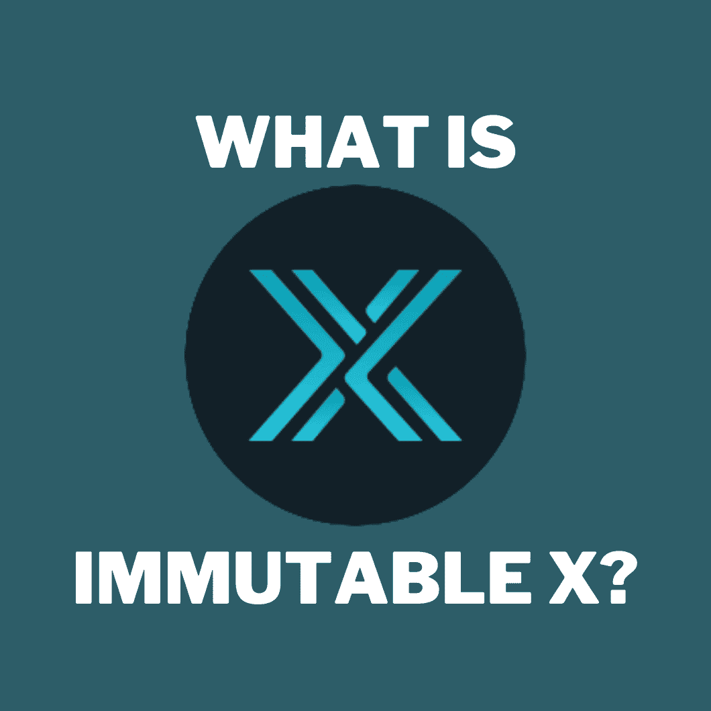

# 什么是不可变 X？

> 原文：<https://medium.com/coinmonks/what-is-immutable-x-d053dc458ba0?source=collection_archive---------6----------------------->

这是下一个大 L2 吗？

Designed by [Author](https://www.quora.com/profile/Sudarsan-Karki-SuperSudar)

如果你在 2021 年活跃在加密领域，你会知道定义性的叙述:**第一层平台/以太坊杀手。**

这是一场在[卡尔达诺](/lets-learn-crypto/djed-will-be-cardanos-first-algorithmic-stablecoin-197dafaf6428)、[索拉纳](https://qr.ae/pGJdJj)、[波尔卡多特](/coinmonks/polkadot-betting-against-blockchain-maximalism-ccfe4fd9db90)和[特拉卢娜](/coinmonks/whats-wrong-with-luna-fc901515207e)之间的四方拉锯战。

但是，在 2022 年，叙述已经转变为:**第二层平台**。