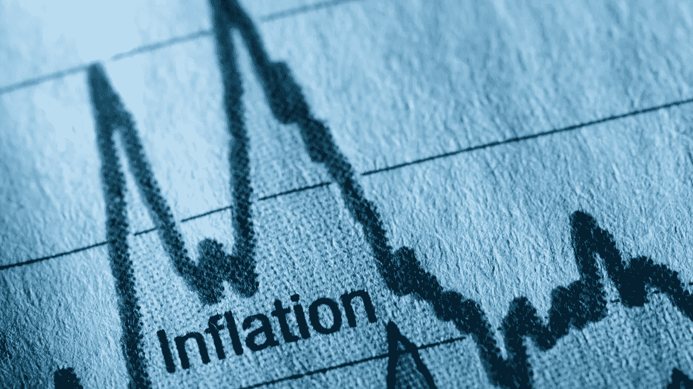

# 什么是通货膨胀？什么导致了通货膨胀？

> 原文：<https://medium.com/coinmonks/what-is-inflation-what-causes-inflation-eda42b9f916e?source=collection_archive---------31----------------------->

通货膨胀是指商品和服务的价格上涨，而货币的实际价值下降。通货膨胀阻止了同样数量的钱购买同样数量的商品。随着通货膨胀率的上升，消费者的购买力下降，导致消费者花更多的钱购买同样的产品。

通货膨胀的一个简单例子是，5 年前 60 泰铢可以买一盘意大利面条，但现在 60 泰铢已经不够买一盘意大利面条了。你可以看到今天 100 泰铢的购买力比过去降低了，直到无法像往常一样买到意大利面。

然而，通货膨胀并不总是一件坏事。通货膨胀在每个经济体中都是常见的事情。但应处于适当的水平。在每个国家，设定通货膨胀目标是为了控制该国的通货膨胀水平。有问题的通胀是恶性通胀。

通货膨胀是一个数字，在需求拉动型通货膨胀的情况下，它可以反映一个国家的经济状况，在成本推动型通货膨胀的情况下，它可以反映生产成本的增加

# **通货膨胀的原因**

**通货膨胀的原因可分为两个主要原因:对商品需求的增加(需求拉动)和生产成本的增加(成本推动)。**

需求拉动是由商品和服务需求增加引起的通货膨胀。而这些商品和服务是不够的。结果，商品的价格水平按照需求和供给(Demand & Supply)的机制上升，这是因为经济非常好，消费者有更多的钱可以花。让更多的钱在经济中流通

成本推动是由生产商品和服务的成本增加引起的通货膨胀，导致商品和服务的价格随着成本的增加而增加。(导致卖家提高产品价格)

# 通货膨胀的影响

通货膨胀会降低我们的购买力或货币的实际价值。所有这些将导致更多的钱花在同样数量的购买上。可以具体看到的通货膨胀的影响包括:

*   产品价格上涨导致生活成本上升
*   由于一种产品是另一种产品的原材料，商品成本增加
*   货币的实际价值下降。让钱闲置而不投资，意味着随着时间的推移，这些钱将无法购买相同的金额。

此外，受通货膨胀影响的人是那些不得不在未来接受货币而不调整通货膨胀的人，例如 A 欠 B 100，000 泰铢，将在 6 年后偿还，但 6 年后，通货膨胀增加。10%的增长，或者说 6 年前可以用 10 万泰铢买到的东西，目前需要 11 万泰铢，但 A 必须用 B 的债务是 10 万，可以看出，与货币相比，B 损失了 1 万泰铢的收益，这样的金额就是购买力。

# 谁负责通货膨胀？

通货膨胀是经济中商品和货币价格水平的问题。因此，每个国家负责监测和处理通货膨胀的机构是中央银行，通过其货币工具，如政策利率。商务部采取措施控制产品价格

可以从每个国家每月发布的消费者价格指数(CPI)中追踪通货膨胀率。

equiti.com

**跟随 EDCoin，*未来储值令牌***

网址:[https://EDC . ed corp . finance](https://edc.edcorp.finance/)

推特:[https://twitter.com/edcorp_finance](https://twitter.com/edcorp_finance)

https://www.facebook.com/edcorp.finance 脸书

电报:[https://t.me/edcoinofficials](https://t.me/edcoinofficials)

insta gram:https://www.instagram.com/edcoin.finance

*本文仅为教育目的而写。这不是以任何方式邀请投资。*