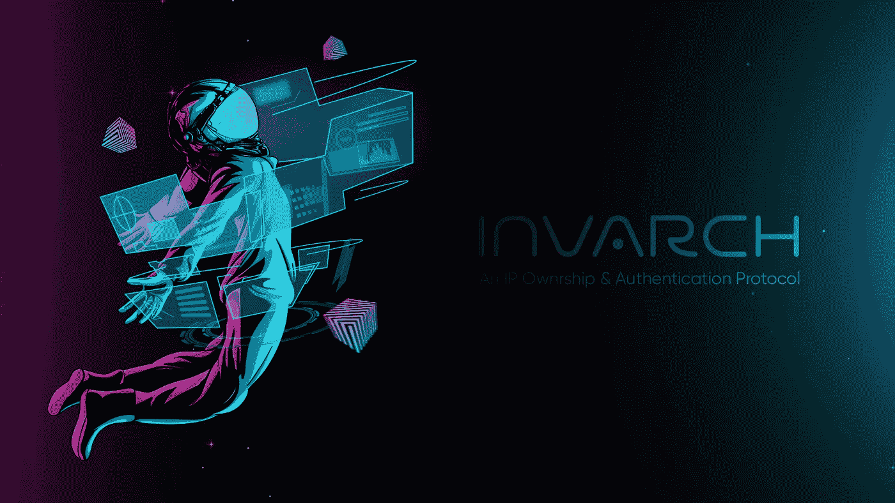
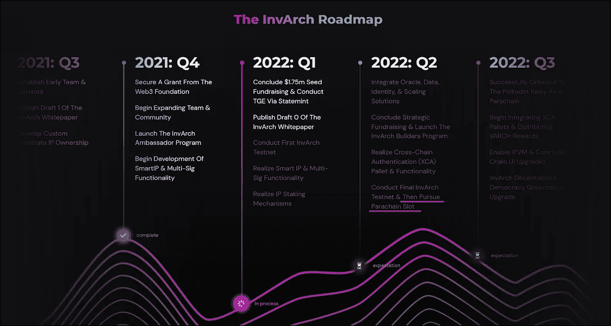
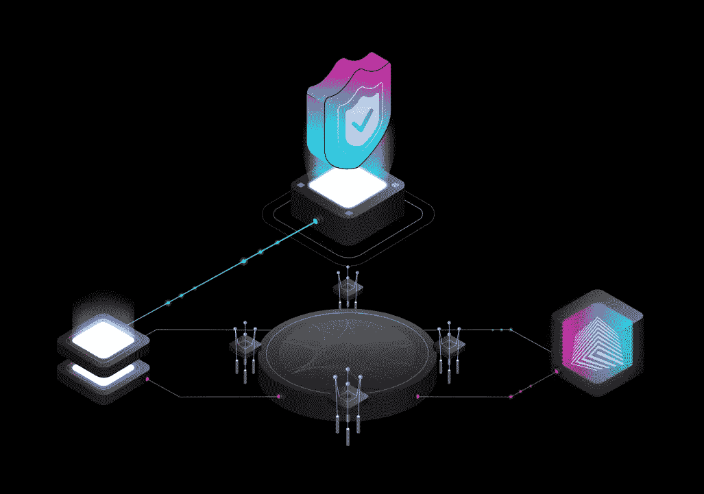
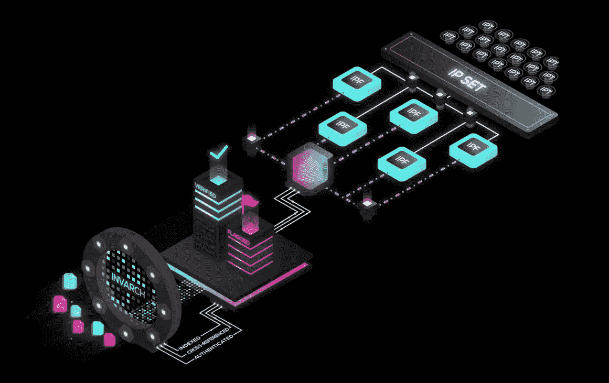
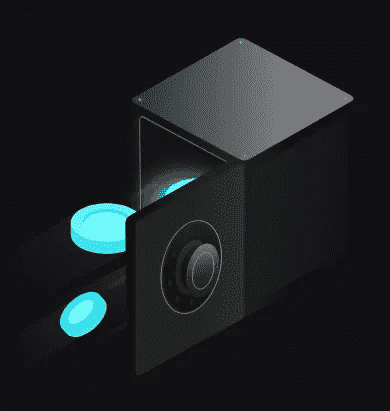

# 什么是因瓦赫网络？

> 原文：<https://medium.com/coinmonks/what-is-invarch-network-bbe3b6937012?source=collection_archive---------23----------------------->

## 波尔卡多特生态系统推广团队

> **免责声明**:本文是由 [Polkadot PromoTeam](https://medium.com/polkadot-ecosystem-promoteam) 制作的[同名视频](http://youtu.be/h2BwtP9438w)的翻版，旨在推广有价值的评论。

InvArch 是一个有机会成为分散开发和管理知识产权的标准的项目。

> 它为许多商业用例奠定了基础，如区块链开发的商业图书馆，区块链的付费多媒体，以及最令人兴奋的分散项目协作的新方法。

此外，它的特点是知识产权赌注，奖励知识产权创作者和 dApp 开发者等等。

InvArch 团队计划在 2022 年获得 Polkadot parachain 插槽。

他们获得了一笔 [Web3 赠款](https://invarch.medium.com/invarch-is-honored-to-share-some-news-d1325a49dc68)，最近[以 2500 万美元的估值获得了 7%的令牌供应](https://cointelegraph.com/press-releases/invarch-raises-175m-to-fund-cross-chain-ip-utility-and-authentication)完成了种子期。

## **简而言之，InvArch 是什么？**

> InvArch 是一种协议，它以 NFT 的形式标记任何想法，并在安全的区块链环境中在所有贡献者之间分配它们的所有权。创意不会丢失，因为它们会被保存在一个不变的账本上，并且受到剽窃检测系统的保护。

## **该协议有几个主要组成部分:**

1.  **波尔卡多特中继链**，保护因瓦赫。
2.  **InvArch parachain** ，用于创建所有新的知识产权文件并检查它们是否抄袭，它还用于标记和管理。
3.  **一个跨链 IP 托盘模块**，本质上和主副链做的一样，除了抄袭验证，还是由副链处理。
    【为了促进 Polkadot 的采用，InvArch 将把其 vArch 供应的 10%分配给前 10 个将集成其 IP 托盘模块的 parachains。使用这个模块，任何用户都可以在另一个 parachain 上创建 IP 文件，但是这些文件仍然会在主 InvArch IP 数据库中建立索引]。

## **因瓦赫生态系统的主要单元是以下资产:**

*   **知识产权文件或 IPF** 每个 IPF 都是一个 NFT，其中包含一个包含必要信息的文件，如设计、代码、媒体文件或其他内容。所有 IP 文件都存储在 IPFS 基础设施上。
*   每个 IP 集都是一个产品想法或实现，由一个或多个描述或包含该想法的 IP 文件组成。它可以是代码库、音乐专辑、画廊、新智能手机的蓝图、智能合同或整个 dApp。
*   **知识产权令牌或 IPT。** 这种类型的令牌确认一个 ip 集合的所有权或其他类型的权利，它可以在多个地址或所有者之间划分。
    IPT 令牌将完全可编程，IP 集的创建者将能够定义 IP 令牌的用途和用例。
    每个 IP 集的 IP 令牌数量由其创建者定义，但可以由 IPT 持有者通过投票进行更改。

> InvArch parachain 是一款基于基板的区块链，完全支持 EVM 和 WASM 技术。

# VARCH 令牌

它的主要标志是$VARCH，用于赌注、治理和付费:

*   40%的网络费用给了校对者
*   25%的费用进入连锁金库
*   35%归 IP 集所有者。

## **子铆接**

这里有一个最具创新性的因瓦奇激励措施:分赌注。在将它们委托给整理器的过程中，每个用户都可以用她的 VARCH 令牌为任何 IP 集投票。任何 IP 集都是合格的，一个想法或 dApp，仍在进行中或已部署。

用户还可以将一部分赌注奖励转移到一个 IP 集，以换取一部分 IP 令牌，这些令牌可用于为有前途的想法筹集资金。

> 所以 InvArch 基本上是承载项目想法的网络。然而，它涵盖了项目生命周期的全部，从想法到部署，并且将相同的原则应用于 dApps。Dapp 开发者也有机会在网络的本地令牌中获得奖励。
> 
> 因此，总的来说，InvArch 是第一个管理知识产权的区块链，但除此之外，它还拥有深思熟虑的令牌组学、赌注和治理、对知识产权所有者和 dapp 开发者的新奖励模式、EVM 和 WASM 支持、分散的 KYC 集成，甚至还有自己的基板托盘模块。

该项目拥有一个庞大的开发人员社区，并积极发展其大使计划[…]

我们相信 InvArch 的目标和未来，我们将继续为您提供有关其发展的新信息。

敬请期待！

访问因瓦赫官方渠道:
[**网站**](https://invarch.network/)】[**推特**](https://twitter.com/InvArchNetwork)**不和**】[**亚社会**](https://app.subsocial.network/5857)】[**中社会**](https://invarch.medium.com/)[**电报**](https://t.me/InvArch)[**Github**](https://github.com/Invarch)】

— — — — — — — — — — — — — — — — — — —

> 加入 Coinmonks [电报频道](https://t.me/coincodecap)和 [Youtube 频道](https://www.youtube.com/c/coinmonks/videos)了解加密交易和投资

# 另外，阅读

*   [Bitsgap 审查](/coinmonks/bitsgap-review-a-crypto-trading-bot-that-makes-easy-money-a5d88a336df2) | [Quadency 审查](/coinmonks/quadency-review-a-crypto-trading-automation-platform-3068eaa374e1) | [Bitbns 审查](/coinmonks/bitbns-review-38256a07e161)
*   [加密复制交易平台](/coinmonks/top-10-crypto-copy-trading-platforms-for-beginners-d0c37c7d698c) | [Coinmama 评论](/coinmonks/coinmama-review-ace5641bde6e)
*   [印度加密交易所](/coinmonks/bitcoin-exchange-in-india-7f1fe79715c9) | [比特币储蓄账户](/coinmonks/bitcoin-savings-account-e65b13f92451)
*   [OKEx vs KuCoin](https://coincodecap.com/okex-kucoin) | [摄氏替代品](https://coincodecap.com/celsius-alternatives) | [如何购买 VeChain](https://coincodecap.com/buy-vechain)
*   [币安期货交易](https://coincodecap.com/binance-futures-trading)|[3 commas vs Mudrex vs eToro](https://coincodecap.com/mudrex-3commas-etoro)