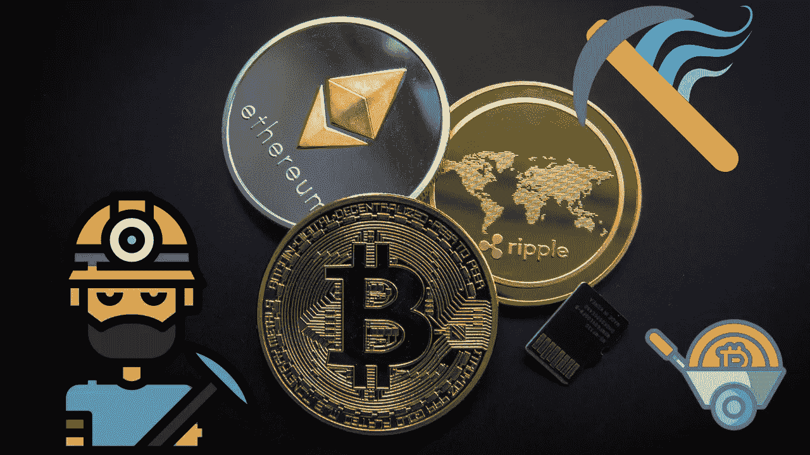

# 2022 年开采 crypto 是什么感觉？

> 原文：<https://medium.com/coinmonks/what-is-it-like-to-mine-crypto-in-2022-3e193af8298e?source=collection_archive---------23----------------------->

让我们来讨论一下你需要什么来开始，这样你就可以从采矿中获得最大的收益。如果你想进入长期挖矿，你可能要投入一笔可观的资金来获得专门的比特币或以太坊挖矿硬件。比特币采矿可能是一个昂贵的过程，无论是从昂贵的计算机硬件和软件来看，还是从保持采矿设备运行所需的能源来看。

目前，除非你计划使用一台拥有数万个 CPU 或 GPU 核心的超级计算机来挖掘比特币，否则你不太可能成为一名比特币矿工，而且几乎永远不会盈利。曾经有一段时间，你可以用 GPU 挖掘比特币，但话说回来……今天你真的需要一个 ASIC 和一个与电力公司的交易，才能在 2020 年通过挖掘比特币赚钱。

挖矿难度的增加，以及专门为比特币设计的 ASICs 的兴起，使得在家挖矿比特币已经不可能。现在，在家里用 PC 挖矿比特币几乎是不可能的，但你仍然可以在家里挖矿其他加密货币。现在我们了解了挖掘是如何工作的，让我们来看看可以在家里挖掘的加密货币。采矿也可以在家里进行，但你需要考虑你想要开采的资源和建立自己的采矿所需的投资。

在决定购买哪种 ASIC 矿机之前，您需要确定您是否拥有成功完成采矿作业的环境。在调试你的比特币挖矿硬件之前，你需要为你的电脑选择挖矿软件。除了实际的挖矿硬件(基本上就是拥有一个最好的显卡)，你还需要决定运行什么软件，如何获得报酬。

你将获得比特币支付，如果你愿意，你可以将其兑换成以太坊。事实上，你将计算机的计算能力提供给其他用户，他们可以选择开采什么，并以比特币获得报酬。租赁可以让你开始比特币挖矿，几乎没有准入门槛。这个相对便宜的切入点表明，不直接购买加密货币就开始赚取加密货币是多么容易。

现在比特币和其他加密货币的价格再次飙升，人们对加密采矿的兴趣重新抬头，加密采矿是一种无需支付费用即可积累加密货币的方式。有趣的是，随着比特币的普及，它的价值越来越大，越来越多的人转向专业挖矿。随着比特币挖矿越来越受欢迎，矿工们开始寻找在竞争中获得优势的方法，GPU 挖矿应运而生。截至 2020 年 7 月，比特币挖矿的盈利能力已经开始伴随着比特币价值的上升而上升。

比特币自 2008 年以来一直存在，因此是最难开采的加密货币之一。在比特币区块链，每天只有大约 144 个区块被开采，而矿工却有数千人。挖掘一个完整的比特币所需的时间各不相同，并且高度依赖于矿工提供的散列能力。出于这个原因，比特币被设计为每 2016 块评估和调整一次挖掘难度，或者大约每两周一次。

当更多的计算能力被共享用于比特币挖矿时，挖矿难度等级增加，以维持稳定的区块生产。换句话说，越多的矿工(和计算能力)挖掘比特币，希望获得回报，这个难题就越难解决。单人挖矿比纯单人挖矿好用，但是如果你没有足够的计算能力的话，需要一段时间才能获得块矿奖励。

当一个区块被开采出来后，比特币奖励会按照矿工贡献的计算能力(称为哈希能力)按比例分配给不同的矿工。挖掘奖励支付给第一个找到复杂哈希难题解决方案的矿工，参与者找到解决方案的概率与他们在网络总计算能力中的份额有关。通过矿池，单个矿工将他们的资源与其他矿工汇集在一起，增加了他们开采区块的机会，并获得比特币奖励。通过在矿池中一起工作，并在所有参与者之间分配报酬，矿工从他们的矿工被激活的那一天起，就可以获得稳定的比特币流。

其中一些公司可能经营小型矿商可以参与的矿池，以收取少量费用换取一些巨额回报。随着比特币这样的加密货币越来越难以挖掘，挖掘池最终会成为一个很好的选择。在获得比特币(BTC)采矿设备和采矿所需的电力后，小矿工将需要找到合适的采矿池。

你必须给自己买一个快速采矿设备，或者更现实地说，加入一个采矿池，一群矿工集中他们的计算能力，分享开采的比特币。不严重，池矿不值得麻烦，你几乎肯定不会得到任何硬币，至少不会用以太坊或比特币。让我们来看看什么是好的加密货币钻机，以及如果你想认真对待采矿，你需要什么设备。

对许多矿商来说，最大的吸引力在于获得比特币奖励的前景。因此，在适当的条件下，开采和出售比特币可以成为一项有利可图的业务。单独采矿可能更有利可图，但矿区的竞争性质意味着可能需要一段时间才能实现重大利益。在投入时间和金钱之前，设定你的期望，看看你能从采矿中获得多少合理的收入，这将极大地改变你的经历。

参观:-[https://bigbraincrypto.blogspot.com/](https://bigbraincrypto.blogspot.com/)

> 加入 Coinmonks [电报频道](https://t.me/coincodecap)和 [Youtube 频道](https://www.youtube.com/c/coinmonks/videos)了解加密交易和投资

## 另外，阅读

*   [3 商业评论](/coinmonks/3commas-review-an-excellent-crypto-trading-bot-2020-1313a58bec92) | [Pionex 评论](https://coincodecap.com/pionex-review-exchange-with-crypto-trading-bot) | [Coinrule 评论](/coinmonks/coinrule-review-2021-a-beginner-friendly-crypto-trading-bot-daf0504848ba)
*   [莱杰 vs n rave](/coinmonks/ledger-vs-ngrave-zero-7e40f0c1d694)|[莱杰 nano s vs x](/coinmonks/ledger-nano-s-vs-x-battery-hardware-price-storage-59a6663fe3b0) | [币安评论](/coinmonks/binance-review-ee10d3bf3b6e)
*   [Bybit Exchange 审查](/coinmonks/bybit-exchange-review-dbd570019b71) | [Bityard 审查](https://coincodecap.com/bityard-reivew) | [Jet-Bot 审查](https://coincodecap.com/jet-bot-review)
*   [3 commas vs crypto hopper](/coinmonks/3commas-vs-pionex-vs-cryptohopper-best-crypto-bot-6a98d2baa203)|[赚取秘密利息](/coinmonks/earn-crypto-interest-b10b810fdda3)
*   最好的比特币[硬件钱包](/coinmonks/hardware-wallets-dfa1211730c6) | [BitBox02 回顾](/coinmonks/bitbox02-review-your-swiss-bitcoin-hardware-wallet-c36c88fff29)
*   [block fi vs Celsius](/coinmonks/blockfi-vs-celsius-vs-hodlnaut-8a1cc8c26630)|[Hodlnaut 审核](/coinmonks/hodlnaut-review-best-way-to-hodl-is-to-earn-interest-on-your-bitcoin-6658a8c19edf) | [KuCoin 审核](https://coincodecap.com/kucoin-review)
*   [Bitsgap 审查](/coinmonks/bitsgap-review-a-crypto-trading-bot-that-makes-easy-money-a5d88a336df2) | [Quadency 审查](/coinmonks/quadency-review-a-crypto-trading-automation-platform-3068eaa374e1) | [Bitbns 审查](/coinmonks/bitbns-review-38256a07e161)
*   [密码本交易平台](/coinmonks/top-10-crypto-copy-trading-platforms-for-beginners-d0c37c7d698c) | [Coinmama 审核](/coinmonks/coinmama-review-ace5641bde6e)
*   [印度加密交易所](/coinmonks/bitcoin-exchange-in-india-7f1fe79715c9) | [比特币储蓄账户](/coinmonks/bitcoin-savings-account-e65b13f92451)
*   [OKEx vs KuCoin](https://coincodecap.com/okex-kucoin) | [摄氏替代品](https://coincodecap.com/celsius-alternatives) | [如何购买 VeChain](https://coincodecap.com/buy-vechain)
*   [币安期货交易](https://coincodecap.com/binance-futures-trading)|[3 comas vs Mudrex vs eToro](https://coincodecap.com/mudrex-3commas-etoro)
*   [如何购买 Monero](https://coincodecap.com/buy-monero) | [IDEX 评论](https://coincodecap.com/idex-review) | [BitKan 交易机器人](https://coincodecap.com/bitkan-trading-bot)