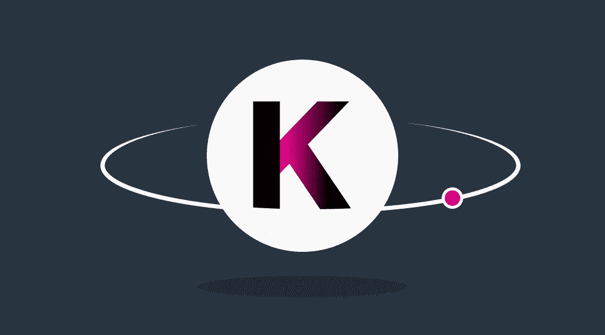

# 什么是嘉手纳币 KDA？嘉手纳区块链运营使用的技术。嘉手纳价格预测

> 原文：<https://medium.com/coinmonks/what-is-kadena-coin-kda-technologies-used-for-kadena-blockchain-operation-kadena-price-prediction-46883b6b61f1?source=collection_archive---------18----------------------->

Kadena (KDA)是一个混合区块链平台，旨在运行智能合同。它的主要特点是可伸缩性和速度。高吞吐量将使 KDA 加密成为加密货币爱好者和普通投资者按需购买的象征。

嘉手纳币今天的价格是 6.1662 美元。

# 嘉手纳令牌简史

该项目的工作是由前摩根大通区块链卓越中心员工和 SEC 技术负责人于 2016 年开始的。嘉手纳的核心网络于 2019 年 11 月发布。

自 2018 年以来，Kadena token technologies 已被多家保险公司用于收集数据。今天，它的客户可以在区块链的目录中搜索其服务被保险覆盖的医生。通常，这些数据由各种数据提供商提供给保险公司。然而，它们的成本每年高达数十亿美元。嘉手纳公司正在通过降低管理成本来解决这个问题。

自 2019 年以来，该项目与 USCF 合作，在嘉手纳的私人网络上开发金融产品，并使用 Chainweb 智能合约，因此客户可以通过嘉手纳访问这些产品。

2020 年 8 月，区块链的吞吐量达到 480，000 TPS。这一速度是通过将核心网络分成 20 个编织链来实现的。

# 嘉手纳 Crypto 是怎么操作的？

Kadena crypto 最初使用工作证明(PoW)进行交易确认。然而，自 2020 年以来，两个区块链的混合模式，如 Chainweb 和李书行，一直在使用。

该解决方案使 Kadena 成为第一个在维护安全性的同时扩展基于 PoW 的区块链的公司。此外，随着带宽的增加，其功耗保持不变，这缓解了 PoW 算法效率低下的问题。该项目团队的目标是创建一个可扩展的公共区块链平台，提供最大的安全性。

该项目旨在为企业提供全面的区块链解决方案。因此，嘉手纳区块链中的智能合约可以在公共和私有网络之间进行互操作。Kadena 加密货币开发商创建的 Pact 实现了网络兼容性。这种编程语言确保智能合约可以随时更新，无需分叉。

# 用于 Kadena 区块链操作的技术

Chainweb 是基于一个改进 PoW 版本。区块链由几个相互独立工作的平行链条组成。该算法在基础级别提供高事务吞吐量，而无需使用简化 dApps 开发的第二层解决方案。

李书行是 Chainweb 的侧链，用于提高交易速度。李书行运营亚马逊网络服务和微软 Azure 基础设施。它使用拜占庭容错作为共识算法，这意味着网络参与者不必完全信任彼此就其状态达成共识。

由于李书行是一个非公开的区块链，它可以通过保持用户数据不被公众检查来充分利用分散的网络。得益于一个加油站功能，开发者和企业客户可以为用户支付交易费用。

# 嘉手纳价格预测

Kadena 提供的解决方案甚至对那些对加密货币不感兴趣的人也有帮助，这让投资者更有利可图。专家们也相信这个项目，WalletInvestor 说一枚 Kadena 硬币的价格将在 2025 年底超过 45 美元。

一个 Gov.capital 团队甚至更加乐观，认为 KDA 硬币的价格将在同一时间达到 180 美元。尽管价格预测专家没有这么高的预期，但他们认为 2025 年 Kadena token 的价格将超过 30 美元。

# 嘉手纳加密货币摘要

嘉手纳是一个有前途的项目，公司和投资者都相信。这是一个快速的区块链，声称解决了扩大电力网络的问题，同时使它们变得强大。

# 哪里可以买到 KDA 硬币？

StealthEX 是购买嘉手纳币最安全的方式。这是最安全的 Kadena exchange 加密平台，因为它要求您提供完成交易所需的基本数据。只需从 400 多种加密货币中进行选择，并等待几分钟即可获得您的 KDA。

# 如何购买嘉手纳币？

只需前往[stealth x](https://stealthex.io/?from=eth&to=kda)交易所，按照以下简单步骤操作:

1.  选择兑换的货币对和金额。例如，KDA 硬币。
2.  按下“开始交换”按钮。
3.  提供硬币将被转移到的收件人地址。
4.  移动你的加密货币进行交易。
5.  接受你的硬币！

非常欢迎您访问 StealthEX 交易所，看看它有多快多方便。

在[媒体](https://stealthex-io.medium.com/)、[推特](https://twitter.com/Stealthex_io)、[电报](https://t.me/StealthEX)、 [YouTube](https://www.youtube.com/channel/UCeES_XBesX76ge7xf1meuSw) 和 [Reddit](https://www.reddit.com/user/Stealthex_io) 上关注我们，获取 [StealthEX.io](https://stealthex.io/) 更新和关于加密世界的最新消息。

*此处表达的观点和意见仅代表作者个人。每一次投资和交易都有风险。做决定时，你应该进行自己的研究。*

*最初发布于*[*https://stealthex . io*](https://stealthex.io/coin/kda)*。*

> 加入 Coinmonks [电报频道](https://t.me/coincodecap)和 [Youtube 频道](https://www.youtube.com/c/coinmonks/videos)了解加密交易和投资

# 另外，阅读

*   [CBET 点评](https://coincodecap.com/cbet-casino-review) | [库币 vs 比特币基地](https://coincodecap.com/kucoin-vs-coinbase) | [拜比特 vs 比特币基地](https://coincodecap.com/bybit-vs-coinbase)
*   [如何在加拿大购买加密货币？](https://coincodecap.com/how-to-buy-cryptocurrency-in-canada)
*   [百无聊赖的猿游艇俱乐部(BAYC)审查](https://coincodecap.com/bored-ape-yacht-club-bayc-review)
*   [5 款最佳加密交易终端](https://coincodecap.com/crypto-trading-terminals) | [最佳 DeFi 应用](https://coincodecap.com/best-defi-apps)
*   [在美国如何使用 BitMEX？](https://coincodecap.com/use-bitmex-in-usa) | [BitMEX 评论](https://coincodecap.com/bitmex-review)