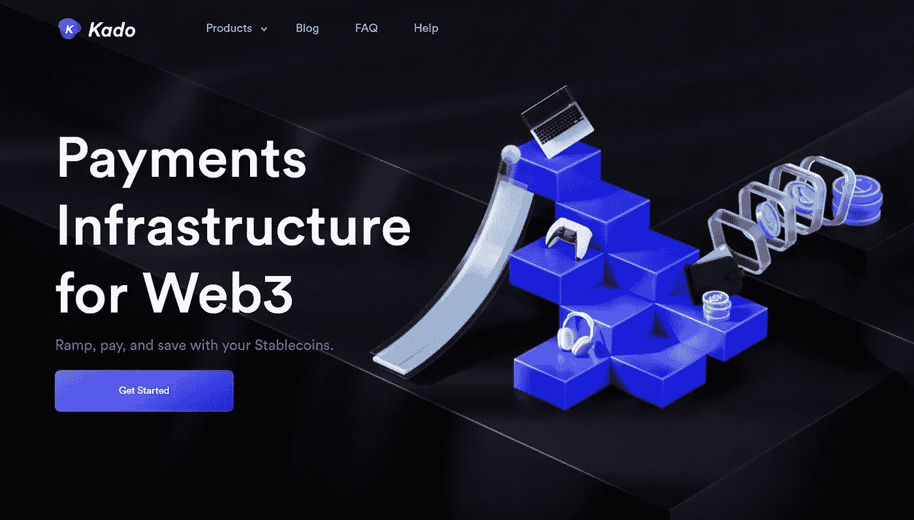
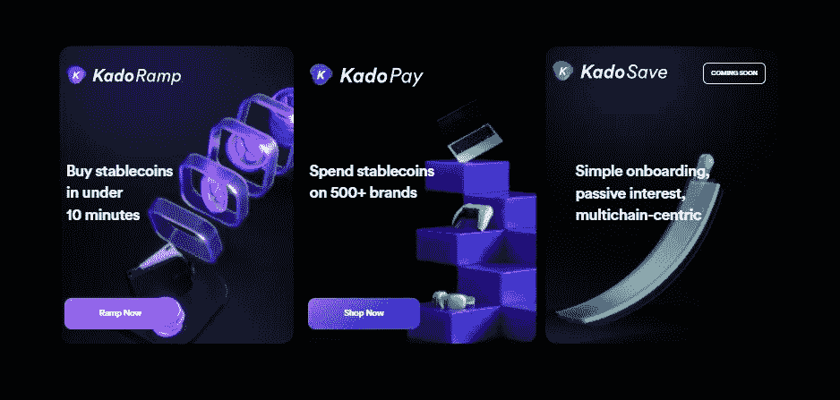
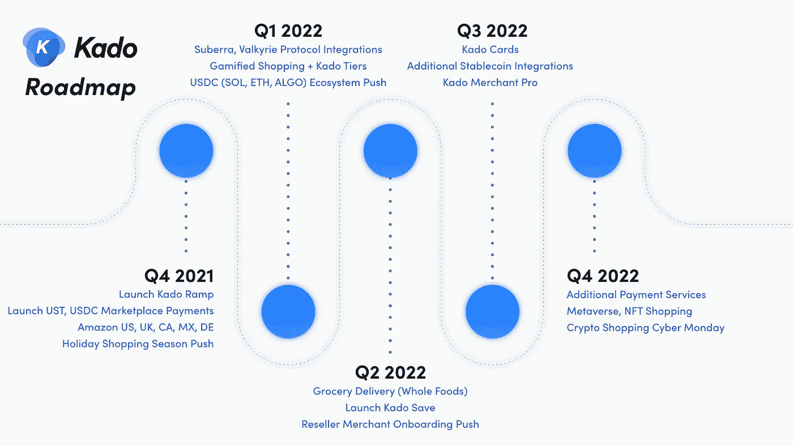

# Kado 是什么？—去 UST 最快的方法！

> 原文：<https://medium.com/coinmonks/what-is-kado-the-fastest-way-to-get-ust-9ed5d6388358?source=collection_archive---------16----------------------->

[Check me out on YouTube too! :)](https://go.thehustlefiles.com/YouTube-sub)

当我在寻找简单地把我的钱用于锚定协议的方法时，我被引入了 Kado 生态系统。

目前加密的最大问题是很难在现实世界中利用你的资产。如果我们谈论的是元宇宙，在那里用你的数字资产购买数字商品，那就更容易理解了。

我过去剪过头发，发型师提到了 crypto。我还年轻，所以她认为我知道得更多。她在这个话题上受过良好的教育，思想开放，我们也有了大多数人对密码的担忧——我们如何在现实生活中使用它？

当我讲述加密如何在数字世界中转化为商品和服务时，我们发现自己陷入了一个僵局，无法真正解释物理世界中的加密。

如果人们不相信我们正在使用的媒介有任何效用，就没有人会使用它。目前，尽管 crypto 很棒，但它在这方面仍然有所欠缺。

目前我无法支付 BTC 或 USDT 的学生贷款或账单。我用另一种货币赚钱，但我用另一种货币付款。加密与“真实”世界脱节。

这就是 Kado 的用武之地。这是密码和真实世界之间的桥梁。你可以在几分钟内将你的法定货币换成加密硬币，并用于任何你想要的用途。

# Kado 是什么？

[Kado’s Homepage](https://www.kado.money/)

简单来说，就是一座桥。Kado 使得消费者可以使用他们的密码，而不必再次使用他们的菲亚特。

根据他们的 [lite 论文](https://lite-paper-v1.kado.money/)，

> *Kado 的使命是能够生活在加密生态系统中，而不必离开。*

基本上，您可以将 stablecoins 用于真实世界的商品和服务。稳定的密码是在密码领域进行交易的首选资产，因为它缺乏易失性和即时可转让性。

# Kado 解决什么问题？

让我开门见山:效用。更具体地说，稳定的效用。

虽然许多加密爱好者称赞加密可以解决世界经历的许多金融问题，但想法在现实世界中转化得不够快。

不要误解我的意思，我们正在实现这一目标，但是大多数加密资产除了投机和价值储存之外没有其他用途。它的真正用途和威力还没有被真正需要加密的人探索和利用。

你可以从 crypto 中赚钱，但是你仍然要把它还给 fiat，这样你就可以支付你的食物、租金、账单等等。使用密码很难支付“真实”世界中的东西。

但是接受比特币和以太坊作为支付的人、商家和国家呢？

虽然这是一个好的步骤，但这些资产对于日常交易来说并不理想。比特币仍然很慢，以太坊因其高昂的 gwei 费用而臭名昭著。

如今，不使用 stablecoins 的商家只能使用信用卡支付方式，收取 1.5%至 3.5%的手续费。此外，资金没有足够快地进入商家的账户，无法用于他们的业务。

这些只是 Kado 希望通过他们的产品和服务解决的一些问题。

# Kado 产品

Kado’s Products

**卡多坡道**

这是我比较熟悉的服务，因为我有过这方面的经验。最大的挑战是消费者很难进入密码，因为它的实用性问题。

Ramp 正在让菲亚特用户进入加密领域。这是第一步。有了 Ramp，你可以更容易地把你的菲亚特换成稳定的硬币，主要是 UST，你可以用它在 Terra 网络中进行项目，或者你可以用 UST 在 Kado Pay 中购物。

**卡多支付**

说起来，Kado Pay 就是 Kado 版的 Venmo 或者 PayPal。这是一个支付处理器，它将加密用户与亚马逊或沃尔玛等现实世界商家的商品联系起来。他们有一个电子商务平台，你可以像平常一样购物，从你的钱包里用 ust 付款，产品就会送到你的手中。

就我个人而言，我还没有用过这个，因为我没有从他们的平台上购买任何东西。但当我这么做的时候，这将是我脑海中的第一件事。

我在他们的购物平台上看到的一个很酷的东西是层级访问功能。我还没有找到一个真正提供基于订阅的服务的项目。这种层访问功能提供了更好的购物体验，有折扣，没有运费，就像 Amazon Prime 一样。

订阅者也可以获得推荐奖励，我不知道这是什么，因为他们没有添加任何细节。我能猜到，这给用户带来了游戏化的购物体验。分层访问由 Suberra 和瓦尔基里协议提供支持。

我也在 Kado 卡的等候名单上。除了根据他们的网站所说的“Kado 卡将为更容易的 UST 消费和储蓄开辟新的可能性”之外，没有关于这张卡的其他细节。如果我有自己的位置，没什么不对的，对吧？

**卡多保存**

在 Terra 生态系统中真正突出的一个项目是 Anchor Protocol。对于希望创造低风险、高收益的被动收入的人来说，这是一个最佳储蓄方案。根据 Kado 的说法，他们正在"*构建与 Terra 和 stablecoins 的直接整合，有效地让商家和消费者从 Anchor 协议中获益。*”

老实说，我不知道这意味着什么，因为几乎没有任何细节提供。

在他们的主要网站上，Kado Save 通过多链支持为你的 stablecoins 赢得了利息。我们还不知道这看起来像什么，但我认为它像锚协议，但列出了许多其他稳定的收入，你可以从中获得被动收入。

我们只能等着看这个产品会是什么样。

# 我对卡多的看法

我相信 Kado 将是大规模采用 crypto 的一大步。如果这个平台有更多的实用性证明，Terra 网络中的更多项目很可能会被涉及。

当我找到 Kado 作为我的锚协议使用时，我感到非常欣慰。它确实节省了我很多时间。让 UST 进入我的 Terra 钱包是如此的容易和快速，以至于值得一提的是，开始使用这个作为获得 UST 的主要方法。

Kado 对 2022 年有很大的计划，我期待的是他们的经销商商家的加入。基本上，经销商可以进入他们的平台，销售产品，并通过 crypto 获得报酬。这相当于做了亚马逊卖家。

[Kado Roadmap for 2021–2022](https://lite-paper-v1.kado.money/lite-paper-v1/kados-roadmap)

现在，我们以商人的身份去亚马逊，但是 Kado 可以成为创建一个以加密为中心的商业网络的重要工具。

我现在能想到的一件事是 Kado 更容易进入 crypto，但是没有办法回到 fiat。这是一扇单行道。目前，世界仍然依赖于菲亚特，所以选择也回购菲亚特可能会使它更容易被用户接受。

我和许多在加密领域的人，可能理解 Kado 试图做什么，但不是每个人都理解它。消费者现在无法将数字资产与现实世界的商品和服务联系起来。如果你决定使用整个 Kado 生态系统，这只是需要考虑的事情。

我不是财务顾问，所以你自己研究吧。

就我个人而言，我没有遇到任何问题，所以我找不到任何可以评论的东西。但总的来说，我喜欢 Kado，我会继续使用 Kado。

**有用资源:**

*   https://lite-paper-v1.kado.money/
*   【https://www.kado.money/ 

**更多来自我:**

*   [我 2022 年的 5 个财务目标！](/@dailydredd/my-5-financial-goals-for-2022-7982d537d993)
*   [我尝试了 3 个月的 PancakeSwap](/@dailydredd/i-tried-pancakeswap-for-3-months-f034e37d23e)
*   [如何在主播协议中用 Kado 赚钱(主播协议教程)——第三部分](/coinmonks/how-to-earn-in-anchor-protocol-using-kado-money-anchor-protocol-tutorial-part-3-6af2d7915964)
*   我的观察名单上有 5 个 NFT 游戏！

> 加入 Coinmonks [电报频道](https://t.me/coincodecap)和 [Youtube 频道](https://www.youtube.com/c/coinmonks/videos)了解加密交易和投资

# 另外，阅读

*   [印度的加密交易所](/coinmonks/bitcoin-exchange-in-india-7f1fe79715c9) | [比特币储蓄账户](/coinmonks/bitcoin-savings-account-e65b13f92451)
*   [OKEx vs KuCoin](https://coincodecap.com/okex-kucoin) | [摄氏替代品](https://coincodecap.com/celsius-alternatives) | [如何购买 VeChain](https://coincodecap.com/buy-vechain)
*   [币安期货交易](https://coincodecap.com/binance-futures-trading)|[3 comas vs Mudrex vs eToro](https://coincodecap.com/mudrex-3commas-etoro)
*   [如何购买 Monero](https://coincodecap.com/buy-monero) | [IDEX 评论](https://coincodecap.com/idex-review) | [BitKan 交易机器人](https://coincodecap.com/bitkan-trading-bot)
*   [CoinDCX 评论](/coinmonks/coindcx-review-8444db3621a2) | [加密保证金交易交易所](https://coincodecap.com/crypto-margin-trading-exchanges)