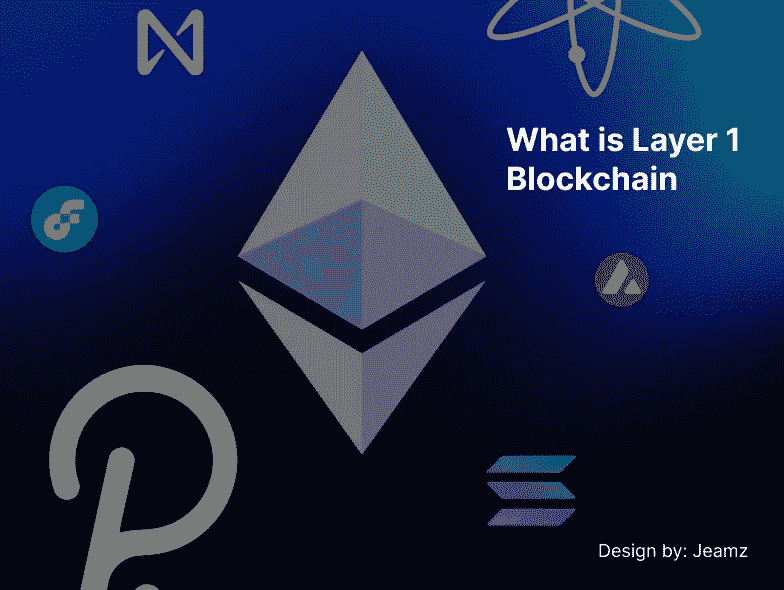

# 什么是第一层区块链？你需要知道的一切

> 原文：<https://medium.com/coinmonks/what-is-layer-1-blockchain-everything-you-need-to-know-316cc0ec67b1?source=collection_archive---------22----------------------->

> 如果您知道区块链可伸缩性，那么您离第 1 层区块链就不远了

区块链技术的发展过程是巨大的。有如此多的项目和应用旨在提供传统金融系统长期以来未能解决的解决方案。但是值得注意的是，区块链手头有一个三难问题，即去中心化、安全性和可伸缩性。为所有这三种情况提供解决方案变得更加困难。

越来越多的应用程序在不同的网络上运行，非常关注可伸缩性。

可扩展性是数字空间中对区块链网络操作需求的增加。其中包括交易处理速度、新应用的适应性和用户操作。

扩展区块链网络意味着它可以在交易量、应用构建和用户参与方面与集中式网络竞争。

不解决第 1 层区块链问题，就无法正确解决可扩展性问题。

## 什么是第 1 层区块链？

第 1 层区块链指的是不需要另一个网络就可以确认和完成交易的基础网络，如比特币、以太坊、币安智能链等。

从比特币的角度来看，可扩展性已经成为一个主要问题。这是因为对网络以更快的速度处理事务的需求增加了。

比特币使用工作证明(POW)作为共识机制，这需要大量的计算资源。

权力集中于权力下放和安全。随着交易需求的增加，POW 往往会变慢，导致确认的延迟和交易费用的增加，这导致了用户之间的争论。

区块链开发者已经提出了提高可扩展性的方法，例如

(1)增加块大小

(2)改变以太坊 2.0 的共识机制

(3)实现分片

> 分片有其自身的安全限制和对黑客的暴露。

我们将研究开发人员用来提高可伸缩性的三个共识协议。

## 共识协议

**(1)工作证明(POW)** :这是比特币和以太坊的传统共识机制。这旨在通过使用矿工解码复杂的密码算法来实现去中心化和安全性。从某种意义上说，当交易需求增加、汽油费增加和资源密集时，它会变得很慢。

**(2)利益证明(POS)** :是一种以区块链网络上的分布式共识为特征的机制。用户在利害关系的基础上认证交易。就交易速度而言，POS 优于 POW，但它缺乏安全性。

**(3)分片**:这是区块链公司使用的一种数据库分区技术，目的是获得可伸缩性，使他们能够每秒处理更多的事务(TPS)。

分片使区块链网络能够分裂成多个分片。每个碎片包含自己的数据，使其独立于其他碎片。现在很多区块链网络都采用这种方式，比如 Near 协议。

随着区块链空间的不断扩大，将会有更多更好的方法来解决我们手头的这个三难问题。在此之前，请继续与加密空间一起发展。

我希望你喜欢这篇文章，我对新的角色持开放态度，你可以随时给我发邮件或打招呼

[Jamesobande2015@gmail.com](https://www.jamesobande2015@gmail.com/)

[推特](https://twitter.com/jeamz007)

> 加入 Coinmonks [电报频道](https://t.me/coincodecap)和 [Youtube 频道](https://www.youtube.com/c/coinmonks/videos)了解加密交易和投资

# 另外，阅读

*   [MoonXBT 副本交易](https://coincodecap.com/moonxbt-copy-trading) | [阿联酋的加密钱包](https://coincodecap.com/crypto-wallets-in-uae)
*   [MoonXBT vs Bybit vs 币安](https://coincodecap.com/bybit-binance-moonxbt) | [硬件钱包](/coinmonks/hardware-wallets-dfa1211730c6)
*   [雷米塔诺审查](https://coincodecap.com/remitano-review)|[1 英寸协议指南](https://coincodecap.com/1inch)
*   [十大最佳加密货币博客](https://coincodecap.com/best-cryptocurrency-blogs) | [YouHodler 评论](https://coincodecap.com/youhodler-review)
*   [KuCoin vs 币安](https://coincodecap.com/kucoin-vs-binance) | [Bitrue 点评](https://coincodecap.com/bitrue-review) | [Jet-Bot 点评](https://coincodecap.com/jet-bot-review)
*   [买 PancakeSwap(蛋糕)](https://coincodecap.com/buy-pancakeswap)|[matrix export Review](https://coincodecap.com/matrixport-review)