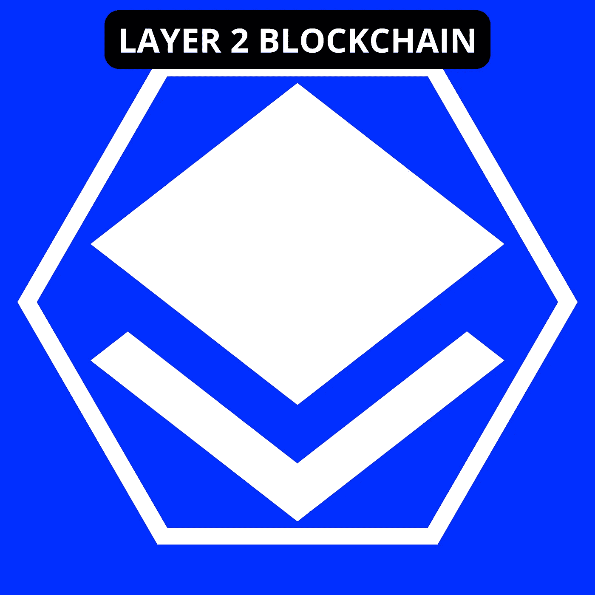
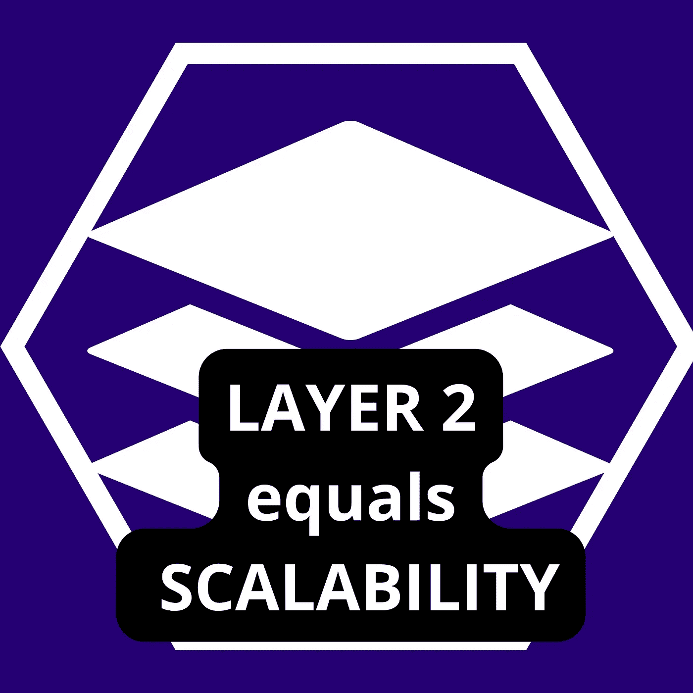
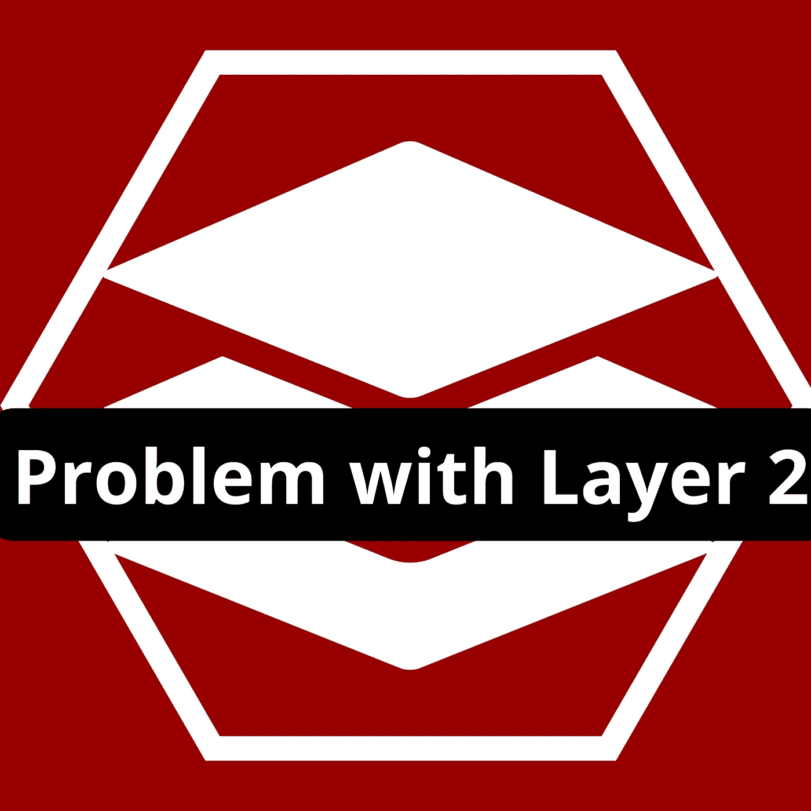
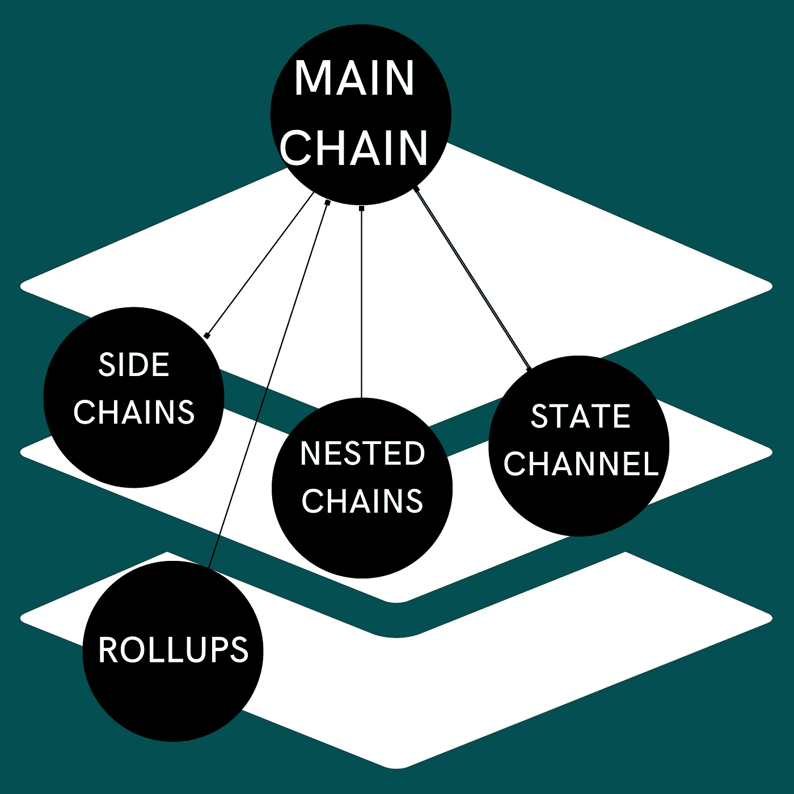

# 什么是第 2 层区块链|什么，为什么，类型

> 原文：<https://medium.com/coinmonks/what-is-layer-2-blockchain-what-why-types-850ce3356166?source=collection_archive---------6----------------------->

Layer 2 blockchain.

在一个有分工的公司里；工作由不同的部门分担和执行，节省了时间并使生产可扩展。

正如劳动分工在经济中的重要性一样；区块链也是如此。大多数第一层区块链需要时间进行交易，其中一些有可怕的天然气费。(例如以太坊)。这就是第 2 层扩展解决方案介入的地方；让交易更快更便宜。

你是愿意花一大笔钱买一辆速度慢的区块链车，还是愿意换一辆更快更便宜的车？肯定是后者。

什么是第二层区块链？

第 2 层区块链是构建在现有区块链(第 1 层)之上的次级链。第 2 层的唯一目的是提高区块链生态系统的全面可伸缩性。

它们有助于提高交易速度，并使交易相对便宜。第 2 层区块链将部分事务负载从主链转移到自己的链外协议，一旦网络确认了该事务，就将其发送回母链(第 1 层)。这样主链不那么拥堵，交易完成更快。

Layer 2 = Scalability.

**为什么我们需要第 2 层**

区块链是一项令人惊叹的技术，它将我们的交易方式转变为一种更加分散、安全和透明的方式；但是一个主要的问题是可伸缩性。根据 Vitalik Buterin(以太坊的联合创始人)的说法，区块链由三个要素组成；去中心化、安全性和可扩展性。

他说，没有一个区块链能提供足够的三人组，因此，每个区块链将不得不牺牲一个元素，以达到最佳运作。对于前两名的区块链；比特币和以太坊，可扩展性是必须牺牲的元素，以使他们的网络分散和安全。

这种情况下的可伸缩性；是区块链随着其生态系统的增长而高效地容纳不断增加的事务负载的能力。

以太坊是最复杂的区块链之一，几乎每天都有不同的令牌和协议被部署。由于它的大量增长和采用；每分钟都有数以千计的交易发生，导致拥堵和汽油大战。

在第二层区块链的帮助下；一部分拥塞可以转移到链外协议，现在你不必在交易完成前等待数小时。

**第二层出现问题**

Layer 2 and its problem.

第 2 层实际上解决了区块链规模的问题，但如前所述；区块链由三个要素组成；去中心化、安全性和可扩展性。大多数第 1 层区块链更关注安全性而不是可伸缩性，但是第 2 层则更关注可伸缩性而不是安全性。

第 2 层作为链外协议运行；这意味着当交易从主链转移到辅助链时，主链的安全性不再对其进行保障。换句话说，您可能必须相信第 2 层区块链足够安全，能够安全地处理您的事务并向主链报告。

> 在密码的世界里；“信任”不是大多数人喜欢的东西。

因为有 3 个元素，而区块链只能提供两个；用户有两种选择。要么使用可扩展且安全但不分散的第 2 层，要么使用可扩展且分散但在安全性方面不是最好的第 2 层。

**第二层区块链的类型**

**侧链**:这些是独立的链条，通过桥与主链相连。侧链允许资产在主链上来回转移(双向挂钩)。

基本上，如果一个用户想在以太网上发送 eth，但由于高昂的煤气费而无法发送；他们可以很容易地将 eth 桥接到 Polygon 这样的侧链上，并以更便宜的汽油费进行交易。

**状态通道:**状态通道允许用户尽可能多地进行交易，同时只向主链提交两个链上交易。

参与方之间的交易由国家渠道智能合同保密，只有第一笔和最后一笔交易记录在公共分类账(主链)上。对于国有渠道，用户依赖于一个智能合同来监督整个链外交易。

状态通道为用户提供了发送和接收加密的机会，而无需依赖或等待矿工验证他们的交易；这意味着更低的费用和更快的交易。

**状态通道的例子有:** Lightning Network 允许用户在特定时间框架内进行少量交易，Raiden Network 允许各方通过其渠道创建智能合同

**嵌套区块链:**这些是构建在主链内部或顶部的区块链。基本上是主链的一部分；只是它被委派了执行事务并向主链报告的职责。

主链和嵌套链之间的通信机制类似于父链和子链。父链(主链)将任务分配给子链(嵌套)，子链则执行这些任务并向父链汇报。

嵌套区块链的一个例子是 OMG 等离子体，它建立在以太坊区块链之上，以促进更快更便宜的交易。

**Rollups:** Rollups 获取主链上的多个事务，并将它们汇总成一个数据，然后定期提交回主链。汇总使交易更便宜、更快捷。

根据 Vitalik Buterin 的说法，即使在 Eth 2.0 推出后，rollups 等扩展解决方案仍将在区块链以太坊中发挥重要作用。

**有两种类型的汇总:**

**乐观汇总:**此汇总[乐观汇总](https://decrypt.co/resources/what-is-optimism-using-rollups-to-help-scale-ethereum) y 表示汇总中的所有事务都是有效的。这意味着没有坏人试图通过重复消费来操纵区块链。

然而，验证者有一周的时间来检查汇总，并确保没有错误或欺诈性的数据发送到主链。乐观汇总的示例有:乐观和武断。

**零知识汇总:**

零知识汇总或[Zk-汇总](https://coinmarketcap.com/alexandria/glossary/zero-knowledge-rollups)像其他汇总一样，从主链中提取事务，并将其汇总到一个数据。但与乐观汇总不同，zk-rollups 采用了一种不同的验证机制，称为 Merkle Trees，这是一种复杂的数学，可以确保数据不会被伪造或操纵。Zk-roll up 的例子有 [Loopring](https://loopring.org) 和不可变 x。

## [**1 分钟了解区块链的 4 层**](/coinmonks/the-layers-of-the-block-chain-layers-0-1-2-3-3d41a9bda69e)

**概要:**

1.)区块链包含三个要素:去中心化、安全性和可扩展性。以太坊是去中心化的，安全的，但是不可扩展。

2.)第 2 层提供了区块链的缩放解决方案。从而使交易更快更便宜。

3.)第 1 层区块链比第 2 层更安全

4.)侧链是通过桥与主链相连的独立链。你可以将你的代币从收费较高的主链桥接到收费较低的副链。

5.)国家渠道创建智能合约，参与者可以在链外进行私人交易，只有第一笔和最后一笔交易被发送到主链分类账。

6.)嵌套区块链是构建在主链上并以父子关系与主链连接的区块链。主链(父链)将事务分配给嵌套链(子链)。在确认这些交易后，它向主链报告。

7.)Rollups 是扩展解决方案，它从主链中取出多个事务，并在将它们提交回主链之前，将它们滚动到一个数据中。

> 加入 Coinmonks [电报频道](https://t.me/coincodecap)和 [Youtube 频道](https://www.youtube.com/c/coinmonks/videos)了解加密交易和投资

# 另外，阅读

*   [Pionex 双投](https://coincodecap.com/pionex-dual-investment) | [AdvCash 审核](https://coincodecap.com/advcash-review) | [光宗耀祖审核](https://coincodecap.com/uphold-review)
*   [面向开发者的 8 个最佳加密货币 API](https://coincodecap.com/best-cryptocurrency-apis)
*   [7 个最佳零费用加密交易平台](https://coincodecap.com/zero-fee-crypto-exchanges)
*   [最佳网上赌场](https://coincodecap.com/best-online-casinos) | [期货交易机器人](/coinmonks/futures-trading-bots-5a282ccee3f5)
*   [分散交易所](https://coincodecap.com/what-are-decentralized-exchanges) | [比特 FIP](https://coincodecap.com/bitbns-fip) | [宾邦评论](https://coincodecap.com/bingbon-review)