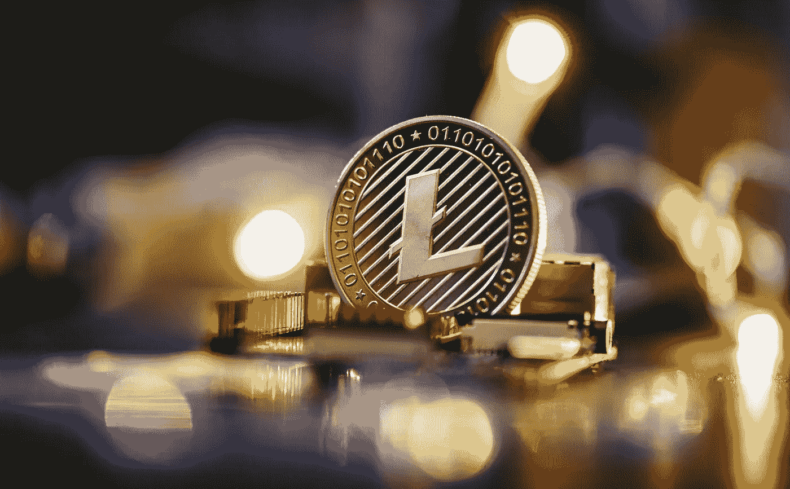

# 什么是莱特币？

> 原文：<https://medium.com/coinmonks/what-is-litecoin-98f16c1c9b3d?source=collection_archive---------55----------------------->

Source photo Unsplash.com

作为第一种被开发的加密货币，比特币，莱特币是原始数字货币的一个分支。点对点数字货币是莱特币理念的核心。Litecoin 的名字表明它是比特币的一个更轻便的版本。因此，莱特币被设计成更快的比特币版本，交易成本更低。在很大程度上，莱特币的目标是为您提供快速和廉价的数字…