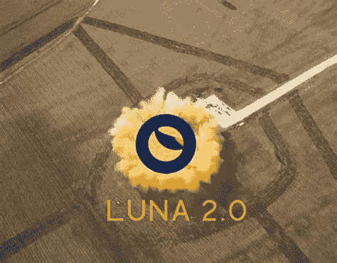

# 什么是 Luna 2.0，如何分发给用户？

> 原文：<https://medium.com/coinmonks/what-is-luna-2-0-and-how-will-be-distributed-to-users-14335a9b93ba?source=collection_archive---------1----------------------->

Source photo [luna 2.0 — Bing images](https://www.bing.com/images/search?view=detailV2&ccid=faQ6X8Rj&id=6B42F01DF2BD6883403815EE322C622AE4076B2C&thid=OIF.%2boYxVZ59k%2fo8l1Orqnvkjg&mediaurl=https%3a%2f%2fwatcher.guru%2fnews%2fwp-content%2fuploads%2f2022%2f05%2fluna-20-terra.jpg&cdnurl=https%3a%2f%2fth.bing.com%2fth%2fid%2fR.7da43a5fc4637fb7a6c5769b0816cdff%3frik%3d%26pid%3dImgRaw%26r%3d0&exph=815&expw=1040&q=luna+2.0&simid=6957623887934&FORM=IRPRST&ck=FA8631559E7D93FA3C9753ABAA7BE48E&selectedIndex=25&ajaxhist=0&ajaxserp=0)

# 什么是 Luna 2.0

5 月 25 日，Terra Classic 用户批准了建立新的 Terra 链的提议。根据这个想法，Luna 的 genesis 发行版也将空投给用户。按照计划，Terra Classic chain 用户将获得基于 depeg 前后拍摄的快照的空投。