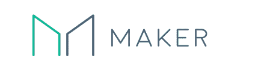

# 什么是马克尔道？

> 原文：<https://medium.com/coinmonks/what-is-makerdao-7d8b4ecba063?source=collection_archive---------28----------------------->

MakerDAO 是以太坊上一个去中心化的自主信用平台。这是一个基于以太坊的协议，发行 Dai stablecoin，并在没有中介的情况下促进抵押品支持的贷款。

纵观 MakerDAO 的一生，它需要改变、实现和发展。这些行动需要决策，而做出适当决策的方法是实现治理系统。

**首先，什么是治理？**

治理是关注组织的利益相关者之间的交互和决策过程。做出决定意味着权力，因此意味着制度的改变。这就是道的意义所在。

*在我们继续之前，我要做一点自我冷却。*

*如果你想要更多关于技术密码的技术文章，你可以查看我的* [*子页面*](https://substack.com/profile/11997845-kyriansol-?utm_source=user-menu) *。*

道的最重要的目的，是监测，支持和加强稳定的硬币，戴的价值。这是一种稳定的货币，其价值与美元挂钩。任何人都可以使用 Maker 打开金库，锁定 ETH 等抵押品，然后生成 DAI 作为该抵押品债务。

戴的债务产生了不断累积的利息。这是一种稳定机制，在偿还所借 DAI 时支付。用户可以借入高达其抵押品价值 66%的 DAI(150%的抵押率)。低于这一比率的金库将受到 13%的罚款和清算，以使金库摆脱违约状态。清算抵押品在公开市场上以 3%的折扣出售。

现在，为了让这种治理完全去中心化，必须要有一种安全透明的方式。为了实现这一点，马克道使用 MKR 代币。

MKR 令牌持有者是“道”的主要利益相关方，他们使用所持的 MKR 令牌在治理系统中投票。一份 MKR 代币就相当于同样份额的政府权力。每个人都可以拥有 MKR，所以每个人都可以在道中投票和拥有权力。

这些创客治理令牌(MKR)的持有者通过对风险参数和其他可能出现的问题进行投票来治理系统。它们是黑天鹅事件发生时的最后一道防线。在这种情况下，如果整个系统的抵押品价值下降得太低太快，MKR 就被铸造出来，并在公开市场上出售，以筹集更多的抵押品。

**创客治理是一个三段式结构**。它有三种主要的投票类型:

*   论坛信号线程:这发生在 MakerDAO 论坛的链外，其目的是测量公共治理社区的情绪。在这种类型的投票中，您不需要使用 MKR 来投票。
*   治理投票:这发生在链上，可以通过创客基金会的投票门户访问。这种投票衡量 MKR 选民的情绪。作为一个分散的借贷平台，与传统的融资方式相比，Maker 使借贷变得更加简单、高效和有组织。其既定目标是促进“没有波动的财务自由”。
*   高管投票:这也发生在链上，可以通过创客基金会的投票门户网站访问。这是最后一步投票，因为它“执行”了对 Maker 协议的技术更改。

正如我们所看到的，第一步衡量社区的情绪，第二步衡量 MKR 选民的情绪，最后一步，治理制度衡量每个 MKR 持有者的决策权。每个令牌持有者都行使投票权，因此拥有强大的治理系统。

每个 MKR 代币持有者也有动机继续持有和管理，因为他们可以从 MKR 代币中分得一杯羹，这些代币已被用作做市商系统的交易费。这有助于确保用户在 Maker 智能合约及其本机令牌 MKR 的开发中发挥积极作用。

创客还有一个功能叫戴储蓄率(DSR)。阿呆利率可以通过将其存入 dai 储蓄利率(DSR)来获得，Dai 储蓄利率的资金来源是向制造商抵押品保管库所有者收取的费用，并且对每个 Dai 持有人免费。

DSR 并不要求您放弃对资金的控制，您可以随时提取您的戴。Dai 储蓄率由 MKR 持有者根据市场情况决定，但范围从 0%到 8.75%。如果您想提取您锁定在做市商抵押品保管库中的抵押品，您必须偿还您所借的 Dai，此外还需支付年收益率费用。DAI 持有人可以将其 DAI 锁定在制造商的 DSR 合约中，以赚取 DAI 的可变利息，该利息来自稳定费。

话虽如此，持有 MKR 也伴随着自身的一系列风险——尽管其中大部分是假设的，并没有发生。最大的风险是以太坊的价格可能会崩盘，导致创客生态系统中的所有抵押品变得一文不值。还有一个风险是，不良贷款和不还款的数量可能会增加到 MKR 代币价格下跌的程度。

**结论:**

我们都知道加密货币和加密资产通常以其巨大的价格波动而闻名，但 Maker Protocol 一直专注于释放分散金融的可能性，并为开发者和用户提供新的、更具创新性的金融工具。因此，Maker 协议和 DAI 形成了一个重要的基础，在此基础上，各种其他 DeFi 协议的基础结构正在建立。随着 DeFi 空间继续增长，DApps 获得动力，Maker 很可能成为主要受益者。

> 加入 Coinmonks [电报频道](https://t.me/coincodecap)和 [Youtube 频道](https://www.youtube.com/c/coinmonks/videos)了解加密交易和投资

# 另外，阅读

*   [加密保证金交易交易所](/coinmonks/crypto-margin-trading-exchanges-428b1f7ad108) | [赚取比特币](/coinmonks/earn-bitcoin-6e8bd3c592d9) | [Mudrex 投资](https://coincodecap.com/mudrex-invest-review-the-best-way-to-invest-in-crypto)
*   [WazirX vs coin dcx vs bit bns](/coinmonks/wazirx-vs-coindcx-vs-bitbns-149f4f19a2f1)|[block fi vs coin loan vs Nexo](/coinmonks/blockfi-vs-coinloan-vs-nexo-cb624635230d)
*   [比斯勒评论](https://coincodecap.com/bitsler-review)|[WazirX vs coin switch vs coin dcx](https://coincodecap.com/wazirx-vs-coinswitch-vs-coindcx)
*   [7 大副本交易平台](https://coincodecap.com/copy-trading-platforms) | [BuyCoins 点评](https://coincodecap.com/buycoins-review)
*   《XT.COM 评论》的[《币安评论》的](https://coincodecap.com/profittradingapp-for-binance)|
*   [SmithBot 评论](https://coincodecap.com/smithbot-review) | [4 款最佳免费开源交易机器人](https://coincodecap.com/free-open-source-trading-bots)