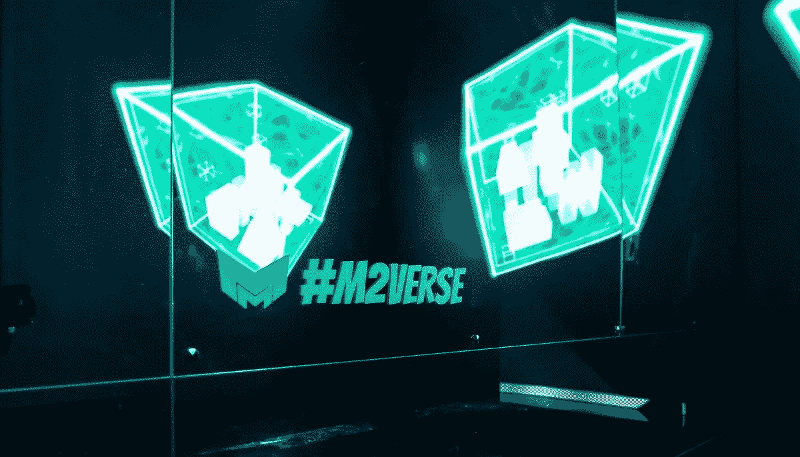

# 前 MetaMask 开发者正在开发的“MetaMetaverse”是什么？

> 原文：<https://medium.com/coinmonks/what-is-metametaverse-on-which-former-metamask-developers-are-working-15d4523a633e?source=collection_archive---------64----------------------->

既然“元宇宙”这个词正在成为企业的营销术语，开发以太坊钱包“MetaMask”的乔尔·迪茨(Joel Dietz)就有了 Web3 (Web3.0)的最初愿景。

我在努力实现它。一个名为“MetaMetaverse”的项目让迪茨先生走出了他所谓的“加密退休”在参与 MetaMask 的开发后，Dietz 已经离开该领域好几年了。

但他现在带着这个领域的新野心和元宇宙的概念回来了，这让我们想起了 Web3 开发的曙光。“研究元元宇宙甚至是个人的责任，”迪茨说。“以太坊早期的许多参与者对互联网有一个非常乌托邦式的愿景。

我不想说我忘记了，但是现在，有了元宇宙，我们又回到了那里。我觉得我又回来了。Dietz 致力于元宇宙的原因被称为“元”元宇宙，因为它专注于互操作性(这并不意味着元=旧脸书的元宇宙)。元元宇宙允许你建立一个项目使用几个不同的游戏引擎。

Metametaverse 也有自己的第 1 层区块链，也可以使用一种叫做“metametalang”的编程语言。

**未来是一个“立方体”**

元元宇宙基于用户拥有的虚拟分区“立方体”的概念。立方体里面，有更多的立方体，里面也有立方体。迪茨所说的“爱丽丝梦游仙境效应”被创造出来，空间被嵌入自身，用户进入立方体，体验立方体的世界。

根据新闻稿，编程语言 Metametallang 用于“在立方体内运行游戏和模拟，绘制平行世界，”并可用于跨链环境。

该平台仍在开发中，该团队尚未宣布在“火星”空间的第一个虚拟部分销售。Dietz 说，元元宇宙是对分散土地和沙盒等现有元工具的补充，最终减少了开发者的约束和互操作性。

假设“我想做我真正感兴趣的事情，极客。我认为开发一种语言来描绘元宇宙未来的任何现实是非常酷的。它也可以赚很多钱，”迪茨说。

metaverse 在 2021 年 12 月筹集了一轮种子资金，并从 Polygon Studios，DAO Maker 和 Ghaf Capital 筹集了 200 万美元。

> 加入 Coinmonks [电报频道](https://t.me/coincodecap)和 [Youtube 频道](https://www.youtube.com/c/coinmonks/videos)了解加密交易和投资

# 另外，阅读

*   [Bitsgap 评审](/coinmonks/bitsgap-review-a-crypto-trading-bot-that-makes-easy-money-a5d88a336df2) | [Quadency 评审](/coinmonks/quadency-review-a-crypto-trading-automation-platform-3068eaa374e1) | [Bitbns 评审](/coinmonks/bitbns-review-38256a07e161)
*   [加密复制交易平台](/coinmonks/top-10-crypto-copy-trading-platforms-for-beginners-d0c37c7d698c) | [Coinmama 审核](/coinmonks/coinmama-review-ace5641bde6e)
*   [印度的加密交易所](/coinmonks/bitcoin-exchange-in-india-7f1fe79715c9) | [比特币储蓄账户](/coinmonks/bitcoin-savings-account-e65b13f92451)
*   [OKEx vs KuCoin](https://coincodecap.com/okex-kucoin) | [摄氏替代品](https://coincodecap.com/celsius-alternatives) | [如何购买 VeChain](https://coincodecap.com/buy-vechain)
*   [币安期货交易](https://coincodecap.com/binance-futures-trading)|[3 comas vs Mudrex vs eToro](https://coincodecap.com/mudrex-3commas-etoro)