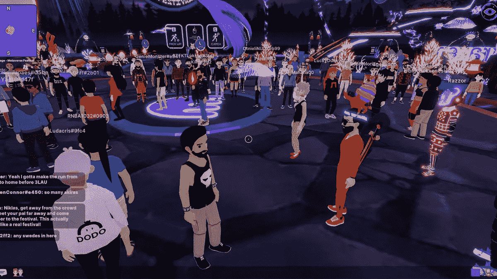

# 什么是元宇宙？

> 原文：<https://medium.com/coinmonks/what-is-metaverse-5b8bc8d8d516?source=collection_archive---------19----------------------->

简单地说，元宇宙是一个数字空间，由人、地点和事物的数字表示来表示。这个虚拟世界是一个虚拟现实世界和新兴技术，用户可以在其中互动、游戏和体验事物，就像他们与现实世界的用户一样。元宇宙可以定义为一个模拟的数字环境，它使用增强现实(AR)、虚拟现实(VR)和区块链以及社交媒体概念来创建模拟现实世界的丰富用户交互空间。

在本书中，元宇宙被描述为互联网的最新发展，一种虚拟现实，其中任何虚拟互动都可以对现实世界产生直接影响。元宇宙是一个公共的集体虚拟空间，是虚拟增强物理现实和物理永久虚拟空间的融合[1]，包括所有虚拟世界、增强现实和互联网的总和。元宇宙是一个物理上永久的虚拟空间，包含头像、数字社交互动和游戏，以及许多我们今天与元宇宙联系在一起的独特事物。元宇宙是一个雄心勃勃的术语，用来描述未来的数字世界，它似乎与我们的现实生活和身体有着更切实的联系。

随着元宇宙的发展，在线空间将会被创造出来，在这个空间中，用户交互将会比当前技术所支持的更加多维。随着元宇宙的扩张，它将为你提供一个超真实的替代世界，你可以在其中共存。虽然元宇宙技术的全面实现还很遥远，但据预测，它最终将成为一个你可以在在线虚拟环境中工作、娱乐、学习、创作、购物和与朋友联系的地方。元宇宙的用户将不再只是浏览数字内容，而是能够沉浸在数字和物理世界融合的空间中。

无论是在虚拟现实(VR)、增强现实(AR)还是仅仅在屏幕上，元宇宙都有望在财富、通信、生产力、购物和娱乐方面为我们的数字生活和物理生活带来更大的融合。

元宇宙是一种数字现实，结合了社交媒体、在线游戏、增强现实(AR)、虚拟现实(VR)和加密货币的各个方面，允许用户进行虚拟互动。一般来说，构成元宇宙的技术可以包括虚拟现实和增强现实，虚拟现实的特点是即使你不玩，虚拟世界也会持续存在，增强现实将数字世界和物理世界的各个方面结合起来。元宇宙是一个实时渲染的大规模、可互操作的 3D 虚拟世界网络，可以由真正无限数量的用户同时连续体验，具有个人存在感和数据连续性，如个性。，故事。、权利、对象、通信和支付。

由于许多汇集了数百万玩家的 MMO 与元宇宙共享功能，但只允许访问仅由几十名玩家使用的虚拟世界的非持久实例，因此多元宇宙虚拟世界的概念被用来区分它们来自元宇宙。描述如此广泛，以至于许多人声称元宇宙已经存在于 Roblox、《我的世界》和堡垒之夜的数字世界中，允许玩家在 2D 环境中走到一起。像 Rec Room 和 Roblox 和《我的世界》这样的世界建设游戏是关于元宇宙是什么的讨论的一部分。像《我的世界》、Roblox 和堡垒之夜这样的游戏也被称为元宇宙。

脸书元宇宙的想法包括人们玩游戏、开会、参加研讨会、玩游戏、运动、学习和交流的虚拟化身，以及可以在现实中进行的各种活动。元宇宙可以是一个数字或虚拟世界，旨在准确反映现实世界，也可以类似于您可能在视频游戏中遇到的完全虚构的世界。尼尔·斯蒂文森(Neil Stevenson)在他 1992 年的小说《冰雪奇缘》(Snow Crash)中创造了一个著名的术语“元宇宙”，他指的是一个由真人化身填充的 3D 虚拟世界，一个由真人化身填充的 3D 虚拟世界。尼尔·斯蒂文森在 1992 年的小说《冰雪奇缘》中创作了元宇宙，小说中的主角是一名披萨司机，他发现自己置身于一个在线虚拟幻想世界中。

作家尼尔·斯蒂芬森在他 1992 年的科幻小说《雪崩》中引入了“元宇宙”一词，在这部小说中，他引入了在逼真的 3D 建筑和其他虚拟现实环境中发现的逼真化身。“元宇宙”一词是 1992 年由 Neil Stevenson 在科幻小说《雪崩》中创造的，在这部小说中，人类充当化身，使用现实世界的隐喻在 3D 空间中与软件代理进行交互。在他 1992 年的小说中(就像元宇宙的其他作品一样)，使用者将元宇宙作为一种逃避未来的、很大程度上是反乌托邦的世界的方式。对一些人来说，进入这个虚拟世界包括在购物时试穿增强现实服装，而对另一些人来说，这意味着在会议中使用化身进行互动和合作，以及能够在现实世界中进行互动和合作，并在世界之间无缝移动。单一元宇宙中的虚拟化是最终目标。

在实践中，当用户可以进入一个巨大的虚拟购物中心，购买一个独特的数字产品，然后在几个星期后出售相同的数字产品，元宇宙将会存在。一个完全不同的虚拟世界，或者在 Twitter、易贝或 OpenSea 上。在未来，另一个例子可能是构成元宇宙一部分的许多分散世界中的一个，数字资产和货币在它们之间移动，就像法定货币和实物资产在不同国家的人之间交换一样。世界。真实世界。如果你认为元宇宙不必由少数公司拥有，那么有一些新技术可以促进不那么集中的虚拟世界，如加密货币和不可替代的令牌或 NFT。大多数平台目前将虚拟身份、头像和库存绑定到一个平台，但元宇宙允许你创建一个可以随身携带的人，就像从社交网络复制你的个人资料图片到另一个平台一样容易。

[来源](https://bigbraincrypto.blogspot.com/)