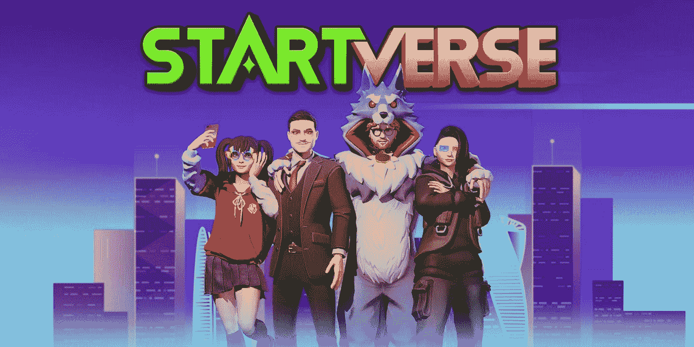

# 什么是元宇宙？

> 原文：<https://medium.com/coinmonks/what-is-metaverse-80de81dd3b4e?source=collection_archive---------76----------------------->

## 你的虚拟耳机就是现实！

元宇宙——一种混合虚拟现实技术，一个与物理世界平行的“地方”。2021 年，微软、脸书和其他 AR 和 VR 公司宣布了新的“元宇宙”,人们可以在虚拟环境中合作，为通用的虚拟空间定制自己的角色。这一行动在很大程度上促成了今天这一技术的爆炸。

**“元宇宙”——互联网的进化阶段**

术语“元宇宙”是宇宙中“元”和“诗”的组合。有了元宇宙、3D 图像或环境，从一个虚拟世界到另一个虚拟世界不再是梦想。你的模型就是你的复制品。你所要做的就是坐在你的房间里玩你人生的游戏。

“元宇宙”一词源自尼尔·斯蒂芬森 1992 年的启示录《雪灾》。最近的灵感来自名为《就绪玩家一号》(Ready Player One)的热门电影，这是一部根据欧内斯特·克莱恩(Ernest Cline)的同名小说改编的 2018 年美国科幻电影。然而，元宇宙远非科幻。这个术语本身被定义为一种特定的技术，在可预见的未来将会很普遍。

Unity 的首席执行官 John Riccitiello 说:“10 年后，你已经戴上了护目镜，但它们只是一副太阳镜，碰巧能够将你带入元宇宙的体验。”。想象元宇宙是一个时间点。和朋友一起走上去的时候，突然出现一杯咖啡。很酷，对吧？

**VR ( Virtual Reality)**

为了接触到这些新千年一代，社区已经发生了很大的变化。在线交流始于 1980 年的实时聊天，即 AOL 在社交媒体网站上的聊天室。继这一成功之后，多人在线游戏和虚拟世界的多用户地下城出现了。今天的网络游戏《堡垒之夜》是这种特殊社会经历的真正产物。更具体地说，想想 Grab 是如何告诉你该吃什么食物的，或者网飞是如何判断你看了什么并提出建议的。元宇宙正是你现在所想的，互联网的进化。它是 XR(扩展现实 VR/AR)和去中心化交易的结合，让你可以用钱兑换虚拟硬币。

**一网多得**

元宇宙不是再造车轮，而是在现有基础上创新。这个平台将通过支持额外的社交活动来增加体验，这些社交活动允许玩家与朋友合作。

生意？没关系。VR 和 AR 技术将改善用户在线会议的体验。在元宇宙的业务中，你将能够像坐在办公室里一样与全球的同事合作。新朋友？元宇宙会帮你联系任何你想联系的人。如果说 Tinder 只是让用户上传和发布图片，那么元宇宙授权用户走近数字世界中的虚拟形象，就像你真实的自己一样，基于虚拟形象的动作、风格和声音。沉浸在元宇宙将为你打开一个新的世界，提供数百万种服务。

**真正的钱，真正的利润**

在 Covid 19 疫情的中央，每个人都必须远程工作。元宇宙可以为你提供赚钱的来源。这是这里的要点，林，她的生意已经崩溃，她失去了所有的资产，因为在最近的商业事件中选择了错误的合作伙伴。这是她重获新生的机会。这不像加入一个游戏并互相竞争，这是一种有情感的生活，工作，发明东西，并开始从这些创造中赚钱。

在基于区块链的游戏中，参与者可以将他们花费的时间转换成加密货币。玩家可以购买、训练、建造属于自己的农业用地，每个人都在以太坊区块链注册。这是一个活跃的市场，允许玩家以加密货币出售生物。

元宇宙开创了一个新时代——一个允许人类创造自己生活故事的时代！

**Startverse Metaverse**

以帮助人们继续书写他们的梦想为使命， **Startverse** 作为初创公司的基石而成立。用户进入游戏的任务是建立自己的幻想公司，雇佣朋友工作，并从这些工作中赚钱。

作为越南元宇宙技术的先驱，Startverse 将为您带来与全球成千上万其他玩家的 3D 体验，而无需花费一分钱。玩家将分别选择三个角色中的一个:老板，自由职业者，土地所有者，并使用他们的 NFT 资产工作，从硬币和代币中获得收入，然后直接转换成真实的货币。

最新的虚拟现实技术被实施到 Startverse 中，以在虚拟世界中带来独特的 3D 体验。我们的游戏将支持运行于:

●移动端:安卓、IOS。

● WebGL 和 PC。

游戏流派:模拟，管理，VR。

年龄:9 岁以上

有意思吧？您还在等什么，现在就加入 Startverse，和我们一起玩游戏吧！

*在****Startverse****加入来自世界各地的创业公司、老板、土地所有者的社区，同时接收最新的项目新闻，享受特别内容:*

[网站](https://startverse.io/) | [脸书](https://www.facebook.com/Startverse-Global-102077955725659/) | [推特](https://twitter.com/StartverseGame) | [不和](https://discord.gg/cfUSrHUvSz) | [电报](https://t.me/StarverseGlobal) | [白皮书](https://whitepaper.startverse.io/)

> 加入 Coinmonks [电报频道](https://t.me/coincodecap)和 [Youtube 频道](https://www.youtube.com/c/coinmonks/videos)了解加密交易和投资

# 另外，阅读

*   [Exness 回顾](https://coincodecap.com/exness-review)|[moon xbt Vs bit get Vs Bingbon](https://coincodecap.com/bingbon-vs-bitget-vs-moonxbt)
*   [如何开始用加密贷款赚取被动收入](https://coincodecap.com/passive-income-crypto-lending)
*   [Coldcard 评论](https://coincodecap.com/coldcard-review) | [BOXtradEX 评论](https://coincodecap.com/boxtradex-review)|[uni swap 指南](https://coincodecap.com/uniswap)
*   [比特币基地 vs 瓦济克斯](https://coincodecap.com/coinbase-vs-wazirx) | [波洛涅克斯 vs 比特雷克斯](https://coincodecap.com/poloniex-vs-bittrex) | [购买流量令牌](https://coincodecap.com/buy-flow-token)
*   [阿联酋 5 大最佳加密交易所](https://coincodecap.com/best-crypto-exchanges-in-uae) | [SimpleSwap 评论](https://coincodecap.com/simpleswap-review)