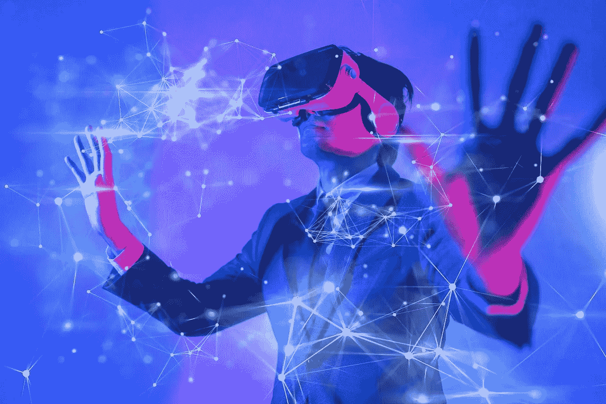

# 什么是元宇宙？

> 原文：<https://medium.com/coinmonks/what-is-metaverse-8cb8659badbd?source=collection_archive---------49----------------------->

Source photo [metaverse — Bing images](https://www.bing.com/images/search?view=detailV2&ccid=%2fN4by6KS&id=C4402D21E7423ECC01778E40F75169994558FE01&thid=OIP._N4by6KS24gxxfD3Vb4aDgHaE8&mediaurl=https%3a%2f%2fmox.cl%2fstatic%2farticles%2fmicrosoft-presenta-su-propio-metaverso-mesh.jpg&cdnurl=https%3a%2f%2fth.bing.com%2fth%2fid%2fR.fcde1bcba292db8831c5f0f755be1a0e%3frik%3dAf5YRZlpUfdAjg%26pid%3dImgRaw%26r%3d0&exph=1001&expw=1500&q=metaverse&simid=608011114141388872&FORM=IRPRST&ck=3D6E21091B3510968E5F052FEF030D3D&selectedIndex=20&ajaxhist=0&ajaxserp=0)

毫无疑问，我们现在都通过智能手机、台式机和平板电脑联系在一起。然而，分析人士认为，随着商品、服务和能力的联系和融合，元宇宙将进一步发展。

事实上，元宇宙可以被认为是物理宇宙的数字等价物。头像用来描绘人的侧面，是现实世界的延伸。办公空间，真实…