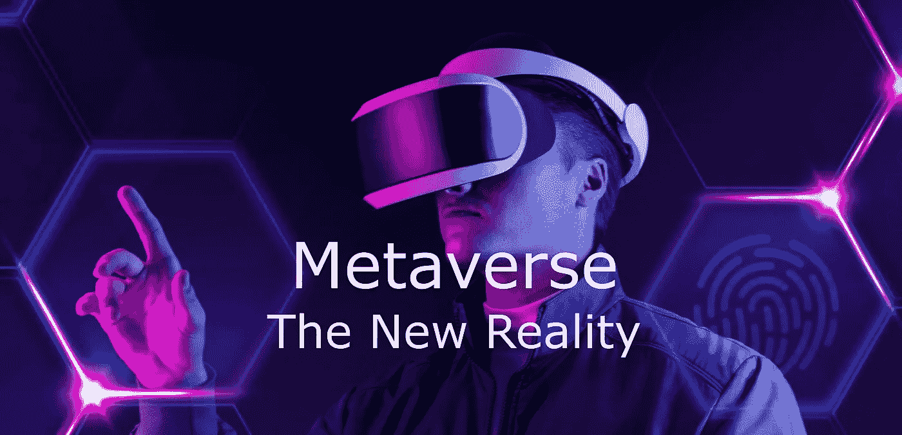
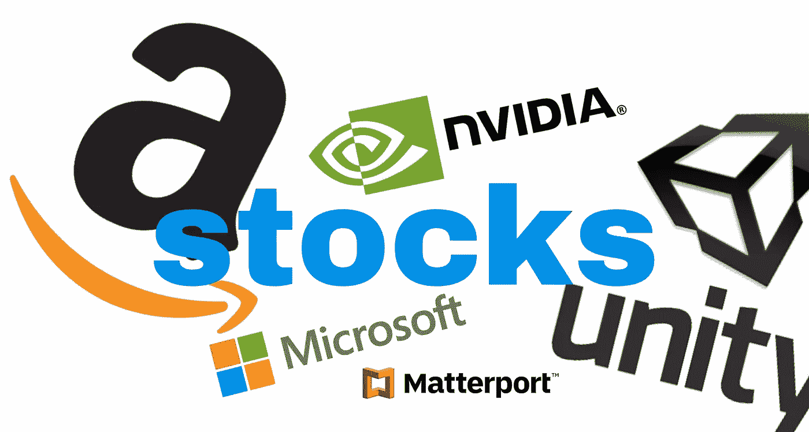
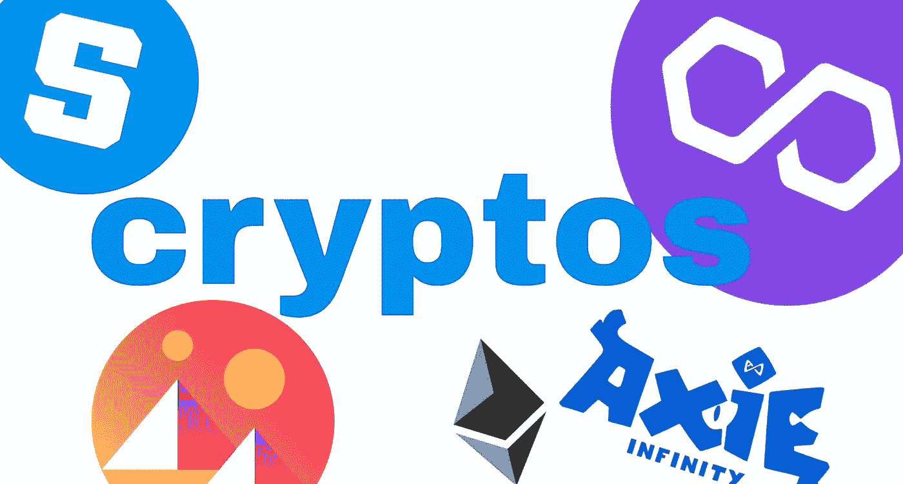
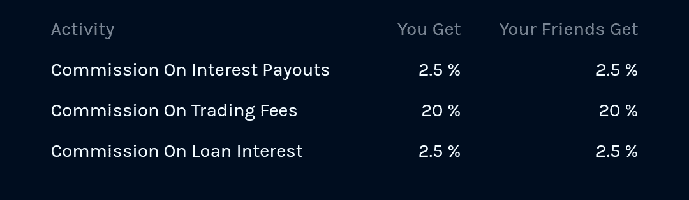

# 什么是元宇宙？如何在元宇宙投资？

> 原文：<https://medium.com/coinmonks/what-is-metaverse-how-to-invest-in-metaverse-7286198354fe?source=collection_archive---------27----------------------->

> *元宇宙，*新的现实！*I***s 它呢？** *我们将来会知道，但是* ***如果是的话，我正在写这篇博客！！***

你可能会多次听到这个词，**元宇宙**。但是它是什么，为什么我们需要知道它？

**The Next OPPORTUNITY!**

虚拟世界是一个虚拟的世界，在这里你可以和世界上任何地方的人联系，就像在现实世界中一样，你可以舒舒服服地呆在家里。我们可以做的不仅仅是与人们联系，比如玩游戏、组织现场音乐会，它还有更多可以给未来带来巨大变化的用例。

元宇宙经常与 Web 3.0 联系在一起，你可以搜索一下，看看股票市场在从 Web 1.0 到 Web 2.0 的演变过程中是如何反应的

所以我们应该投资元宇宙，仅仅是因为这是一个巨大的机会尽早进入，并从中获得尽可能好的回报。如果它成功了，是的，我们必须赌一把！因为在现阶段我们无法预测哪项投资会成功。因此，我们应该根据自己的风险偏好，尝试投资一系列工具。

> 我建议看这部电影来一睹元宇宙的风采:**预备玩家一**

现在，让我们来看看如何才能早点搭上这趟列车，以下是我们现在可以看到的投资选择。

1.  股票
2.  加密货币
3.  股票交易所交易基金和共同基金/加密交易所交易基金
4.  NFTs

在这篇博客中，我们将介绍如何识别进入元宇宙空间的股票和加密货币。

由于我们没有太多的时间和专业知识来研究这些股票，我看到一个简单的方法来参考专业人士创建的 ETF 的持有量。我们可以直接投资 ETF，或者利用这些 ETF 控股公司创建我们自己的元宇宙股票投资组合。

这里有一个例子供你参考:[https://www.roundhillinvestments.com/etf/metv/full-holdings](https://www.roundhillinvestments.com/etf/metv/full-holdings)

同样，我们也有加密令牌的 ETF，我们可以直接投资或基于现有的 ETF 创建我们的投资组合。

https://coinmarketcap.com/view/metaverse/元宇宙令牌列表

这也将是一个通过投资美国股票和加密货币使我们的投资组合多样化的好机会。要记住的重要一点是，加密是一种高度不稳定的资产，所以我们可以从中获得非常好的回报，专家还建议将加密最多只分配到投资组合的 5%，这样我们就不会遭受重大损失。

*快乐而安全的投资！！*

> 在你开始投资之前好好研究一下。我根据我学习目的的经验创建了这个博客。

嘿加密用户伙伴！我用 Vauld 赚取高息，贷款，用我的密码交易。您可以使用我的推荐链接，立即加入 Vauld 社区

 [## Vauld |用密码自动积累财富

### 使用比特币(BTC)、以太坊(ETH)、系绳(USDT)和其他主要加密货币进行借贷和交易。购买和销售…

www.vauld.com](https://www.vauld.com/register/iqs50pc) 

链接:【https://www.vauld.com/register/iqs50pc 

如果你使用的是 ***移动*** ，不要忘记申请这个成功的代码。代码: **iqs50pc**

**Enjoy the Lifetime BENEFITS! of this Referal.** You get back 20% on trading fees plus other benefits.

> 加入 Coinmonks [电报频道](https://t.me/coincodecap)和 [Youtube 频道](https://www.youtube.com/c/coinmonks/videos)了解加密交易和投资

# 另外，阅读

*   [Coinswitch 俱吠罗评论](/coinmonks/coinswitch-kuber-review-1a8dc5c7a739) | [电网交易机器人](https://coincodecap.com/grid-trading) | [比特币基地收费](/coinmonks/coinbase-fees-831e77d4f2c5)
*   [Bitget 评论](https://coincodecap.com/bitget-review) | [双子星 vs BlockFi](https://coincodecap.com/gemini-vs-blockfi) | [OKEx 期货交易](https://coincodecap.com/okex-futures-trading)
*   [OKEx vs KuCoin](https://coincodecap.com/okex-kucoin) | [摄氏替代品](https://coincodecap.com/celsius-alternatives) | [如何购买 VeChain](https://coincodecap.com/buy-vechain)
*   [币安期货交易](https://coincodecap.com/binance-futures-trading)|[3 commas vs Mudrex vs eToro](https://coincodecap.com/mudrex-3commas-etoro)
*   [在印度利用加密套利赚取被动收入](https://coincodecap.com/crypto-arbitrage-in-india)
*   [德国最好的加密交易所](https://coincodecap.com/crypto-exchanges-in-germany) | [WazirX P2P](https://coincodecap.com/wazirx-p2p)
*   [如何购买 Monero](https://coincodecap.com/buy-monero) | [IDEX 评论](https://coincodecap.com/idex-review) | [BitKan 交易机器人](https://coincodecap.com/bitkan-trading-bot)
*   [加拿大最佳加密交易机器人](https://coincodecap.com/5-best-crypto-trading-bots-in-canada) | [赌注加密](https://coincodecap.com/staking-crypto)
*   [如何在印度购买比特币？](/coinmonks/buy-bitcoin-in-india-feb50ddfef94) | [瓦济克斯审查](/coinmonks/wazirx-review-5c811b074f5b)
*   [最佳网上赌场](https://coincodecap.com/best-online-casinos) | [硬件钱包](/coinmonks/hardware-wallets-dfa1211730c6) | [Jet-Bot 评论](https://coincodecap.com/jet-bot-review)