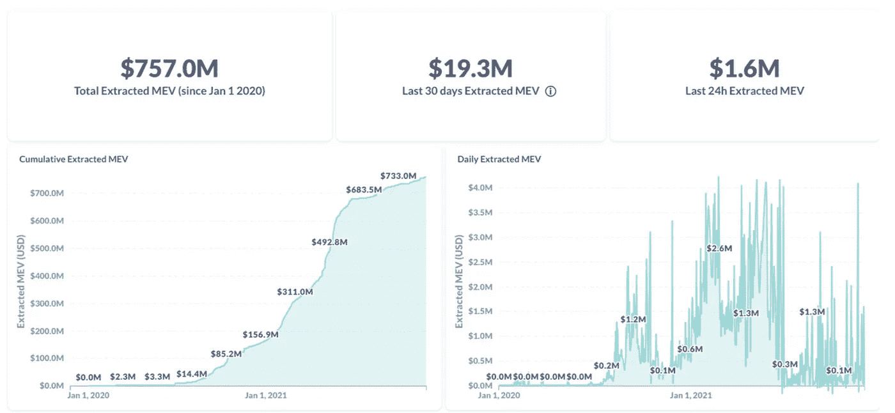
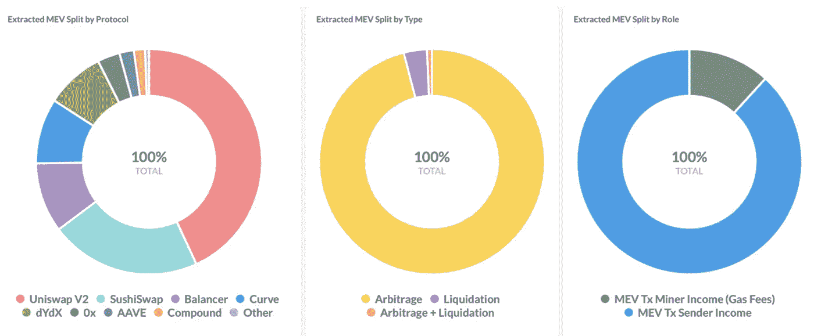

# MEV 是什么？为什么它与验证器相关？

> 原文：<https://medium.com/coinmonks/what-is-mev-why-is-it-relevant-for-validators-4d00f432d58c?source=collection_archive---------12----------------------->

MEV 或“矿工可提取价值”的概念最初是在 [Flash Boys 2.0](http://arxiv.org/abs/1904.05234) 论文中引入的，指的是验证者/矿工在利益证明(PoW)或工作证明(PoS)算法中可以获得的利润额。

它最近被重新命名为“最大可提取价值”，因为除了与交易费或硬币开采相关的利润之外，不仅电力系统的采矿者可以通过区块链的区块排序获利。

对于所提出的问题，我将集中于利害关系的证明，因为在该算法中，验证者负责解密区块链中下一个块的散列(通过对组成该块的交易进行排序)并获得与该块相关联的交易费作为报酬。

验证器可以检测尚未在 mempool 中确认的潜在有利可图的交易。这些交易主要涉及套利交易或在贷款协议中赚取清算奖金的可能性。

由于验证者能够包含他们自己的交易或者选择他们将要铸造/伪造的块中的交易顺序，因此可以获利。根据 [MEV-Explore](https://explore.flashbots.net/) 公布的数据，截至今天，MEV 价值超过 7 . 5 亿美元(见*图 1* )。

Figure 1: Extracted MEV over time. Source: MEV-Explore.

观察到提取 MEV 量最高的协议是 Uniswap V2、Sushiswap 和 Balancer。在这三者之间，它们占提取的总 MEV 的 76%。

套利交易占提取的 EMV 的 96%。与矿商收入(22%)相比，发行商收入在提取的 [MEV](https://slothtrading.com) 中扮演着重要角色(88%)。这些数据可以在图 2 中找到。

Figure 2: Extracted MEV drill down. Source: MEV-Explore.

有了这些见解，就很容易回答为什么 MEV 对验证者很重要的问题了。简而言之，除了块铸造之外，他们还可以获得一个好处，因为他们拥有在块中对事务进行排序或在块中包含自己的事务的特权。

操作程序块的主要技术有三个方面，总结如下:

*   Frontrunning:当验证程序将自己的一个事务放在验证程序认为是关键的另一个事务前面以获取利润时发生。
*   Backrunning:是一个类似于 frontrunning 的操作，只是在这种情况下，验证器事务被放在键事务的后面。
*   夹层:是两种技术的结合，验证器将自己的事务放在对操作成功至关重要的其他事务中间。有[夹心](https://sandwiched.wtf)之类的平台，你可以在那里查看自己是否曾经是夹心的受害者。

预防 MEV 是一项艰巨且通常难以处理的任务。然而，根据[蜻蜓研究所](/dragonfly-research/we-live-in-a-mempool-backrunning-the-mev-crisis-a4ea0b493b05)的一份报告，目前有三种机制被用来限制验证者的权力，从而避免 MEV 的存在。

这三种机制是:利用私有内存池(如最近倒闭的[太极网](https://github.com/Taichi-Network/docs))、使用[flash bot](https://github.com/flashbots/pm)(这目前正在紧张的研发中)或联合起来限制对之前未列入白名单的新地址的访问(如 KeeperDAO 和 BProtocol 中发生的情况)。

记得看一下我的[网站](https://slothtrading.com/)，这里使用几个神经网络每小时发布不同资产的价格预测。

请在[推特](https://twitter.com/SlothTradingCom)关注我。

考虑给我们一笔[捐款](https://ko-fi.com/slothtrading)来继续开发这个项目，我们将不胜感激:)。

> *加入 Coinmonks* [*电报频道*](https://t.me/coincodecap) *和* [*Youtube 频道*](https://www.youtube.com/c/coinmonks/videos) *了解加密交易和投资*

# 另外，阅读

*   [印度最佳 P2P 加密交易所](https://coincodecap.com/p2p-crypto-exchanges-in-india) | [柴犬钱包](https://coincodecap.com/baby-shiba-inu-wallets)
*   [8 大加密附属计划](https://coincodecap.com/crypto-affiliate-programs) | [eToro vs 比特币基地](https://coincodecap.com/etoro-vs-coinbase)
*   [最佳以太坊钱包](https://coincodecap.com/best-ethereum-wallets) | [电报上的加密货币机器人](https://coincodecap.com/telegram-crypto-bots)
*   [交易杠杆代币的最佳交易所](https://coincodecap.com/leveraged-token-exchanges) | [购买 Floki](https://coincodecap.com/buy-floki-inu-token)
*   [3 commas vs . Pionex vs . crypto hopper](https://coincodecap.com/3commas-vs-pionex-vs-cryptohopper)|[Bingbon Review](https://coincodecap.com/bingbon-review)