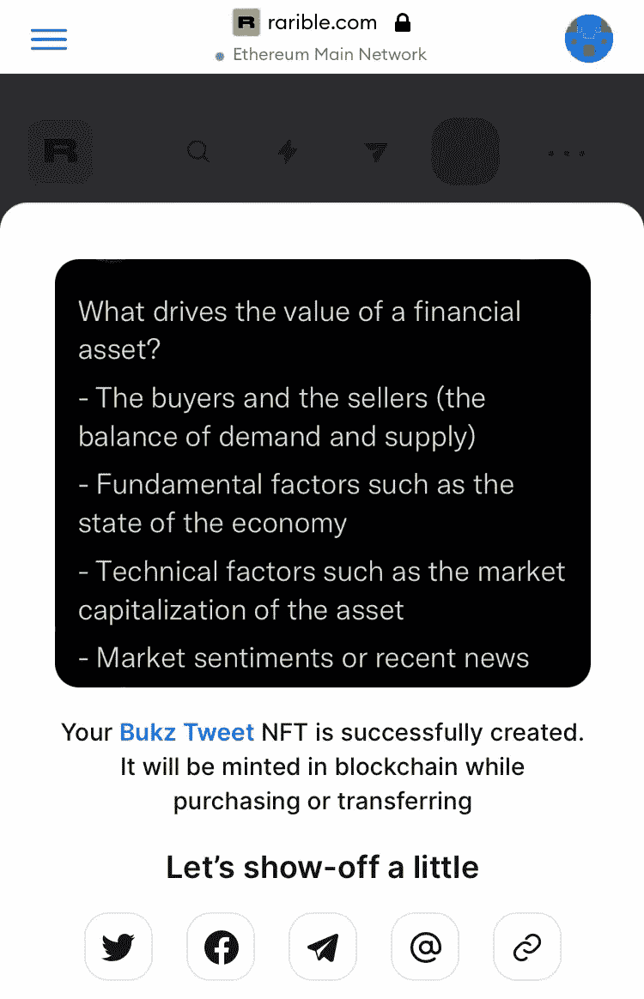
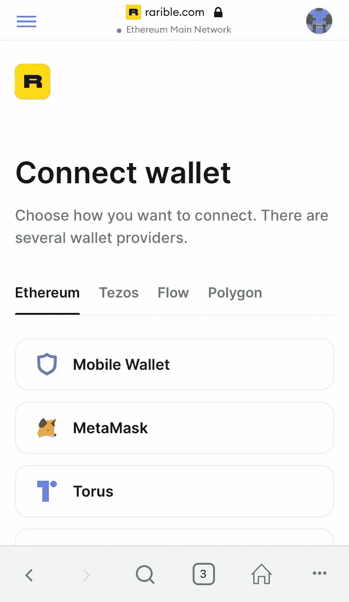
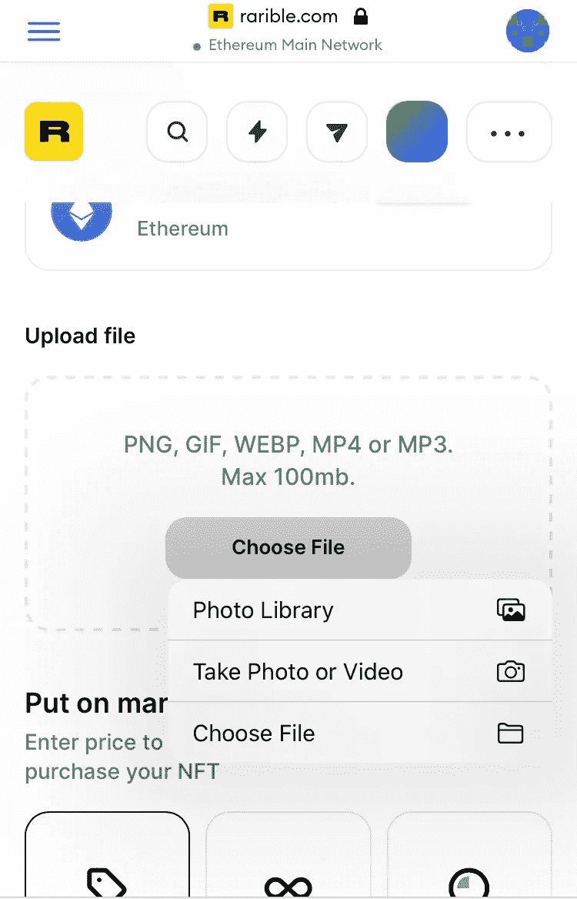
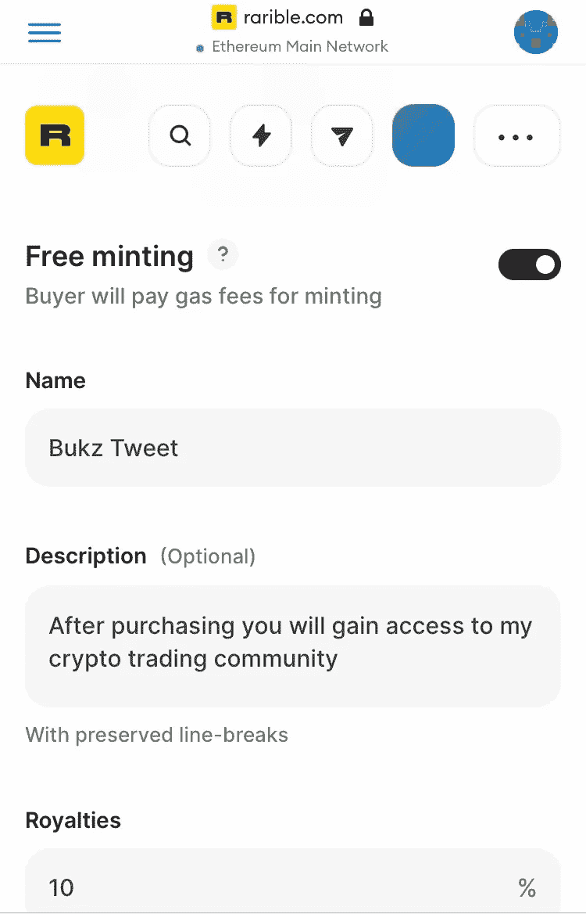

# NFT 正在铸造什么

> 原文：<https://medium.com/coinmonks/what-is-minting-in-nft-30d753f79a98?source=collection_archive---------26----------------------->

我的名字是楚克武布卡。

我已经学会削减开支，优先考虑生活中重要的事情。

写作将使我更加充实，特别是因为我分享了我从研究加密空间中获得的价值。

在我人生的这个阶段，优先写作是很重要的。我想做我喜欢做的事情。

尽管我过去没有很多机会这样做，但我知道这是成为一名完全职业球员的一部分。

现在是这样做的时候了。我正在培养我的写作技巧，并看到我的表现更上一层楼。

此时此地，我正在寻找机会为更上一层楼做出我的贡献。

我的故事讲完了，现在让我们进入今天的主题:“NFT 铸造什么？

铸造意味着首次创造某种东西，比如铸造一种加密货币。在 crypto 中，它有类似的含义，尽管过程不同。

在这篇文章中，我将解释什么是 NFT 铸币，以及你如何铸造一个。

# NFT 铸造的是什么？

NFT 的发明是为了证明数字资产的所有权，因为它们不容易被复制或拷贝。

想象一下，出售一件艺术品(不作为所有权的证明保存在区块链中)。我不认为它会有价值，因为任何人都可以拷贝或复制它。

在 NFT，铸造是一个转换任何文件(视频，音乐，艺术品，图像，文章等)的过程。)转换成记录在区块链上的数字资产。

区块链是一个分散的系统，使每个加密交易安全和透明。添加到区块链的任何资产都不能被更改或操纵。

# **如何铸造 NFT**

首先，你需要购买类似以太坊和 Rari 的兼容加密货币来创建和销售 NFT。

1.  创建一个信任的交易所帐户，购买您的首选加密铸造。您还需要创建一个类似 Metamask 的钱包来存储您的加密货币。
2.  选择您想要使用的 NFT 市场。这里有几个你可以从中选择；

*   [Opensea](http://www.opensea.io)
*   [稀有](http://www.rarible.com)
*   [超级稀有](http://www.superrare.com)
*   [俏皮网关](https://niftygateway.com/)
*   [NFT 展厅](https://nftshowroom.com/)
*   [阿谢商场](https://marketplace.axieinfinity.com/)

*在你决定之前，你应该比较一下费用是多少，以及哪个市场最容易使用，因为每个市场的特点略有不同。*

3.将您的钱包连接到 NFT 市场。

*   连接后，创建个人资料，用您的详细信息更新您的个人资料，并提供您的社交媒体页面和网站的链接(如果您有)
*   指定你接受买家的加密货币。

4.访问市场的主页。在那里你会发现一个按钮，可以让你铸造你的 NFT。

*   上传您的文件(图像、视频或作品)
*   为文件命名，并为潜在买家添加对 NFT 的描述。
*   指定如果买家购买您的 NFT，您希望收到多少版税。
*   你需要用你选择的加密货币支付汽油费。

然而，像 Opensea 和 Rarible 这样的 NFT 市场支持惰性铸造。

# 什么是懒造币？

惰性铸造是指只有当买家购买 NFT 时，铸造过程才会发生。这意味着买方支付汽油费。

Rarible 和 Opensea 收取 2.5%的燃气费

# 铸造 NFT 需要多少钱？

这将取决于你想使用的市场，如何独特的资产，以及何时你想铸造 NFT。费用会有所不同。如果你正在使用一个懒惰的铸币市场，你将不必支付汽油费。

# 结论

*既然你知道了什么是铸造，以及如何创造你的非专利技术。这是由你来决定是否要铸造一个 NFT。*

*如果你喜欢读这篇文章，分享它并为它鼓掌👏也是。*

请关注我，以免错过我的下一篇文章。

> 加入 Coinmonks [电报频道](https://t.me/coincodecap)和 [Youtube 频道](https://www.youtube.com/c/coinmonks/videos)了解加密交易和投资