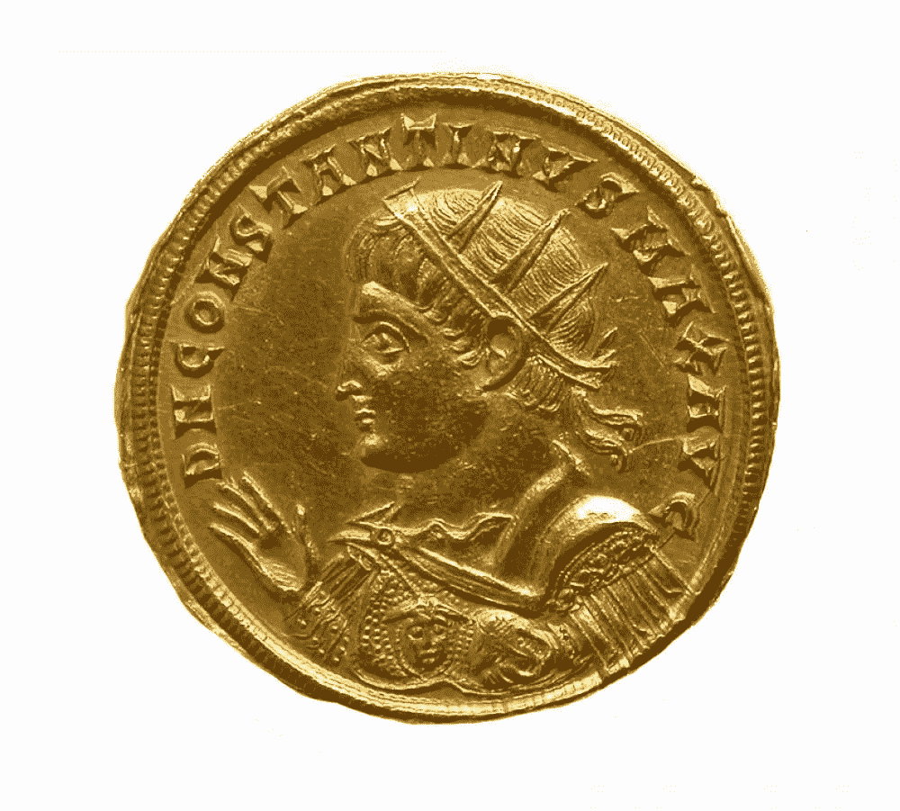
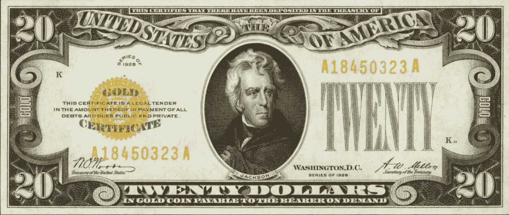
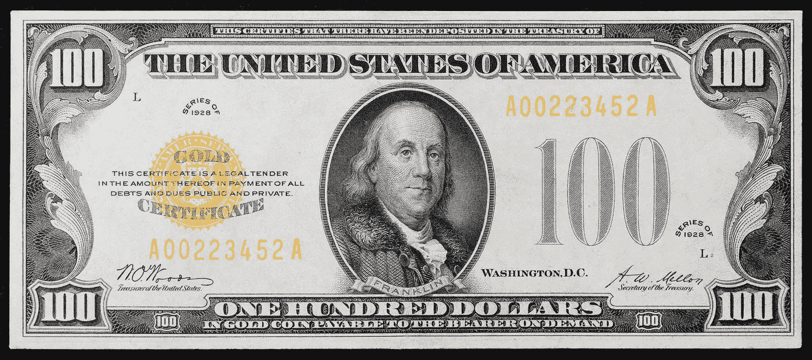
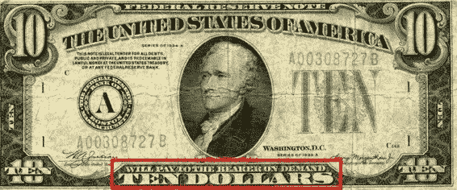
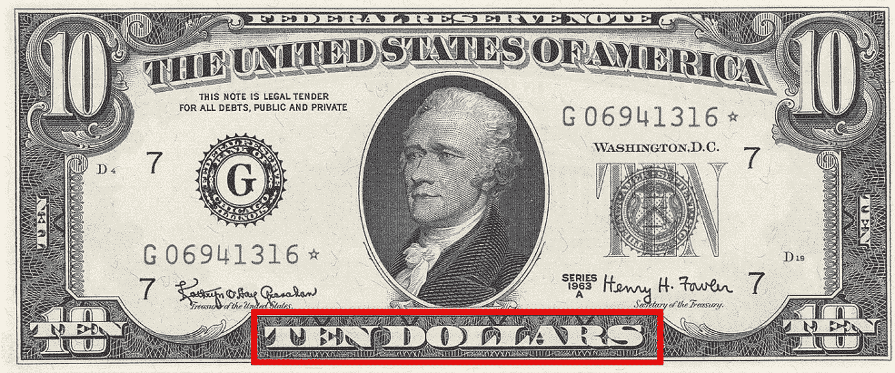
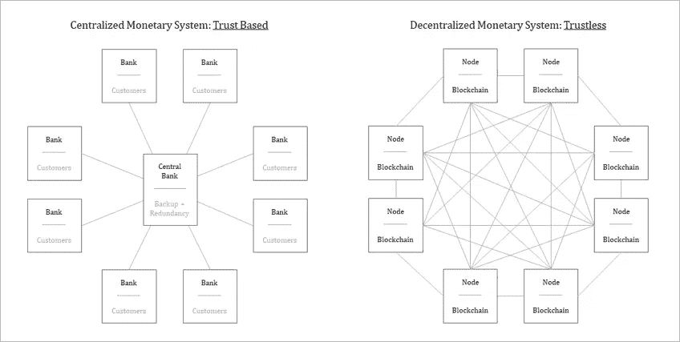
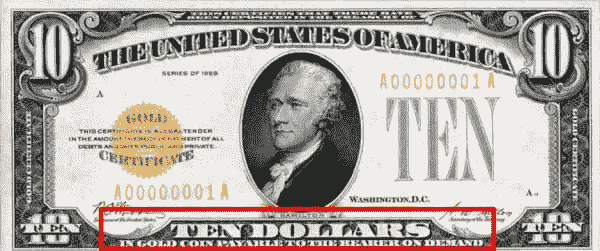
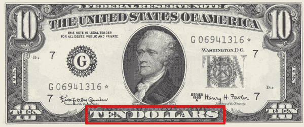

# 钱是什么？

> 原文：<https://medium.com/coinmonks/what-is-money-d016aa8d0a0e?source=collection_archive---------34----------------------->

***“在没有金本位的情况下，没有办法通过通货膨胀保护储蓄不被没收。没有安全的价值储存。如果有，政府将不得不宣布其持有为非法，就像在黄金问题上所做的那样。福利国家的金融政策要求财富的所有者没有办法保护自己。”***

*艾伦·格林斯潘*

公元 3 世纪，罗马经济陷入危机。通货膨胀猖獗，易货贸易现在是整个帝国的主要贸易形式。政治动荡随之而来，从公元 235 年到 284 年，有 50 多个皇帝统治着这个衰落的帝国。他们中的大多数人在战斗中被谋杀、暗杀或杀害。当君士坦丁在公元 306 年成为皇帝时，他成功地重新统一了分裂成三个国家的帝国；并将首都从罗马迁至君士坦丁堡(今天的伊斯坦布尔),标志着东罗马帝国的诞生。

他还实施了经济改革以稳定货币体系。一种新的金币 Solidus(拉丁语意为固体)被引入以抑制通货膨胀，它含有 1/72 磅(4.55 克)的黄金。结果，东罗马帝国繁荣昌盛，而西方国家的经济由于货币贬值和物物交换的广泛使用而持续衰退。Solidus 成为整个罗马/拜占庭帝国的标准，并被广泛用于国际贸易，直到 11 世纪才经历了严重的贬值。

1971 年 8 月 15 日，理查德·尼克松总统“暂时中止”美元与黄金的兑换，震惊了世界。这种暂时的暂停变成了永久的暂停，从而正式结束了将美元价值与黄金挂钩的布雷顿森林体系，并允许其他中央银行将美元兑换成黄金。一夜之间，美元变成了自由浮动的法定货币(fiat 是拉丁语，意为“让它去做”)，随后，世界上所有其他货币都变成了法定货币，因为它们都是美元衍生品。与延续了 1 000 多年的统一货币体系相比，目前的法定货币体系只有 50 年的历史，在很大程度上仍然是一个正在进行的经济实验。我们大多数 1971 年后出生的人并不认为当前的法定货币体系有什么问题，我们已经接受它是正常的。

这部分是因为我们大多数人不知道钱到底是什么，也是因为我们当前货币体系的不透明性。只有回到基本原则，问一个最基本的问题，“钱是什么？”系统中固有的危险裂缝是否变得明显。例如，菲亚特系统的一个主要缺陷是，它让政府能够进行赤字支出。魏玛德国、委内瑞拉和津巴布韦是一些可以从赤字开支的危险中吸取教训的例子。冠状病毒疫情极大地加速了赤字支出，因为政策制定者试图通过发放价值数万亿美元的刺激支票来缓冲其公民免受封锁的影响。随着通货膨胀率在政府债务上升的刺激下不断攀升，比特币作为一种替代品的重要性对许多人来说将变得显而易见。

几个世纪以来，黄金一直是法定货币的最佳替代品，原因之一是其购买力不受政府政策的影响。法定货币作为黄金收据出现，因为长距离运输黄金被证明是麻烦和不安全的，因此利用了黄金的货币属性。没有黄金，法定货币就不会以现在的形式存在。比特币破坏了黄金，黄金是所有模拟社会的基础层，尽管它与黄金类似；它的货币属性远远优于黄金和纸币。加密技术、基于共识规则的透明货币政策(由分散节点网络执行，完整节点是一台维护完整版比特币区块链的计算机)和不可变的交易分类账(其完整性由矿工网络保证)的组合；强化和保护比特币的货币属性。

这一切和你有什么关系？考虑到我们大部分时间都在为钱而工作，许多问题浮现在脑海中。如果作为我们文明基础的货币体系存在根本缺陷，那么你的劳动的真正价值是什么？你会继续每年加倍努力工作，只是为了在财务上保持不变吗？这对你的投资有什么影响？你的股票投资组合会超过通货膨胀吗？你的退休投资组合会免受通货膨胀的影响吗？你能负担得起退休生活吗？我可以继续说下去，但我相信你已经明白了。

在可预见的未来，当前的菲亚特系统可能会在很大程度上失败或崩溃。不了解货币到底是什么，就很难理解为什么比特币是必要的，以及为什么拥有比特币是目前防范金融体系灾难性失败的最佳保险形式。即使这在我们的有生之年不会发生，与大量传统的基于法定货币的投资工具相比，随着时间的推移，比特币仍然是最好的财富储存手段。

(1)

***“货币不是国家的发明。它不是立法行为的产物。甚至政治权威的认可也不是它存在的必要条件。某些商品很自然地成为货币，这是独立于国家权力之外的经济关系的结果。”***

[T5【卡尔·门格尔】T6](https://www.azquotes.com/author/32103-Carl_Menger)

贝宝的联合创始人彼得·泰尔在他的书《零比一》中描述了贝宝最初的使命，他说:“至少贝宝有一个合适的宏伟使命——那种后泡沫时代的怀疑论者后来称之为宏伟的使命: ***我们想创造一种新的互联网货币来取代美元。”尽管这一“疯狂”使命的原因数不胜数，但有一点是显而易见的，即法定货币体系存在根本性缺陷。更重要的是，取代美元的使命不是由任何政府机构指导或影响的。它诞生于为 21 世纪创造一种更好的货币形式的愿望。这不是第一次有人试图创造一种互联网货币，正如你现在已经知道的，这也不会是最后一次。PayPal 后来确实偏离了这一使命，但仍需要一个新的货币体系来取代菲亚特。***

没有回答最重要的问题就批评法定货币体系是很容易的；金钱到底是什么？是黄金还是白银还是美元？货币可以被定义为一种通用的交换媒介，一种能够跨越时间和空间进行价值转移的技术。货币也是思考和衡量不同商品和服务价值的工具。在这个想法的基础上，我们还可以说它是你思维过程的延伸。这就是为什么操纵货币体系是危险的，因为它扭曲了你对真实价值的理解和计算。简而言之，这是一种洗脑。金钱既是能源，也是有效利用和引导能源的工具。钱不仅仅是一张印着政客头像的纸，最棒的是；这不是政府的创造。总结这一切； ***货币是通用的交换媒介，是一种跨越时间和空间转移价值的技术，是你思考价值的思维延伸，是一种对所有其他形式的能量都有要求的能量形式。***

任何被认为是货币的东西都必须满足以下五个特性:

> *可分的*
> 
> *便携式*
> 
> *经久耐用*
> 
> *可识别的*
> 
> *稀缺*

数千年来，黄金最能满足货币的上述属性，在比特币出现之前，黄金在这一角色上一直无可争议。法定货币满足上述所有特征，除了最后一个，稀缺性，因为它没有数量限制。对货币的需求必须总是超过供给，对于法定货币来说，情况正好相反，从而导致通货膨胀。

随着时间的推移，法定货币从黄金支持的货币转变为债务支持的货币；其中的细节在[“*通货膨胀是时间盗窃”中有深入的讨论。*](https://kudzai.substack.com/p/inflation-is-time-theft-bitcoin-fixes) 下表给你一个黄金与美元转换的历史快照:

(3)

与黄金不同，法定货币的价值不是来自自由市场，也不是纯粹基于我们上面概述的货币属性。法定货币最初是作为黄金的部分代表。纸币解决了黄金固有的便携性限制，它实际上是一张可以随时兑换黄金的借据或收据。现行的法定货币体系就是从黄金的这一缺点中诞生的。这种可携带性限制导致黄金托管由银行集中，因为它们最终开始发行更多超过托管黄金数量的“纸质收据”。这违背了整个系统建立的信任，你今天接受纸币，并认为它可以在未来的某个时候兑换成固定数量的黄金。

(4)

这种违反信任的行为至今仍在继续。我们也相信央行作为唯一的货币发行者能够管理和维持货币供应的稳定；这就是问题所在。正如 Satoshi 指出的那样，*“传统货币的根本问题是它运转所需的所有信任。必须相信中央银行***不会让货币贬值，但法定货币的历史充满了对这种信任的破坏。我们必须信任银行持有我们的钱，并以电子方式转移，但它们在信贷泡沫的浪潮中放贷，几乎没有一部分储备。”如果历史可以为鉴，中央政府过度膨胀货币供应量的诱惑仍有待克服。无论是为下一场战争融资还是“建设新的基础设施”或者寻求连任，政客们总是有动机在短期内扩大货币供应，这是以你的钱的长期购买力下降为代价的。这是发明比特币的原因之一:这样你就可以选择要么承担有缺陷的货币体系的风险，要么承担自我主权的责任。**

**“我* ***相信，要解决任何以前从未解决过的问题，你必须让未知的门半开。”****

*理查德·费曼教授*

*与法定系统形成鲜明对比的是，比特币是一个不可信的货币网络，它的运行不依赖于对任何第三方的信任。Satoshi 在[比特币白皮书](https://bitcoin.org/bitcoin.pdf)中用以下语句解释了无信任货币网络的重要性:*“我们需要的是一个基于密码证明的电子支付系统，而不是信任的***，允许任何两个自愿方直接相互交易，而不需要一个* ***可信的第三方。”*⑤****

****

**(3)**

**完全节点基于一组公共的网络共识规则独立地组合一个版本的区块链，并且每个节点验证所有事务。任何人都可以运行一个完整的节点，访问比特币网络，并在没有许可的基础上广播交易。节点不需要**信任**任何其他节点。这是因为每个节点根据一套通用的规则独立审计比特币交易的完整历史，允许网络在不信任的基础上收敛于一致和准确的交易历史版本。**

**所有交易的历史由所有节点维护，允许每个节点确定任何未来交易的有效性。网络是完全分散的，没有单点故障。每个节点都是对网络其余部分的制衡，如果没有一个集中的真实来源，网络就无法抵御攻击和腐败。这是世界上最安全的计算网络，因为任何人都可以访问它，而且它是 100%不可信的。任何节点都可能发生故障或损坏，但即使发生这种情况，网络的其余部分也不会受到影响。随着网络上节点数量的增加，比特币变得更加分散，从而使网络更能抵御腐败和审查。这是比特币网络消除对任何集中式第三方信任的机制。(3)**

**虽然上述内容对一些人来说可能有点技术性，但最重要的是，比特币的不可信性质使网络完全透明，没有任何一个实体有权在没有所有参与节点达成共识的情况下随意改变网络规则，从而确保所有比特币持有者的平等财产权，无论他们持有的比特币的经济价值如何。与《动物庄园》不同，没有动物“比其他动物更平等”这一突破的重要性怎么强调都不为过，因为在法定货币体系中情况正好相反。此外，例如，住在拉格斯的持有比特币的人，现在基本上不受 DC 政府决策的影响，不像他的同龄人那样持有美元存款。**

*****“货币是经济体系的神经中枢。因此，如果国家能够获得对所有账户单位的绝对控制，那么国家就能够支配整个经济体系和整个社会。”*****

***默里·罗斯巴德***

**读写能力不是我们与生俱来的能力，但它是一种心理技术，可以增强我们的思维过程、解决问题的技能和认知能力。在 1440 年印刷机发明之前，只有 20%的英国成年人识字，而且这些人大多是上层社会的精英。书籍以卷轴的形式存在，并且大多是手写的，这使得它们非常昂贵并且很难得到。14 世纪一本书的成本相当于一栋房子的成本。(6)印刷机的发明使得以较低的价格大量生产书籍成为可能，从而使公众获取知识的途径民主化。结果，识字率上升，到 1800 年，62%的英国成年人识字。如果不是因为这个新发现的超级大国廉价地向许多人传播信息，科学革命、文艺复兴和新教改革就不会产生很大的影响，甚至不会起步。这使得合作比以往任何时候都多，同时加速了思想的传播。神学家马丁·路德完美地总结了印刷机在宗教改革中发挥的巨大作用，他说:“印刷是上帝的终极礼物，也是最伟大的礼物。”**

**金钱使我们能够交流、衡量和思考不同商品和服务的价值。它也是一种心理技术，因为没有它，经济计算几乎是不可能的。如果没有准确的经济计算能力，怎么可能有效地经营企业呢？即使是复式记账会计也是从准确跟踪和记录财务交易的需要发展而来的。然而，今天的主要问题是，就像印刷术发明之前的时期一样，尽管我们处于“信息时代”，但金融文盲在我们的社会中普遍存在。我不是指传统意义上的不懂财务管理的基本概念的财务盲，而是指未能理解金钱到底是什么和不是什么的根本意义上的财务盲。这也是为什么从个人层面到国家层面都存在大量不正当投资的部分原因。当一个人对金钱的理解存在严重缺陷时，他怎么能做出明智的财务决策呢？**

**比特币是一项发明，它颠覆了我们继承的中央金融体系的所有前提。比特币挑战了传统体系的基本前提，即一点点通胀是可以接受的，或者控制自己的资金风险很大，或者中央计划者最清楚等等。有“一点通货膨胀”是对你的财产权的侵犯，因为这是一种通过后门没收你的财富的形式。必须从头开始建立一个与现状完全不同的新的选择环境。随着菲亚特系统的裂缝越来越明显，系统内的每一个经济指标都将被破坏。一些国家甚至审查真实的通货膨胀率，最近的一个例子是土耳其，总统解雇了统计机构的负责人，因为他公布了创纪录的高通货膨胀率。对抗体制的唯一方法就是从外部下注并获胜。比特币是出口。**

# **来源**

**1.**剩余的货币。**二十元金圆券黄色印章。*剩余的货币。*【在线】【引用时间:2022 年 2 月 3 日。][https://www . leftovercurrency . com/app/uploads/2017/03/twenty-dollars-gold-certificate-yellow-seal-1 . jpg .](https://www.leftovercurrency.com/app/uploads/2017/03/twenty-dollars-gold-certificate-yellow-seal-1.jpg.)**

**2.**蒂尔，彼得。** *创业公司零比一笔记，或者说如何打造未来。*纽约:皇冠商务，2014 年。**

**3.**刘易斯·帕克。**比特币不是无中生有。*被解放的资本。*【在线】【引用时间:2022 年 02 月 03 日。][https://unchained . com/blog/bit coin-is-not-backed-by-nothing/。](https://unchained.com/blog/bitcoin-is-not-backed-by-nothing/.)**

**4. **BTC，记录在案。**货币简史。*推特。*【在线】【引用时间:2022 年 2 月 3 日。]**

****

**[记录比特币📄@DocumentingBTC](https://twitter.com/DocumentingBTC/status/1436787677081309191?s=20&t=MsL5MtHbyFg7KIbJq_QsMQ.)**

**关于金钱的简短历史课**

************

**2021 年 9 月 11 日**

**[1651 条转发 6581 个赞](https://twitter.com/DocumentingBTC/status/1436787677081309191?s=20&t=MsL5MtHbyFg7KIbJq_QsMQ.)**

**5.**中本聪。**比特币:一种点对点的电子现金系统。*比特币。*【在线】【引用时间:2022 年 2 月 3 日。][https://bitcoin.org/bitcoin.pdf.](https://bitcoin.org/bitcoin.pdf.)**

**6.**历史。印刷机改变世界的 7 种方式。*历史。*【在线】【引用日期:2022 年 2 月 4 日。】[https://www.history.com/news/printing-press-renaissance.](https://www.history.com/news/printing-press-renaissance.)****

> **加入 Coinmonks [电报频道](https://t.me/coincodecap)和 [Youtube 频道](https://www.youtube.com/c/coinmonks/videos)了解加密交易和投资**

# **另外，阅读**

*   **[如何匿名购买比特币](https://coincodecap.com/buy-bitcoin-anonymously) | [比特币现金钱包](https://coincodecap.com/bitcoin-cash-wallets)**
*   **[瓦济里克斯 NFT 评论](https://coincodecap.com/wazirx-nft-review)|[Bitsgap vs Pionex](https://coincodecap.com/bitsgap-vs-pionex)|[坦吉姆评论](https://coincodecap.com/tangem-wallet-review)**
*   **[如何使用 Solidity 在以太坊上创建 DApp？](https://coincodecap.com/create-a-dapp-on-ethereum-using-solidity)**
*   **[币安 vs FTX](https://coincodecap.com/binance-vs-ftx) | [最佳(SOL)索拉纳钱包](https://coincodecap.com/solana-wallets)**
*   **[如何在 Uniswap 上交换加密？](https://coincodecap.com/swap-crypto-on-uniswap) | [A-Ads 评论](https://coincodecap.com/a-ads-review)**