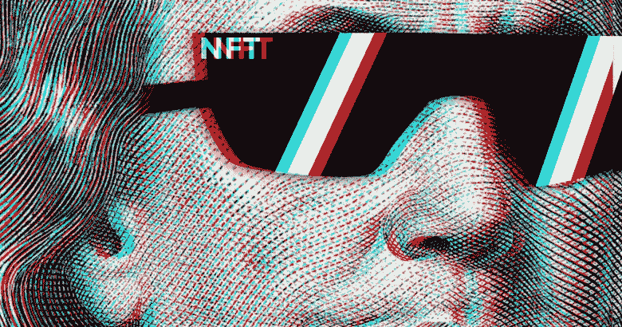
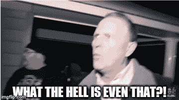
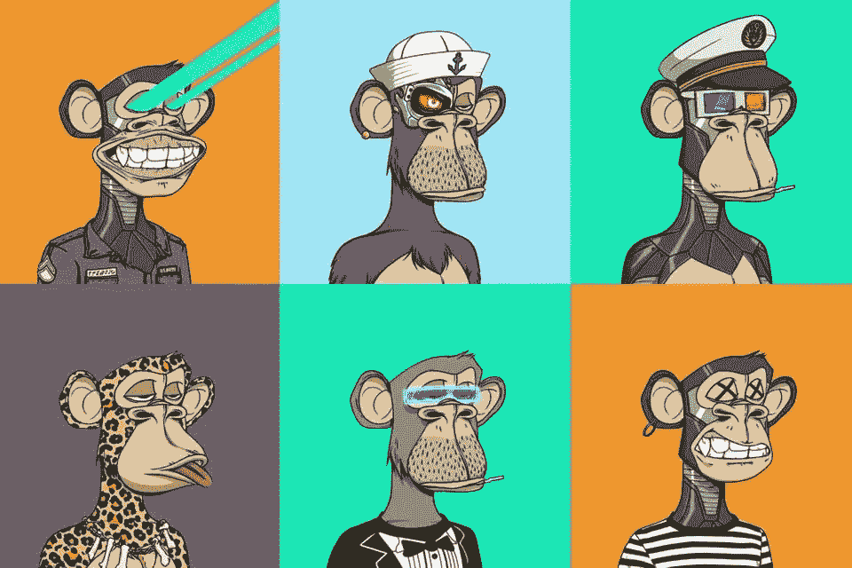
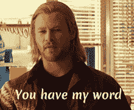
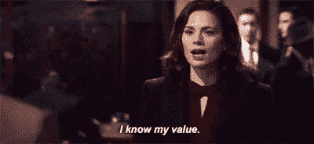

# 什么是 NFT？

> 原文：<https://medium.com/coinmonks/what-is-nft-1b21eb1b3ccf?source=collection_archive---------64----------------------->

By Melissa Kuhnert on SEEBURGER blog

NFT 不仅是现在的流行趋势，而且也是它的顶峰。

你难道不好奇为什么现在不仅大公司，连艺术家也开始涉足 NFT 的生意了吗？我是说，NFT 到底是什么？

By LaLaSimmer on Tumblr

所以我准备了这个。今天，我们将花时间来了解 NFT 是什么。

*那么，我们开始吧！*

## NFT 的定义

NFT 是一种不可替代的货币。

正如你在我们之前与硬币相关的帖子中所看到的，加密货币可以兑换现金或相同金额的其他硬币(像真实货币一样)，但 NFT 实际上不能与其他 NFT 进行兑换或交易。

简而言之，这意味着虚拟资产不能用其他代币代替区块链中的代币。如果出现这种情况，你就不用担心搬到另一个地方，这样资产的所有权就清晰了，对吧？

因此，NFT 将各个领域的数字资产标记化，包括需要创作的游戏和艺术品，甚至是如今的房地产。

Image from Art Rights

By Eric Bartelson on Premortem Games

## NFT 安全吗？值得信任吗？

我觉得稳定是很多人担心的。

在数字世界中，即使是我创作的作品，如果没有来源或标识，也可以很快成为别人的作品。​

然而，NFT 绝不会那样做！

GIF on Tenor

当然，我不能保证它可以防止 100%的复制，但所有 NFT 的内容都包含独特的认可价值和所有权信息。而且由于信息是记录在区块链上的，永远无法复制，即使是复制，也不难找到原主。

但是从价格上来说我不敢说安全，哈哈。

## 流行的原因和前景

那么，NFT 难道不是只对搞艺术的人方便和有益吗？

GIF on GIPHY

答案是否定的。

NFT 不仅受艺术家欢迎，也受公众欢迎的原因是因为它的稀缺性。前面说过，独特的认同价值观和所有权是吸引买家的最大原因。

不管是否出名，我买了某人唯一的作品或他们拥有的东西本身的稀缺性是值得的。

所以，不仅名人，普通人也可以成为卖家。

然而，虽然名气是你不能忽视的事情之一，但买家追随名气不一定是正确的，因为许多 NFT 卖家正在尝试各种有内容的东西。

NFT 最重要的是**价值**。

GIF on Tenor

重要的是我创作的内容有多有价值，大众有多想买。

> 今天，我们谈论了 NFT，这是最近的热门话题。你觉得怎么样？
> 
> 如果你对 NFT 以及硬币、金融科技等更感兴趣的话。，请随时来我们的社区获取任何相关信息:)
> 
> **推特**:[https://twitter.com/el_coinmonster](https://twitter.com/el_coinmonster)
> 
> 下集见！:)

​

> 加入 Coinmonks [电报频道](https://t.me/coincodecap)和 [Youtube 频道](https://www.youtube.com/c/coinmonks/videos)了解加密交易和投资

# 另外，阅读

*   [瓦济里克斯 NFT 评论](https://coincodecap.com/wazirx-nft-review)|[Bitsgap vs Pionex](https://coincodecap.com/bitsgap-vs-pionex)|[Tangem 评论](https://coincodecap.com/tangem-wallet-review)
*   [如何使用 Solidity 在以太坊上创建 DApp？](https://coincodecap.com/create-a-dapp-on-ethereum-using-solidity)
*   [币安 vs FTX](https://coincodecap.com/binance-vs-ftx) | [最佳(SOL)索拉纳钱包](https://coincodecap.com/solana-wallets)
*   [如何在 Uniswap 上交换加密？](https://coincodecap.com/swap-crypto-on-uniswap) | [A-Ads 审查](https://coincodecap.com/a-ads-review)
*   [加密货币储蓄账户](/coinmonks/cryptocurrency-savings-accounts-be3bc0feffbf) | [YoBit 评论](/coinmonks/yobit-review-175464162c62)

​