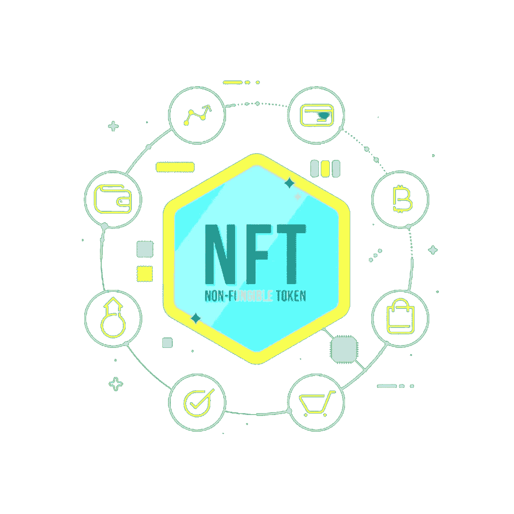
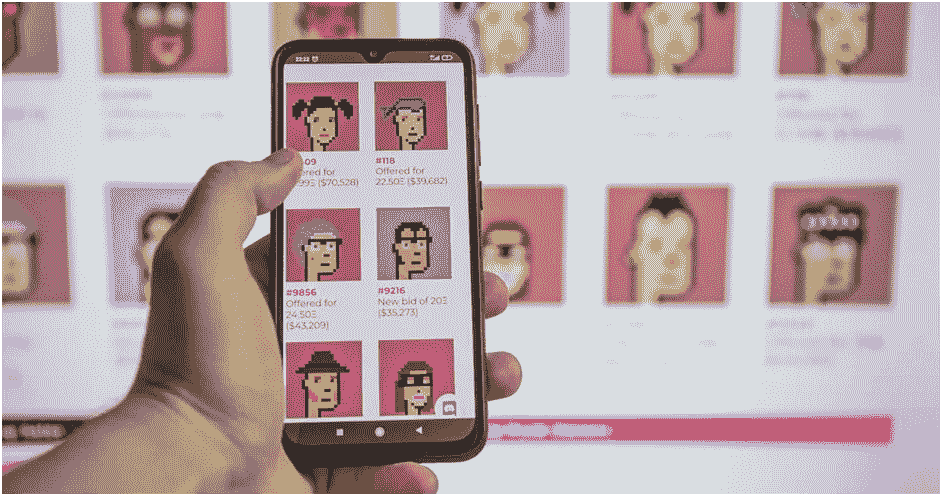
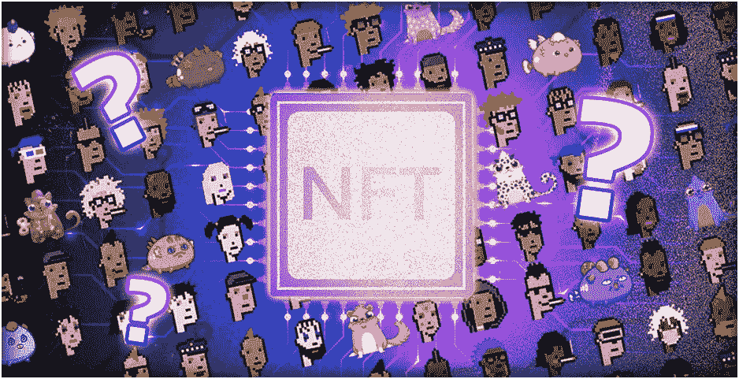
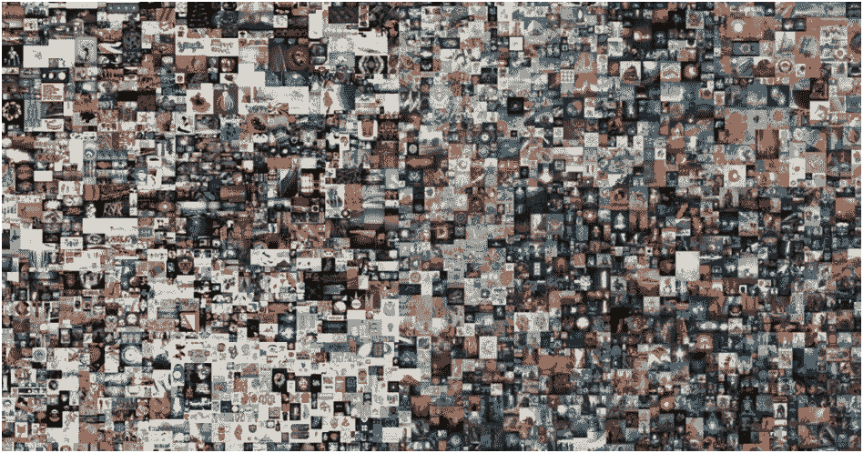
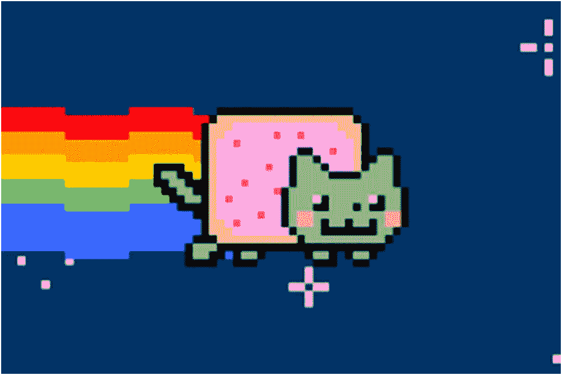
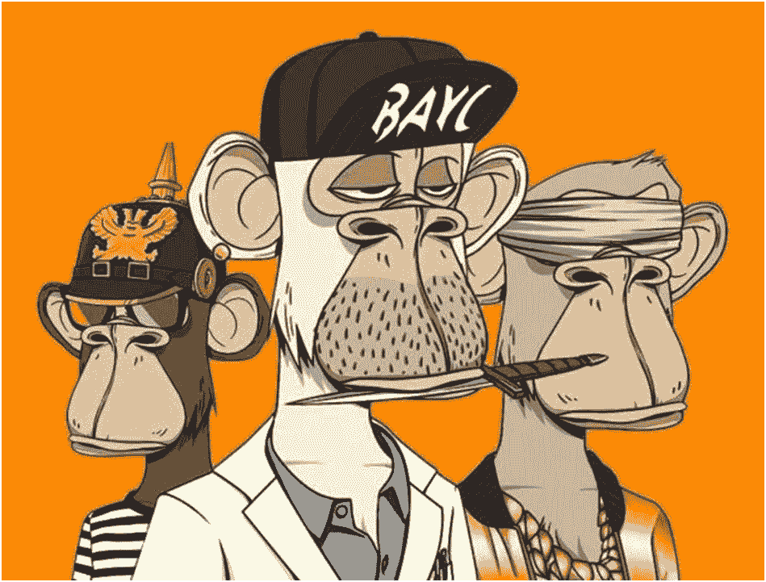

# 什么是 NFT？

> 原文：<https://medium.com/coinmonks/what-is-nft-378fed82a233?source=collection_archive---------23----------------------->

## 什么是 NFT(不可替代令牌)？

如今，像什么是 NFT 这样的问题？你怎么能买 NFT 呢？非常受欢迎。您可以在本文中找到这些问题的答案和关于 NFTs 的基本信息。

我们看到 NFT 被用于数字艺术、收藏品、游戏、音乐、电影、体育和时尚等领域。例如，Twitter 首席执行官杰克·多西以 290 万美元的价格出售了他作为 NFT 的第一条推文。但是在你进入这个领域之前，有一些基础知识你应该知道。在本文中，我们为您编译了它们。

## **什么是 NFT？**

不可替代令牌(NFT)是存储在区块链上的不可互换的数据单位，是一种可以出售和交易的数字分类账形式。NFT 数据单元的类型可以与诸如照片、视频和音频的数字文件相关联。因为每个令牌都是唯一可识别的，所以 NFT 不同于大多数加密货币，如比特币，它们是可替代的。

NFT 分类账声称提供一个公共证书的真实性或所有权的证明，但 NFT 传达的法律权利可能是不确定的。NFT 不限制底层数字文件的共享或复制，不一定传达数字文件的版权，并且不阻止具有相同关联文件的 NFT 的创建。

NFT 一直被用作投机资产，它们因验证区块链交易的能源成本和碳足迹以及在艺术品骗局中的频繁使用而受到越来越多的批评。NFT 市场也被比作庞氏骗局。

NFT 现在被用来商品化艺术、音乐、体育和其他流行娱乐中的数字资产。大多数 NFT 是以太坊区块链的一部分；然而，其他区块链可以实现他们自己版本的 NFT。

NFT 的市值在 2020 年增长了两倍，超过 2.5 亿美元。NFT 交易的增加引发了越来越多的环境批评。工作验证，主要用于 NFT 的那种，与区块链相关的计算繁重的过程需要高能量输入，这导致了全球变暖。维持这些区块链所需的能源产生的碳排放迫使 NFT 市场的一些人重新思考他们的碳足迹。

## **如何制作 NFT？**

任何人只要有一点点钱就可以铸造一枚 NFT。今天的 NFT 平台提供了一些工具，可以让你创建各种各样的非锁定文件，还可以给你的文件附加不可锁定的内容。无论你是艺术家、音乐家、收藏家、企业家还是公司，你都可以使用 NFT 市场上的简单铸造工具来创造你自己的 NFT。NFT 需要使用一种称为密码术的技术来创建数字令牌。在加密领域，这种令牌创建被称为铸造。通常情况下，你必须付费才能使用加密货币创建智能合同，以制造 NFT。

智能合同是一段软件代码，使区块链能够安全透明地存储信息。最终，这些代码是管理 NFT 所有权和转让的技术。

NFT 铸币厂生产的 ERC-727C 令牌标准是由区块链以太坊的开发者编写的。当然，让 NFT 生产商的工作变得更容易是很重要的，因为区块链的技术层面会变得相当复杂。为制造商执行 NFT 生产过程提供便利的平台促进了这种情况。这样，厂商在这个过程中需要的是一个数字加密货币钱包。

## 如何销售 NFT？

有很多在线平台可以用来制作和销售 NFT。一些最受欢迎的 NFT 拍卖平台包括 OpenSea、Rarible、SuperRare、Nifty Gateway、Foundation、VIV3、BakerySwap、Axie Marketplace 和 NFT 展厅。

NFT 也有很多支付平台，其中最著名的有比特币基地、MetaMask、Torus、Portis、WalletConnect、MyEtherWallet 和 Fortmatic。

要制造和销售 NFT，你需要加密货币。上面提到的所有 NFT 拍卖平台都希望预先支付“铸造”NFT 的费用，这是一个将你的艺术品变成你可以出售的不可替代的令牌的过程。

在大多数情况下，支付必须以加密货币进行，这意味着在你有机会通过出售你的作品的 NFT 获得任何加密货币之前，你需要购买一些以支付费用。

如果你已经拥有一些 ETH，你需要确保你有一个数字钱包，你需要连接到你选择的 NFT 平台进行(和接收)支付。

## **流行 NFT 的例子**

1.  **每一天:前 5000 天**

这幅 NFT 是一幅由 5000 幅图像组成的数字拼贴画，由数字艺术家迈克·温克尔曼创作，他在专业上被称为 Beeple。它被铸造为 JPG 档案，并于 2021 年在一家主要拍卖行以创纪录的 6930 万美元售出。这个 NFT 的价值在于从 2007 年 5 月 1 日到 2021 年 1 月 7 日，人们每天制作 5000 张未来主义的照片。

**2。** **年年猫 GIF**

NFTs 最酷的一点是，任何人都可以把他们的创造变成独一无二的资产。在 10 周年纪念日，Nyan Cat 的创造者决定将这个广受欢迎的 GIF 图片变成 NFT 并拍卖掉。你能猜出中标的是什么吗？300 个以太币！

**3。** **无聊猿游艇俱乐部**

无聊猿游艇俱乐部是 NFT 最卖座的 1 万只卡通猿的集合。这是四个朋友的想法，他们受到启发，用猿作为他们的社交化身，因为“模仿”是一个术语，指那些不考虑风险就购买新 NFT 的人。他们一点也不知道，几年后，从企业家到名人，每个人都会蜂拥而至，在他们的创作上花费数十万美元。(例如，阿姆花了 46.2 万美元买了一只无聊的猿 NFT。)

## **简单地说**

当然，这篇文章并不是一个全面的列表。NFT 是一个非常大的领域。在不涉及太多技术细节的情况下，我们希望能够回答您的问题，尤其是主要问题“什么是 NFT？”。不应忘记，该部门发展非常迅速，每天都有新项目诞生。

*乌姆查卡*

**来源:**

[https://www.creativebloq.com/how-to/make-and-sell-an-NFT](https://www.creativebloq.com/how-to/make-and-sell-an-NFT)

[https://cryptogamingarea.com/en/faq/nft-definition/](https://cryptogamingarea.com/en/faq/nft-definition/)

[https://www . latimes . com/business/technology/story/2021-03-11/NFT-explainer-crypto-trading-collectible](https://www.latimes.com/business/technology/story/2021-03-11/nft-explainer-crypto-trading-collectible)

[https://mymodernmet.com/what-is-nft-crypto-art/](https://mymodernmet.com/what-is-nft-crypto-art/)

[https://www.oberlo.com/blog/how-to-make-nft](https://www.oberlo.com/blog/how-to-make-nft)

 [## 人们在非食物疗法上花费了数百万。什么？为什么？

### NFT，或不可替代的令牌，已经存在一段时间了，但是“NFT”是什么意思呢？几个…

www.theverge.com](https://www.theverge.com/22310188/nft-explainer-what-is-blockchain-crypto-art-faq) 

> 加入 Coinmonks [电报频道](https://t.me/coincodecap)和 [Youtube 频道](https://www.youtube.com/c/coinmonks/videos)了解加密交易和投资

# 另外，阅读

*   [Bookmap 点评](https://coincodecap.com/bookmap-review-2021-best-trading-software) | [美国 5 大最佳加密交易所](https://coincodecap.com/crypto-exchange-usa)
*   最佳加密[硬件钱包](/coinmonks/hardware-wallets-dfa1211730c6) | [Bitbns 评论](/coinmonks/bitbns-review-38256a07e161)
*   [新加坡十大最佳加密交易所](https://coincodecap.com/crypto-exchange-in-singapore) | [收购 AXS](https://coincodecap.com/buy-axs-token)
*   [红狗赌场评论](https://coincodecap.com/red-dog-casino-review) | [Swyftx 评论](https://coincodecap.com/swyftx-review) | [CoinGate 评论](https://coincodecap.com/coingate-review)
*   [投资印度的最佳加密软件](https://coincodecap.com/best-crypto-to-invest-in-india-in-2021)|[WazirX P2P](https://coincodecap.com/wazirx-p2p)|[Hi Dollar Review](https://coincodecap.com/hi-dollar-review)