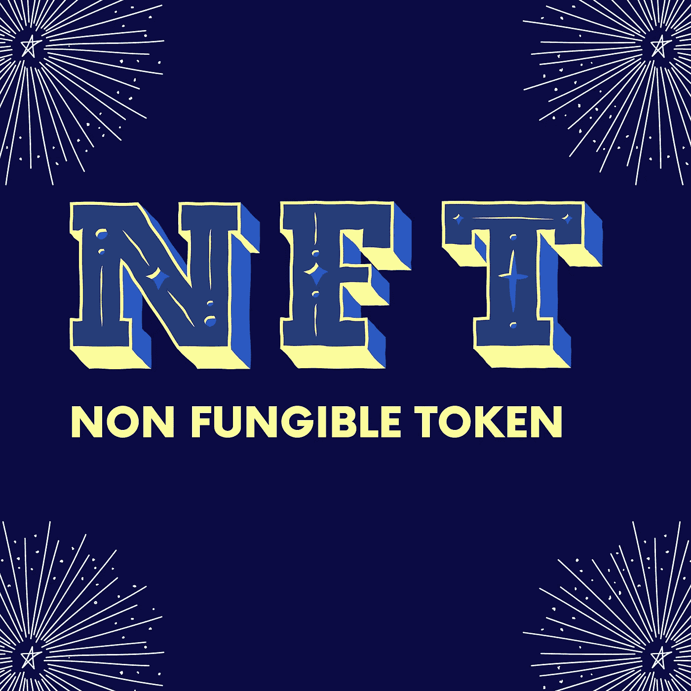

# 什么是 NFT，你如何从 NFT 赚钱？

> 原文：<https://medium.com/coinmonks/what-is-nft-and-how-you-can-make-money-from-nft-bf008d800b84?source=collection_archive---------29----------------------->

Design on canva

在不可替代代币(NFT)出现之前，数字复制在创作者和用户中变得猖獗。很难确定资产的独特性。NFT 的创作使创作者从他们的作品中获得收入成为可能。每个 NFT 都有一个数字签名，这使得 NFT 不可能被复制，并帮助创作者证明他们的资产所有权。

要购买或出售 NFTs，在与 NFTs 市场交互之前，需要一个加密钱包和一些加密。

由于 NFT 的独特性和优势，它已经成为[分散金融世界(DeFi)中的主要用例之一。](/coinmonks/beginner-guide-to-decentralized-finance-defi-30f9c6cb510d?source=friends_link&sk=230b3825f5ceb6456828bd157082752c)

# 什么是 NFT？

不可替换令牌(NFT)是一种基于区块链构建的加密令牌，代表唯一且不可互换的资产。它可以由现实世界资产或数字项目的标记化版本来表示，包括歌曲、动画 gif、绘图或视频游戏中的项目。NFT 和加密货币是用相同的编程方法构建的，但这就是它们的相似之处。

可替代性这个词意味着一项资产是可以互换的，1 美元可以换成另外 1 美元，因为它们是相同的，价值也是一样的。NFT 是不可替换的，它们不能为另一个令牌完全相同地改变，它不同于可以为彼此完全相同地改变的 ERC-20 令牌。这使得它可以作为所有权和真实性的证明。

NFT 是不可分割的，它们不能像硬币一样被分割成更小的部分，它只作为一个独特的物品存在。每张 NFT 都有所有者的数字签名，这使得它不可能被复制，并有助于证明财产所有权。它可以在区块链上出售赚钱，一个很好的例子是迈克·温克尔马，又名毕普，他在区块链以太坊以 6900 万美元的价格出售了 NFT。这件作品的标题是*“每天-前 5000 天”*，这是他从项目的 5000 天收集的艺术作品。以 NFT 的形式将其艺术品转移到区块链，使其不可能被复制，也没有权力证明对它们的所有权。

NFT 是使用 ERC- 721 和 ERC- 1155，以太坊的通用 NFT 协议，在区块链上建造的。我们还有币安智能链的 BEP- 721 和 BEP-1155。

NFT 可以在 NFT 市场上买卖，比如以太坊上的 opensea 和币安智能链上的 Treasureland 或 Bakeryswap。要存储或购买 NFT，需要一个加密钱包，如元掩码或信任钱包。还值得注意的是，NFT 不能用信用卡或贝宝购买，如前所述，在与 NFT 市场互动之前，需要一个加密钱包和一些加密。

建在区块链上的 NFT 并没有让它免于黑客攻击。它可以被黑客攻击，就像密码资产从交易所或钱包被黑客攻击一样。支持加密钱包的区块链网络很难被黑客攻击。这是黑客倾向于瞄准 NFT 所有者用来交易或存储加密资产的网络的主要原因。保持您的资产私钥安全是保护您的 NFT 的最佳选择，您的加密钱包种子短语不应被泄露。

# NFT 用例

# 1.游戏:

NFT 在游戏世界里非常有用。用户从区块链科技发行的基于 NFT 的游戏的游戏内物品购买中获益。一个例子是**去中心化**。分散土地是一个基于区块链的虚拟现实世界，用户在这里买卖名为土地的 ERC-721 令牌。

分散之地还有一个名为 MANA 的 ERC-20 代币，可以用来购买游戏中的其他物品。分散土地有各种各样的活动，用户可以参加，如游戏，艺术表演，和专门的活动。

**我的秘密英雄**也是一款基于 NFT 的游戏，多人一起玩游戏。角色和其他游戏内物品的 NFT 由 crypto heroe 发行。玩家还可以通过获得包含战斗和任务的 NFT 来提升他们的角色。

# 2.数字艺术

数字艺术家和收藏家受益于 NFT 的创作。在创作 NFT 之前，验证数字艺术的独特性和真实性是一个挑战。NFT 的诞生为这个问题提供了一个解决方案。

任何人都可以在以太坊上复制数字艺术，下载或保存图像，但不可能证明原件的所有者。NFTs 艺术品市场包括超稀有、已知产地等。

# 3.不动产

在虚拟和现实世界中销售数字房地产是 NFTs 的另一个用例。用户可以在虚拟世界中创建和购买区域。NFTs 在不动产方面的工作是确定不动产的原始所有者和生产者。虚拟房地产的一个例子是*“火星屋”*一个用玻璃建造的被霓虹灯包围的家。作为一个虚拟的房子，业主不能进入。房子*“火星屋”*售价约 50 万美元。

虚拟房地产可以在 NFTs 市场上出售，所有者可以通过 NFT 记录在分散的分类账上。

区块链已经有几个虚拟房地产，但是还没有人提出 NFTs 在现实世界中的应用。未来，将 NFT 用于真实世界的房地产可以作为一种验证资产所有权的方式。

# 结论

NFT 是证明资产所有权的一种方式，也是从艺术品中赚钱的一种方式。你可以在 NFT 市场买卖 NFT。在区块链游戏基地玩游戏和出售游戏中的物品是从 NFTs 中获利的另一种方式。NFT 的未来将会把现实世界的房地产符号化为 NFT，使其更加安全可靠。

> 加入 Coinmonks [电报频道](https://t.me/coincodecap)和 [Youtube 频道](https://www.youtube.com/c/coinmonks/videos)了解加密交易和投资

# 另外，阅读

*   [币安期货交易](https://coincodecap.com/binance-futures-trading)|[3 commas vs Mudrex vs eToro](https://coincodecap.com/mudrex-3commas-etoro)
*   [如何购买 Monero](https://coincodecap.com/buy-monero) | [IDEX 评论](https://coincodecap.com/idex-review) | [BitKan 交易机器人](https://coincodecap.com/bitkan-trading-bot)
*   [CoinDCX 评论](/coinmonks/coindcx-review-8444db3621a2) | [加密保证金交易交易所](https://coincodecap.com/crypto-margin-trading-exchanges)
*   [红狗赌场评论](https://coincodecap.com/red-dog-casino-review) | [Swyftx 评论](https://coincodecap.com/swyftx-review) | [CoinGate 评论](https://coincodecap.com/coingate-review)
*   [Bookmap 评论](https://coincodecap.com/bookmap-review-2021-best-trading-software) | [美国 5 大最佳加密交易所](https://coincodecap.com/crypto-exchange-usa)