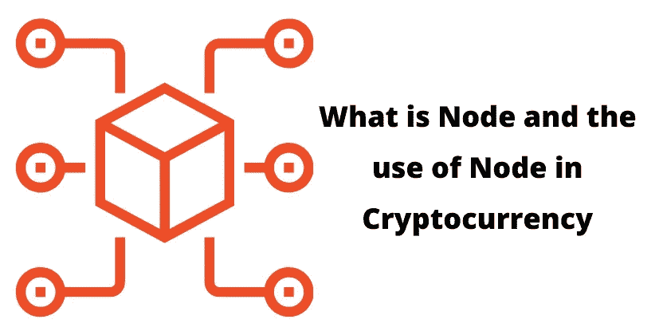

# 什么是节点以及节点在加密货币中的用途

> 原文：<https://medium.com/coinmonks/what-is-node-and-the-use-of-node-in-cryptocurrency-305181ca81fc?source=collection_archive---------14----------------------->

节点是数据通信网络中的连接点。如果所有设备都可以通过网络访问，则它们都被视为节点。每个节点将取决于它所指的网络类型的定义。

例如，在智能家庭自动化系统的网络物理中，家庭中能够通过网络发送或接收信息的每个设备被认为是称为节点的元素。但是诸如配线架之类的被动分布点不会被认为是节点。

节点产生它们接收、传输和交换信息，并且存储或传输信息到不同的节点。例如，连接到互联网的计算机网络内的扫描仪产生图像并将图像传输到计算机，而路由器组织通过互联网接收的信息，并将其转发到网络内的每个设备。

节点的概念在多个层次上起作用，但是广义的节点观将它们定义为来自互联网的流量通常被定向通过的主要点。节点的用法可能有点混乱，因为这些确切的互联网节点也可以被称为互联网集线器。

# 区块链的一个节点是什么？

节点是加密货币的一个元素，是比特币或 Dogecoin 等大多数知名代币工作所必需的。这是[区块链网络](https://www.thecoinleaks.com/blog/what-is-web3-how-web3-works/)的重要组成部分，该网络是用于跟踪加密货币的分散分类账。

越来越多的人参与加密货币市场，这促使个人了解该系统的工作方式。在任何行业都是如此，然而加密货币带来的新鲜感正在引起人们的兴趣。尽管你不需要知道区块链是如何从印度不断上涨的比特币成本中获利的，但了解该领域所用术语的基本知识可能会有所帮助。

它是区块链基础设施中的一个关键要素。它确保了区块链网络的完整性和安全性。区块链节点的主要功能是验证每一批事务，也称为块。每个节点通过独特的标识号与其他节点区分开来。

# 各种类型的节点是什么？

有两种节点:完全节点和轻型节点。

完整节点为网络提供支持和安全。节点下载区块链的全部交易历史来监控和执行规则。

这个网络的每一个成员都构成了一个较轻的节点。为了能够参与，轻量级节点必须连接到完整的节点。

许多志愿者运营完整的比特币节点，以支持改善比特币生态系统。目前，比特币网络中大约有 12130 个公共节点。除了那些公开的节点之外，还有许多秘密节点(非监听节点)。他们通常在防火墙后运行。

# 矿工的节点

还有另外一种节点，称为 Miner 节点。“比特币矿工”一词已经成为一个常用短语。这种类型的挖掘器可以被分类成节点。矿工可以独自工作(单独采矿)，也可以团队工作(联营矿工)。单人矿工使用他们自己的全功能节点。如果您有一个挖掘池，则只有管理员能够使用一个全职节点，该节点称为池的完整挖掘者节点。

**监听节点(超级节点)**

还有一个称为监听节点的子类别。侦听节点基本上是一个公共完整节点。它可以与选择与其建立连接的任何其他节点通信。受信任的超级节点通常总是活跃的，向许多节点传送事务和区块链历史。

区块链是由信息块组成的。这些数据块可以存储在节点中(与小型服务器相比)。节点可以是任何类型的设备(主要是笔记本电脑、计算机或者更大的服务器)。节点构成了区块链的基础。区块链的节点相互链接，并不断相互交换最新的区块链信息，以确保所有节点都是最新的。他们能够存储、分发和保存区块链信息，因此，区块链是一个节点网络。术语“完整节点”是指包含区块链交易记录完整版本的电子设备(如计算机)。

# 节点的作用是什么？

如果一个挖掘者试图在区块链上增加一个额外的事务块，那么它就把它传送给网络中的节点。基于块的有效性(签名和交易的有效性)，节点能够选择接受或拒绝块。如果一个节点能够接受该块作为一个新的事务，那么除了它已经保存的其他块之外，它还将保存和存储该块。简而言之，节点是这样工作的:

节点验证包含事务的特定块是否已经过验证，并接受或拒绝它。

节点存储和保存事务块(存储区块链事务的历史)。

节点向可能需要与区块链同步的其他节点广播并共享事务历史(需要用事务历史进行更新)。

**一个挖掘和一个实际节点**有区别

挖掘器必须始终操作一个完整的节点，以便挑选合法的事务来创建下一个块。如果没有完整的节点，它无法根据区块链上的交易历史来确定新交易是否有效(也就是说，交易期间的所有余额是否足以允许交易)，因为它无法访问整个区块链历史。因此，挖掘节点始终是活动节点。然而，一个节点并不总是挖掘。通过从网络接收数据，存储数据，然后广播整个事务信息(很像服务器)，计算机可以完全像节点一样工作，但不会创建新的事务块。在这种情况下，它充当使用目录的传递点，而挖掘也做同样的事情，但是它尝试创建新的事务。

节点是一个用来描述区块链的术语:一个完整的节点是跨任何平台的区块链交易历史的完整副本。

# 节点如何确保区块链的安全？

节点要么在线连接，要么离线连接。在线节点接收最新的事务，存储和广播往来于其他节点的最新事务块，而离线节点则不然。如果一个离线节点被激活，它需要首先通过下载自该节点离线以来链中包含的所有块来赶上另一个区块链。这有时被称为同步区块链。

# 谁有资格管理节点？

某些区块链托管数千个同时在线的节点。任何人都可以运行下载区块链交易历史的节点。许多区块链和密码爱好者在自愿的基础上运行节点。他们是区块链社区的一部分，这个社区的成长、安全、正直，因为这是他们的热情所在，让他们感觉自己是这个社区的一部分。对于技术熟练的人来说，节点的操作相对简单，不需要大量的资源。然而，一些区块链具有如此庞大的事务数据量，以至于它们需要大量的内存来运行一个完整的节点。许多加密用户只是想利用区块链，因此选择利用钱包应用程序。这些应用程序让他们可以直接从钱包中广播交易，而无需将区块链交易的全部历史下载到他们的设备上。

# masternodes 是如何工作的？

此外，某些区块链还包括主节点。主节点往往比常规节点更强大。除了广播、存档和验证交易之外，masternodes 还可以根据其特定性质协助区块链上的其他活动，例如，管理投票事件、执行协议以及执行相关区块链的规则。主节点通常是可访问的(24/7)，它们比常规节点提供更多的内存。主节点充当互联网上最大的服务器的主机。由于托管一个主节点通常需要更多的资源(电力运行时间，维护以及维护内存存储，内存)，托管一个通常会支付你的利息。

> 加入 Coinmonks [电报频道](https://t.me/coincodecap)和 [Youtube 频道](https://www.youtube.com/c/coinmonks/videos)了解加密交易和投资

# 另外，阅读

*   [最佳以太坊钱包](https://coincodecap.com/best-ethereum-wallets) | [电报上的加密货币机器人](https://coincodecap.com/telegram-crypto-bots)
*   [交易杠杆代币的最佳交易所](https://coincodecap.com/leveraged-token-exchanges) | [购买 HTZ 代币](https://coincodecap.com/how-to-buy-htz-token)
*   [5 大最佳社交交易平台](https://coincodecap.com/best-social-trading-platforms) | [瓦济克斯 NFT 印度](https://coincodecap.com/wazirx-nft-india)
*   [10 本关于加密的最佳书籍](https://coincodecap.com/best-crypto-books) | [英国 5 个最佳加密机器人](https://coincodecap.com/uk-trading-bots)
*   [ko only 点评](https://coincodecap.com/koinly-review) | [Binaryx 点评](https://coincodecap.com/binaryx-review)|[Hodlnaut vs CakeDefi](https://coincodecap.com/hodlnaut-vs-cakedefi-vs-celsius)