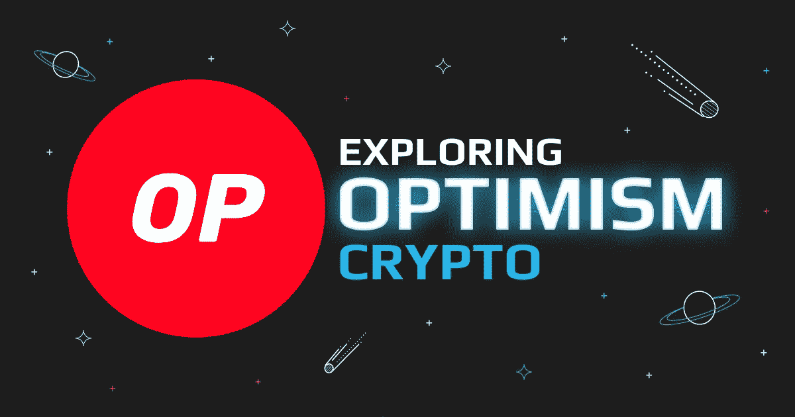

# 什么是乐观主义(OP)？深入的指南

> 原文：<https://medium.com/coinmonks/what-is-optimism-op-an-in-depth-guide-9999cabd5a9f?source=collection_archive---------22----------------------->

卷入[最近的大盗](https://www.coindesk.com/tech/2022/06/09/15m-of-optimism-tokens-stolen-by-an-attacker-after-wintermute-sent-wrong-wallet-address/?utm_medium=referral&utm_source=rss&utm_campaign=headlines)，乐观(OP)闹得沸沸扬扬。在本文中，您将找到关于这个有趣项目的所有信息，包括它是如何工作的、它的独特之处以及它的发展方向。

[乐观(OP)](https://swapzone.io/currencies/optimism) 是一个加密货币网络，它的任务是解决[以太坊(ETH)](https://swapzone.io/currencies/ethereum) 区块链的可扩展性问题，方法是将交易分批进行，以减少用户在此过程中支付的费用。

该项目在众多加密社区中引起了广泛关注，包括以太坊创始人维塔利克·布特林。如果乐观可以成为第二层人群中的佼佼者，那么它的自然 op 令牌可能会前往月球。

# 乐观主义是如何起作用的？

以太坊区块链是出了名的慢，而且在高峰时期，使用费用很高；几个加密项目，包括被称为 layer-2s 的乐观派，已经开始着手解决这个问题。

OP network 将以太坊交易带到其区块链，并使用被称为“乐观汇总”的先进数据压缩协议在那里进行结算

汇总系统将多个以太网交易合并为一个，将它们移出链，一旦它们结算，就向以太坊返回收据。

想象一下，将 100 笔交易汇总成一笔，只需支付一笔交易的油费？这就是乐观主义所做的，意味着理论上 100 个人分担一笔交易的成本。

使用乐观主义节省的确切金额；然而， [DuneAnalytics](https://dune.com/optimismpbc/Optimism) 报道称，该公司削减了 69%的汽油费。

此外，为了加快交易速度，乐观假设交易在结算前是有效的，但给验证者 7 天时间对交易提出异议。

乐观是为了尽可能兼容以太坊，这也是为什么它的代码非常相似，使用以太坊虚拟机(EVM)；相似性使得这两个区块链非常具有互操作性，因此使用乐观是一个相当简单的过程。

# 你如何使用乐观主义？

如果你经常与以太坊区块链互动，你可以从学习如何使用乐观中受益，因为它将为你节省金钱和时间。

要开始乐观，你需要使用兼容的钱包，如 [MetaMask](https://metamask.io/download/) ，通过[乐观网关](https://gateway.optimism.io/)将你的 ETH 令牌发送到 OP 桥。然后，在成功存款后，您可以在所有兼容的 dApps 和 dex 上自由交易代币。

# 乐观主义特征

*   **速度:**乐观情绪加速了区块链以太坊的交易。
*   **费用:**使用乐观区块链进行以太坊交易，给用户一个选择，避免支付天价以太网费用。
*   **安全:** OP 利用以太坊提供的高级安全性来保证其汇总的安全。'
*   **简单:**运用乐观是一个简单的过程，不需要你对区块链技术有很深的了解。

# 乐观的象征是什么？

据 [CoinGecko](https://www.coingecko.com/en/coins/optimism) 报道，2022 年 6 月 1 日上线的 OP token，流通供应量 2.14 亿，最高供应量刚刚超过 42 亿。OP 目前的交易价格为 1.16 美元，比其历史高点 2.1 美元低 45%。

该代币是由空投发起的，有 2.14 亿枚代币被免费发送到钱包里；不幸的是，当一些人比其他人更早收到代币并有时间提前抛售以获利时，这一下降变成了一桩丑闻。

OP 预计将作为项目的治理令牌，[令牌院和公民院](https://optimism.mirror.xyz/gQWKlrDqHzdKPsB1iUnI-cVN3v0NvsWnazK7ajlt1fI)使用它对开发提案做出决策。

就价格预测而言，大多数分析师都非常看好这种代币的长期走势，认为它最迟将在 2025 年创下历史新高。

# 乐观有什么特别的？

以太坊是市值第二大的加密货币，也是最大的智能合约兼容网络。尽管如此，它被可伸缩性的限制拖了好几年——乐观主义可能会解决这个问题。

DuneAnalytics 的报告本身就说明了该项目到目前为止的成功，更值得注意的是，乐观主义仍处于测试阶段，因此它很可能在未来将第 2 层扩展提升到下一个级别。

据 DeFi Llama 称，该项目发展非常迅速，以 3.62 亿美元的总价值锁定(TVL)成为第二大第二层网络，仅次于 [Arbitrum](https://bridge.arbitrum.io/) 。同样值得注意的是，虽然大多数二层玩家一直在亏损，但 TVL 的 OP 在过去七天里增长了 20%以上。

# 你怎么有资格参加空投行动？

虽然第一次空投没有按计划进行，但开发者打算以后再试；不过，目前来看，我们不知道如何获得降级资格。因此，最好的办法是看看是什么标准让人们第一次上了黑名单。

根据[乐观的官方网站](https://app.optimism.io/announcement)，标准如下:

1.  **乐观用户:【2021 年 6 月前使用乐观桥或使用网络超过一天的用户。**
2.  **重复用户:**在 2021 年 6 月 23 日至 2022 年 3 月的四周内使用该应用的人。
3.  **DAO:** 通过在 DAO 中投票参与第一层治理的用户。
4.  **多签者:**这些人控制着大型资金池。
5.  **金币捐赠者:**金币第一层创始回合的捐赠者。
6.  **汽油费节省者:**桥梁的常规用户，活跃于第 1 层链。

# 下一次空投是什么时候？

我们不知道下一次空投的确切日期，但在 2022 年 4 月，乐观主义者在一篇博客文章中说，将会有“整整一季的空投”

如果你想第一个知道下一次空投的日期，请关注 Optimsim 的官方 [Twitter](https://twitter.com/OptiimismOP) 页面并关注[博客](https://optimism.mirror.xyz/)。

即使我们不知道下一次空投的未来标准，如果你开始与乐观主义及其 dApps 互动，你可能会最终出现在名单上。

# 乐观主义的未来

该项目今年从风险投资公司 Andreessen Horowitz 和 Paradigm 获得了超过 1 亿美元的资金，所以钱不是问题；现在的问题是该项目能否发展成为领先的第 2 层协议。

该团队希望通过分片汇总、改进的防错系统和不断增加的去中心化将项目推向下一个层次。

此外，接下来的一系列空投将是该项目的一大考验；为了取得成功，他们需要避免第一轮所犯的错误；否则，投资者可能会开始失去信心。但是，就目前而言，投资者似乎对这个项目很有信心，投资 3.63 亿美元的 TVL 就证明了这一点。

# 常见问题

# 以太坊乐观主义是什么？

乐观是一种第 2 层扩展解决方案，它使用数据压缩和汇总来减少汽油费用并加快以太坊交易。

# 乐观主义安全吗？

像任何加密货币一样，投资乐观主义伴随着高风险，因为市场本来就非常不稳定。

# 以太坊乐观主义怎么用？

乐观主义允许用户在以太坊上以更高的速度进行交易，大大降低了燃气费。

# 以太坊乐观主义会有代币吗？

乐观区块链的本土令牌是 OP，它的最大供应量刚刚超过 40 亿，迄今为止，已有 2.14 亿被空投到符合条件的钱包中。

# 你是如何获得乐观的？

要使用乐观，您必须通过[网关](https://gateway.optimism.io/welcome)将您的 ETH 令牌发送到乐观桥。

> 加入 Coinmonks [电报频道](https://t.me/coincodecap)和 [Youtube 频道](https://www.youtube.com/c/coinmonks/videos)了解加密交易和投资

# 另外，阅读

*   [CoinLoan 评论](https://coincodecap.com/coinloan-review) | [YouHodler 评论](/coinmonks/youhodler-4-easy-ways-to-make-money-98969b9689f2) | [BlockFi 评论](https://coincodecap.com/blockfi-review)
*   [XT.COM 评论](https://coincodecap.com/profittradingapp-for-binance)币安评论 |
*   [SmithBot 评论](https://coincodecap.com/smithbot-review) | [4 款最佳免费开源交易机器人](https://coincodecap.com/free-open-source-trading-bots)
*   [比特币基地僵尸程序](/coinmonks/coinbase-bots-ac6359e897f3) | [AscendEX 审查](/coinmonks/ascendex-review-53e829cf75fa) | [OKEx 交易僵尸程序](/coinmonks/okex-trading-bots-234920f61e60)
*   [如何在印度购买比特币？](/coinmonks/buy-bitcoin-in-india-feb50ddfef94) | [瓦济克斯审查](/coinmonks/wazirx-review-5c811b074f5b)