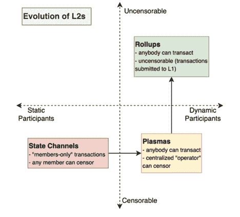

# 什么是乐观主义，为什么他们空投这么多钱？

> 原文：<https://medium.com/coinmonks/what-is-optimismpbc-and-why-did-they-airdrop-so-much-money-2db3859f906d?source=collection_archive---------12----------------------->

在过去的几天里，我们听到了很多关于乐观主义的说法。这是因为他们最近的空投。为了给你协议上发生的全部事实，我决定做一次深入的调查。

在我们继续之前，我要自我放松一下。

*如果你想要更多关于技术加密的文章，你可以查看我的* [*子页面*](https://substack.com/profile/11997845-kyriansol-?utm_source=user-menu) *。*

OptimismPBC

**那么什么是 OptimismPBC 呢？**

乐观是一个以太坊第二层扩展解决方案，它可以扩展每秒可执行的事务数量。它使用一种叫做 Rollups 的 L2 技术，这种技术在最终提交到 mainnet (L1)之前在链外执行事务。

目前，以太坊每秒仅执行大约 10 个事务(TPS ),但是  乐观可以扩展到每秒 200–2000 个事务。使用卷装，乐观减少了 10-100 倍的天然气费用。

作为一个第二层网络，乐观主义有聚合器，将事务整合成一批来执行。这些聚合器可以将多个交易合并成一个交易，然后提交给以太坊进行验证，从而通过在该批中提交交易的每个人之间进行社交，为用户节省宝贵的块空间和油费。

乐观使用欺诈证据来验证其交易。这意味着累计合同记录了它的所有交易。然后，发现无效交易的用户可以通过防欺诈证明来证明它。如果为假，则汇总合同可以恢复交易。

*Image source: coinyuppie.com*

2022 年 4 月 26 日，OptimismPBC 发表了一篇介绍“乐观集体”的文章，这是 OptimismPBC 的一个去中心化数字民主治理协议。还宣布了$OP 令牌和空投#1。

五月的最后一天，空投开始了。

也许开发者只是利用了“以太坊合并”被推迟的事实。但总的来说，这似乎是任何 L2 项目利用这一延迟进一步发展其生态系统的理想时刻。

除此之外，让我们更多地讨论一下乐观集体到底是什么。

乐观主义集体是一种新的模式，用于适当奖励那些创造或维持公共产品的人。乐观主义协议产生了大量的收入，集体将这些钱分配给为公共利益而建设的项目和社区。这个模型带来了对$OP 令牌的需求。

现在，需要注意的是$OP 令牌并不是一个用于在 optimismPBC 上支付汽油费的实用工具令牌。相反，这是实现 optimismPBC 完全去中心化愿景的一个强有力的治理标志。现在，乐观链的排序器由 optimismPBC 团队管理，因为它是协议收入的主要来源。

现在，我们都知道序列器可以是任何云服务器，甚至是运行在某个共识系统中的区块链节点。它计算有效性证明，这需要 CPU/内存和一点网络带宽。拥有这个定序器意味着对交易(MEV 利用)和协议收入有很大的控制权。因此，由于协议正在转向治理模型，所以$OP 令牌持有者将最终控制协议的定序器。

乐观主义集体将由两个独立的实体组成，即象征之家和公民之家。

*   **公民之家**将管理协议开发的公共产品资金。公民身份将被授予不可转让的非永久性居民身份，并将随着时间的推移而增长。截至目前，该市民住宅的具体细节尚未披露。但是，我们知道公民住房的资格将由灵魂绑定令牌(SBT)管理。这些灵魂绑定的令牌是 NFT，就像现实生活中的成就徽章一样，类似于你在完成特定任务或清除里程碑时在视频游戏中获得的东西。但在这种情况下，它将被用来证明统治的能力。
*   **令牌屋**将存放$OP 令牌。这是 25 万人的家园，他们已经收到了空投 1。他们将是管理协议升级、项目激励等的实体。这是当前 Airdrop #1 参与者能够参与乐观公司治理流程的地方。

总的来说，乐观主义集体的目的是建立一个飞轮，为乐观主义产生一个强大的公共产品基础设施，增加第二层的效用，并创造一个有用的经济。协议排序器产生的收入将用于资助。

下面是治理回报飞轮的样子。

所有这些都放在一起，放在一个叫做公益基金(PGF)的基金里。该基金将用于资助那些通过他们的(非盈利)活动对乐观生态系统产生积极影响的项目。该基金的前身是$OP 持有者，他们是乐观集体的一部分。他们完全有权决定哪家初创企业获得资助。

为了确保纳入长期的乐观主义者，将会有多次空投。这种机制有助于过滤掉空投后立即抛售代币的短期用户。

$OP 令牌的初始供应总量为 4，294，967，296 个令牌。细分如下:

*   25%:生态系统基金
*   20%:追溯性公共产品资金
*   19%:用户空投
*   19%:核心贡献者
*   17%:投资者

乐观基金会正在创建，以顺利过渡到一个完全分散的 L2 乐观。它将由乐观派的创始人[——@ jinglejamOP](https://twitter.com/jinglejamOP)和 [@ben_chain](https://twitter.com/ben_chain) 领导，并最终解散。

代币之家的首次治理行动将于 2022 年 5 月 3 日进行。它激活了治理基金(231，928，234 美元 OP ),开始激励乐观的增长。该基金占初始总供应量的 5.4%，将支付给建立在乐观基础上的新老项目。

**空投认领页面:**

[http://app.optimism.io/airdrop/check](https://t.co/mREvrxqjMo)

[http://app.optimism.io/airdrop/learn](https://t.co/gzZTZt795P)

在声明之后，您需要使用乐观协议将您的令牌委托给某人，并且您认为他有能力做出治理决策。如果你还没有合适的人选，你可以在这个[列表](https://gov.optimism.io/t/delegate-commitments/235)中找到一些。现在，需要注意的是，授权并不意味着你要分发硬币。这仅仅意味着你将你的治理投票权转移给能够积极参与该角色的人。

目前，OP 的定价为 1.65 美元，市值为 3.5 亿美元，TVL 为 2.78 亿美元，FDV 为 71 亿美元。目前的流通供应量为 2.15 亿，最大供应量为 43 亿令牌。其公平分配空投约。最大供应量的 5%,超过 52%的代币由参与者领取。

$OP 的归属时间表。网络参与者将获得很大一部分。它看起来很结实，而且没有过分的侵略性。4 年内 30%——-> 100%。

乐观团队希望引导他们的生态系统，确保用户连接到网络，并与部署到链中的协议和协议进行交互。空投是为了激励他们链条上的活动。而众所周知，这将导致收益率的大幅提升。所以，如果你是一个高产的农民，准备好吧！

**交易所**

$OP 目前可在多个交易所交易，如:

*   Okx
*   Bybit
*   Gate.io)
*   MEXC 全球
*   库科恩

在 DEXes 上，可从以下位置获得:

https://app.uniswap.org/#/swap?input currency = 0x 420000000000000000000000000000000000042…

图表:

*   OP/USDC[http://dex tools . io/app/乐观/pair-explorer/0x6f 32061 f59a 21086 c 334d 0d 45 f 804089 ce 374 AAF……](https://t.co/rnn6UiKXoH)
*   OP/WETH[http://dex tools . io/app/乐观主义/pair-explorer/0x 730691 cdac 3c BD 4d 41 fc 5 EB 9d 8 abb B0 CEA 795 b 94……](http://dextools.io/app/optimism/pair-explorer/0x730691cdac3cbd4d41fc5eb9d8abbb0cea795b94%E2%80%A6)

在第一天的象征性索赔过程中，有些事情没有按计划进行。出问题的第一件事是，一些人能够在官方声明之前声称。他们通过 API 探索很早就想出了如何做到这一点。

现在，契约已经在前面部署了，要使用它们，您需要在包含所有合格地址的 Merkle 树中生成一个 Merkle 包含证明。这个 Merkle 证明可以通过查询索赔后端服务器上的 API 端点来获得。理论上，你可以通过逆向工程(未验证的)索赔合同来重建这个证据。我们不确定是否有人完全做到了这一点，但我们将等待团队的声明来确认。

第二个问题是，随着人们发现端点，索赔后端(用于证据生成)很快就崩溃了。它下降是因为缓存导致磁盘填充太快，从而产生了太多的 RPC 请求。

团队的荣誉，因为他们设法修补了一个非常快。但是他们仍然遇到了另一个问题。JSON-RPC 端点完全过载了。对于不知道 JSON-RPC 是什么的人，我们稍微解释一下。

JSON-RPC 是一种协议，用于通过像 metamask 这样的钱包向链发送事务，然后对链进行只读调用。发送到链中的事务都需要命中定序器，定序器运行得很好。在此之前，乐观主义者已经看到了几个小时内每秒 10–12 个事务(TPS)。它类似于以太坊主网，所以没有大问题。

然而，这比过去乐观主义者看到的 TPS 要多得多。问题是只读调用。每次使用 Dapp 时，Dapp 都会对链进行一些只读调用，以便显示有用的数据(例如 Uniswap 上的当前价格)。这个数量远远超过了发送的事务数量(对于一个编写良好的 Dapp 来说是 100 倍，对于 hackjobs 来说则高出太多数量级)。

执行这些调用所需的所有计算都不是由定序器(或者在 L1 上，由挖掘节点)完成的，而是由专用节点完成的。大多数人使用像 Infura 或 Alchemy 这样的节点提供者(又名“infra provider”或“JSON-RPC providers”)。如果使用元掩码，可以为每个链选择 JSON-RPC 提供程序。以太坊默认是 Infura。关于乐观，你可能正在使用[mainnet . optimission . io](https://t.co/CbALQuHumI)

回到这个问题，乐观主义已经达到了破纪录的 TPS 水平。并且[mainnet . optimistry . io](https://t.co/CbALQuHumI)最近已经升级到多个端点提供商(包括内部)之间的负载平衡。但这还不够。他们很快用完了他们使用的各种提供商(Infura、Alchemy、Quicknode)的配额，不得不供应更多。但这还不够。条件刚好足以超过总供应容量。节点提供商必须伸出援手，增加容量，甚至能够帮助发现一些问题，这些问题涉及如何处理一些降低系统速度的事务。

所有这些导致了 dapps 的部分中断，因为他们无法再查询该链。它甚至中断了事务的发送，因为它们也通过受影响的相同端点。团队必须将负载降低到可管理的程度，并暂时过滤掉端点上的“归档”请求。特别是，他们放弃了任何针对链末端后面大于 64 个块的块的状态的调用。高峰时，批处理提交者比 L2 主网落后 1 小时，然后开始追赶。它没有造成更多的破坏。

总的来说，我认为团队处理得很好。中断只持续了几个小时，网络从来没有 100%瘫痪过(即使您使用的是节点提供商)，而且 sequencer 本身运行良好。他们本可以避免这些问题，但至少他们能够做出适当的反应。

他们的良好工作可以在[沙丘](https://dune.com/Marcov/OP-Optimism)和[脱菲拉马](https://defillama.com/chain/Optimism)分析上看到，因为空投目前表现良好。

同样重要的是，要密切关注 TVL 的数据，看看这个连锁企业能否成长为一个可持续的行业参与者。根据 DefiLlama 的说法，它已经拥有一个不断增长的总价值锁定(TVL)数字和 37 个有效协议。该图表似乎表明，optimismPBC 似乎准备在 2022 年下半年进入增长阶段，可能会持续到 2023 年。但是为他们的治理令牌找到更多的效用将是关键。

至于$OP token airdrop，在索赔或交易时要注意短期价格波动。

**结论:**乐观主义刚刚成为“四大”L2(Arbitrum、乐观主义、zkSync 和 StarkNet)中第一个推出原生令牌的。这可能是一个巨大的催化剂，推动乐观的 NFT 场景和整个以太坊 L2 生态系统向前发展。记住要谨慎交易，因为这些产品中的大部分技术相对来说还是新的。

现在，我只能说祝你好运！

> 加入 Coinmonks [Telegram group](https://t.me/joinchat/Trz8jaxd6xEsBI4p) 并了解加密交易和投资