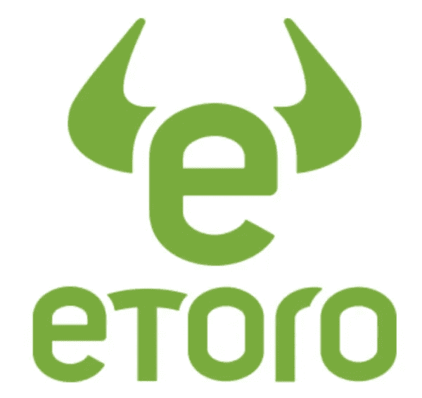

# 什么是便士加密？

> 原文：<https://medium.com/coinmonks/what-is-penny-crypto-80dd9f9fffea?source=collection_archive---------52----------------------->

与股票一样，便士加密货币的交易价格为每单位几美分或不到 5 美元。尽管风险很高，但投资起来并不昂贵，这也是它们对密码交易员如此有吸引力的原因。

今天，我们已经审查了最好的一分钱密码购买权。然而，在拿你辛苦赚来的钱去冒险之前，你应该始终确保你自己已经进行了大量的研究。

Penny Crypto 是一个好的投资吗？

最好的一分钱密码投资应该有能力随着时间的推移增值。否则，将其添加到您的投资组合中是不合逻辑的。

下面我们讨论一些你可能选择购买 2022 年顶级一分钱加密货币的原因:

你不需要有一个大的帐户余额来购买一分钱密码

学习如何购买便士加密货币的一个最明显的优势是，你不需要有很大的账户余额。

[**> >报名参加**](https://yazing.com/deals/coinsmart/kingcormac)

也就是说，如果所有代币的价格都低于 5 美元，那么你可以投资数百种不同的加密货币，其成本还不到一个比特币或以太坊的价格。

美国和英国交易者在受监管的加密平台 eToro.com 上的最低存款额仅为 10 美元，国际交易者的最低存款额略高。

购买最好的细价股来分散你的投资组合

除了购买 penny crypto 的成本效益之外，您还可以通过不将数百或数千美元分配到单一投机资产来最小化风险。

因此，尽管仍然存在风险，但你不必孤注一掷。很容易建立一个多样化和全面的数字货币投资组合，而且只需很少的现金支出。

eToro 是一家在线经纪公司，提供我们今天谈论的 2022 年顶级一分钱加密货币。

还有很多其他的，佣金非常低，你可以只拿 10 美元去冒险。还可以 0 佣金访问一分钱加密货币股票。

如何购买最好的便士加密-幸运块教程

我们推荐 2022 年投资的最佳便士加密货币是幸运块。

因此，我们今天将向您展示如何下单以及如何向您的投资组合添加代币。

*   第一步:获取信任钱包:你需要从下载信任钱包到你的手机开始。这是由主要的加密交易所币安支持，并允许您购买幸运块。
*   第二步:存款 BNB:用直接掉期购买幸运块，你需要一些 BNB 代币。如果你还没有 BNB，你可以通过 Trust Wallet 购买一些。
*   第三步:连接到 Pancakeswap:找到“DApps”并点击按钮将您的钱包链接到 Pancakeswap exchange 并选择“连接钱包”。
*   第四步:粘贴幸运块合同地址:你会在幸运块官方网站上找到合同地址。复制并粘贴到适当的字段
*   第五步:用 BNB 兑换幸运块:输入你想用多少 BNB 代币兑换幸运块，然后确认你的购买

之后，将您购买的幸运块令牌添加到 Trust Wallet 应用程序。

由于加密货币波动很快，请记住，您获得的幸运块令牌的数量将取决于市场价值。

在哪里购买其他便士加密货币

如果你有兴趣购买我们今天提到的一些其他便士加密货币，eToro 是完成投资的最佳场所。

[**> >获得即时访问 CoinSmart**](https://yazing.com/deals/coinsmart/kingcormac)

原因如下:

eToro—2022 年购买 Penny Crypto 的最佳地点

eToro 是 2022 年购买 penny crypto 的最佳场所，因为该平台提供了一系列好处。eToro 的交易成本很低，尤其是因为你只需支付 1%的费用就可以买卖任何你选择的加密货币。eToro 提供 59 种加密货币，以及许多其他资产。

如果你对购买 penny crypto 并将其存储在钱包中的想法感到满意，那么有一款应用程序可以做到这一点。eToro 钱夹以加密应用程序的形式出现，并通过一系列安全功能保护您的投资。这包括标准化协议、DDoS 保护、复杂的签名机制等等。

这家经纪公司为 2500 多万交易员提供服务，并受到多个监管机构的监管，其中包括 SEC 和 FCA 等。上述加密钱包受 GFSC 监管。主要的交易平台使用和导航非常简单。

[**> >报名参加**](https://yazing.com/deals/coinsmart/kingcormac)

此外，不放心照看钱包和私钥的投资者可以通过选择在主平台上购买便士加密货币来简化事情。在这种情况下，当您下订单时，eToro 会将代币添加到您的投资组合中，您可以随时登录您的帐户进行访问。

 [## 多汁的搜索引擎优化工具，你会喜欢

### Mangools 是一个由 5 个简单但强大的搜索引擎优化工具组成的包，用于有效的搜索引擎优化工作流程。深受初学者喜爱，值得信赖…

mangools.com](https://mangools.com#a622bb38ffeebf823de3748aa) 

> *加入 Coinmonks* [*电报频道*](https://t.me/coincodecap) *和* [*Youtube 频道*](https://www.youtube.com/c/coinmonks/videos) *了解加密交易和投资*

# 另外，阅读

*   [Bookmap 点评](https://coincodecap.com/bookmap-review-2021-best-trading-software) | [美国 5 大最佳加密交易所](https://coincodecap.com/crypto-exchange-usa)
*   最佳加密[硬件钱包](/coinmonks/hardware-wallets-dfa1211730c6) | [Bitbns 评论](/coinmonks/bitbns-review-38256a07e161)
*   [新加坡十大最佳加密交易所](https://coincodecap.com/crypto-exchange-in-singapore) | [购买 AXS](https://coincodecap.com/buy-axs-token)
*   [红狗赌场评论](https://coincodecap.com/red-dog-casino-review) | [Swyftx 评论](https://coincodecap.com/swyftx-review) | [CoinGate 评论](https://coincodecap.com/coingate-review)
*   [投资印度的最佳密码](https://coincodecap.com/best-crypto-to-invest-in-india-in-2021)|[WazirX P2P](https://coincodecap.com/wazirx-p2p)|[Hi Dollar Review](https://coincodecap.com/hi-dollar-review)