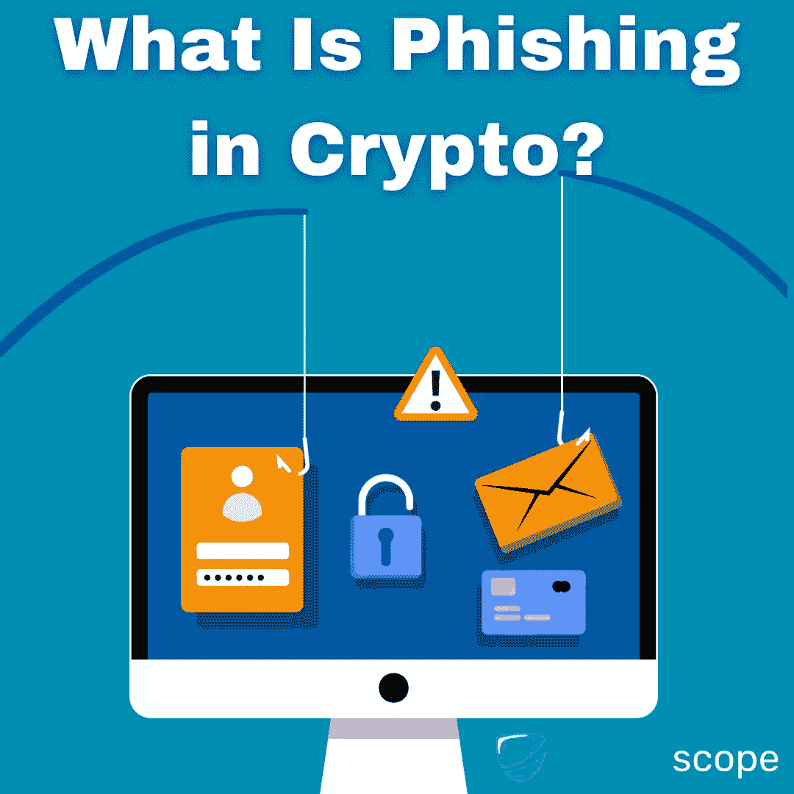
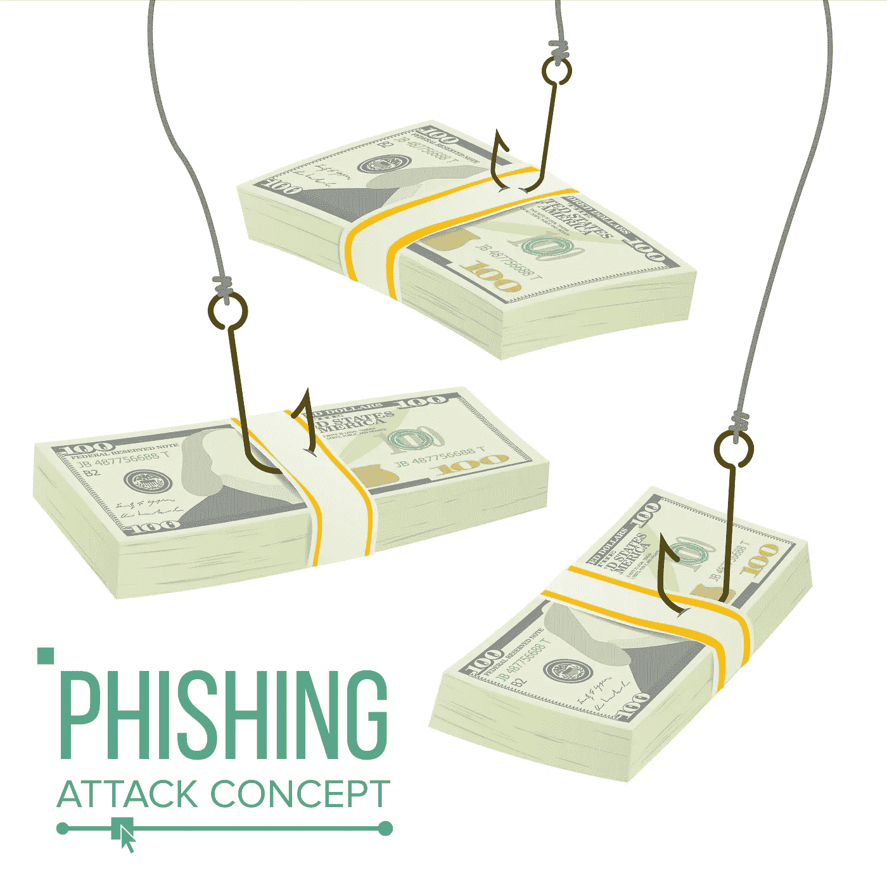

# 什么是加密中的网络钓鱼，如何避免

> 原文：<https://medium.com/coinmonks/what-is-phishing-in-crypto-and-how-you-can-avoid-it-c1eb091d06c8?source=collection_archive---------48----------------------->

网络钓鱼攻击呈上升趋势，这使得网络罪犯比以往任何时候都更容易窃取您的身份、金钱，甚至访问您的设备。联邦调查局的互联网犯罪投诉中心记录的网络钓鱼事件是任何其他类型的计算机犯罪的两倍多。当然，随着加密货币越来越受欢迎，我们也看到加密行业越来越多的网络钓鱼攻击。

为了帮助您远离网络钓鱼诈骗，我们整理了这份指南，介绍什么是网络钓鱼以及如何保护自己免受这些危险的网络攻击。

# 什么是网络钓鱼？

网络钓鱼是一种电子邮件诈骗，黑客会发送假冒的电子邮件，这些邮件看起来像是您认识的公司或组织发送的合法邮件。这些电子邮件通常包含含有恶意软件(恶意软件)的附件、指向恶意网站的链接或对用户名和密码等个人信息的请求。

网络钓鱼攻击不仅限于电子邮件，还可能发生在脸书或 Twitter 等社交媒体网站以及 WhatsApp 或 Telegram 等即时通讯应用上。例如，众所周知，加密货币骗子会在 Telegram 或 WhatsApp 上发送虚假消息，声称用户赢得了免费的比特币或另一种加密货币令牌——但他们只需点击一个附件，就可以领取他们“赢得”的令牌。

# 如何保护自己免受网络钓鱼攻击

保护自己免受网络钓鱼攻击的最好方法是小心你点击的内容和你上网的地方。

以下是一些建议:

*   不要打开你个人或专业不了解的人发来的邮件；如果可能，根本不要打开任何不请自来的电子邮件
*   对任何询问个人信息或如何处理订单的建议的电子邮件持怀疑态度；合法企业不会通过电子邮件询问这类信息
*   当访问看起来像受欢迎的零售商的网站(如亚马逊)，但实际上不是那些公司的网站时要小心；如果有疑问，请检查浏览器窗口顶部的地址栏，以确保您是在您想要访问的实际网站上。例如，一个骗子可能创建了一个亚马逊的复制网站，而不是 Amazon.com，它可能被命名为 amaz0n.com。
*   如果你访问一个加密网站，千万不要输入你的种子短语“连接你的钱包”。Web3 集成不会只在连接您的钱包时询问您的种子短语。
*   如果你的电报账户收到私人信息，一定要仔细检查发送者的用户名。众所周知，加密骗子会复制你的联系人的姓名和头像，并会找借口向你要钱。
*   永远不要相信你关注的群组的“管理员”发来的私信。管理员永远不会 DM 用户来帮助他们或要求他们的种子短语。

# 结论

保护自己免受网络钓鱼攻击的第一步是认识到网络钓鱼攻击的存在。第二，确保合法公司不会要求其客户提供个人信息(即种子短语、密码、信用卡号等)。请记住:如果您收到看似合法的私人消息或电子邮件，但要求您“更新”或提供您的个人信息(如 seed 短语或密码),请不要回复！一个真正的公司绝不会要求这样的信息。

在 [Cyberscope](https://www.cyberscope.io/) ，我们的使命是保护散户投资者和交易者免受骗子和欺诈者的侵害，因此，如果您怀疑有人试图诈骗您，请随时给我们发送消息！

…

*原载于*[*https://www . cyber scope . io*](https://www.cyberscope.io/)*。*

> 加入 Coinmonks [电报频道](https://t.me/coincodecap)和 [Youtube 频道](https://www.youtube.com/c/coinmonks/videos)了解加密交易和投资

# 另外，阅读

*   [比斯勒评论](https://coincodecap.com/bitsler-review)|[WazirX vs coin switch vs coin dcx](https://coincodecap.com/wazirx-vs-coinswitch-vs-coindcx)
*   [7 大副本交易平台](https://coincodecap.com/copy-trading-platforms) | [BuyCoins 点评](https://coincodecap.com/buycoins-review)
*   《XT.COM 评论》的[《币安评论》的](https://coincodecap.com/profittradingapp-for-binance)|
*   [SmithBot 评论](https://coincodecap.com/smithbot-review) | [4 款最佳免费开源交易机器人](https://coincodecap.com/free-open-source-trading-bots)
*   [杠杆令牌](/coinmonks/leveraged-token-3f5257808b22) | [最佳密码交易所](/coinmonks/crypto-exchange-dd2f9d6f3769) | [Paxful 点评](/coinmonks/paxful-review-4daf2354ab70)
*   [加密套利](/coinmonks/crypto-arbitrage-guide-how-to-make-money-as-a-beginner-62bfe5c868f6)指南| [如何做空比特币](/coinmonks/how-to-short-bitcoin-568a2d0b4ae5)