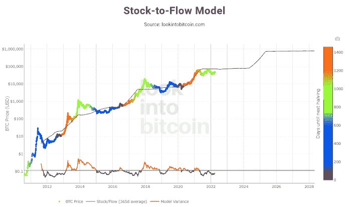

# B 计划的比特币股票到流量图是什么？

> 原文：<https://medium.com/coinmonks/what-is-plan-bs-bitcoin-stock-to-flow-chart-5f2bf7605c19?source=collection_archive---------16----------------------->

股票到流量模型是一些分析师用来尝试和预测比特币未来价格的流行指标。据推广该模型的 twitter 笔名“B 计划”称，该模型对比特币价格的预测在很大程度上是合理的。

# 比特币股票流向模型图是什么？

比特币存量到流量模型是一种流行的比特币预测指标，衡量比特币的当前存量与生产率或一年中开采的总量的比率。存量到流量比较比特币的丰富或稀缺。该模型也适用于其他稀缺商品，如黄金和铂金，甚至更丰富的商品，如石油。

存量指的是资产的总量，而流量指的是每年生产或开采的数量。我们可以使用这两个指标(存量和流量)并用存量除以流量来计算存量与流量的比率。库存与流动比率越高，相对于总供应量而言，进入市场的新供应量就越少。从理论上讲，股票与流动比率较高的资产可以长期保持其价值。

比特币是用存量流量比衡量的完美资产。比特币是稀缺的，因为只有 2100 万个比特币会被开采，并且开采或生产比特币的成本相对较高。这个数字可能更低，因为许多比特币已经丢失。比特币也有“减半”现象，即每 21 万个区块或大约每 4 年，进入系统的新供应量就会减半。根据密码爱好者的说法，这些属性与其他几个属性结合在一起，构成了一种稀缺的数字资产，由于存量与流量之比的不断降低，这种资产可能会随着时间的推移而保留并显著增值。

由于比特币的最大供应量只有 2100 万枚代币，而挖掘一枚新代币是一个时间和精力密集型的过程，比特币的供应量被限制在特定时间范围内可以进入流通的一定数量。库存-流量模型在预测 BTC 价格时考虑了这种稀缺性和供应限制。比特币价格的计算基于一个公式，该公式使用月度股票等变量来流动价值和价格数据。

# 库存-流量模型准确吗

从历史上看，股票到流量一直是比特币最准确的价格预测模型之一，如下图所示。然而，去年在 2021 年 5 月加密市场的闪电崩盘后，这个流行的预测工具受到了一些审查。根据 B 计划，BTC 的价格应该在 2021 年第四季度超过 10 万美元，但这并没有发生。今年晚些时候，B 计划预测比特币的价格可能会达到每年 45 万美元，但最糟糕的情况是年底价格达到 13.5 万美元，这两种情况都没有发生，因为比特币在今年达到了略高于 69，000 美元的高点。B 计划认为，这些预测并没有使股票到流量模型失效，因为比特币价格仍在模型的可接受价格范围内。

# 未来比特币存量到流量预测

股票-现金流图表预测，2022 年 12 月 31 日比特币(BTC) 的[价格将为 78280 美元。其对 1 年后 2023 年 12 月 31 日的比特币价格预测为 81956 美元。接下来的一年，随着 2024 年 12 月 31 日 BTC 价格预测达到 306，984 美元，价格大幅上涨。](https://bumblebeecrypto.com/2022/04/02/what-is-the-crypto-fear-and-greed-index-metric/)

# 如何查看比特币股票流向图

在上面的比特币图表中，价格覆盖在股票流量比率线的顶部。我们可以看到，随着时间的推移，价格继续跟随比特币的存量到流量。因此，该理论表明，我们可以通过观察预计的库存到流量线来预测价格可能的走向，这可以通过我们知道未来比特币开采的大致开采时间表来计算。

这张图表价格线上的彩色圆点表示距离下一次比特币减半(或“减半”)事件还有多少天。

总的来说，股票到流量模型是一个有用的工具，可以用来预测比特币的未来价格。还有许多其他可用的预测工具，然而，随着时间的推移，专注于比特币供应时间表的库存-流量模型已被证明非常受欢迎。

> 加入 Coinmonks [电报频道](https://t.me/coincodecap)和 [Youtube 频道](https://www.youtube.com/c/coinmonks/videos)了解加密交易和投资

# 另外，阅读

*   [3 商业评论](/coinmonks/3commas-review-an-excellent-crypto-trading-bot-2020-1313a58bec92) | [Pionex 评论](https://coincodecap.com/pionex-review-exchange-with-crypto-trading-bot) | [Coinrule 评论](/coinmonks/coinrule-review-2021-a-beginner-friendly-crypto-trading-bot-daf0504848ba)
*   [莱杰 vs Ngrave](/coinmonks/ledger-vs-ngrave-zero-7e40f0c1d694) | [莱杰 nano s vs x](/coinmonks/ledger-nano-s-vs-x-battery-hardware-price-storage-59a6663fe3b0) | [币安评论](/coinmonks/binance-review-ee10d3bf3b6e)
*   [Bybit Exchange 评论](/coinmonks/bybit-exchange-review-dbd570019b71) | [Bityard 评论](https://coincodecap.com/bityard-reivew) | [Jet-Bot 评论](https://coincodecap.com/jet-bot-review)
*   [3 commas vs crypto hopper](/coinmonks/3commas-vs-pionex-vs-cryptohopper-best-crypto-bot-6a98d2baa203)|[赚取加密利息](/coinmonks/earn-crypto-interest-b10b810fdda3)
*   最好的比特币[硬件钱包](/coinmonks/hardware-wallets-dfa1211730c6) | [BitBox02 回顾](/coinmonks/bitbox02-review-your-swiss-bitcoin-hardware-wallet-c36c88fff29)