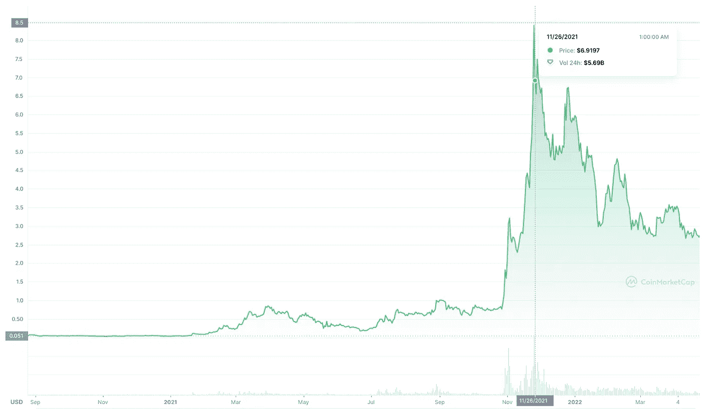

# 什么是玩即赚游戏？——“像五岁小孩一样解释”

> 原文：<https://medium.com/coinmonks/what-is-play-to-earn-gaming-explained-like-im-five-64b591035c83?source=collection_archive---------58----------------------->

## 游戏的未来将是玩到赚的游戏，玩家可以通过玩视频游戏来赚钱

**预计阅读时间:**只有 2 分 58 秒

游戏为我们提供了一种逃避现实、更好地与同龄人联系、建立虚拟城镇、甚至扮演我们最喜爱的明星运动员的方式。

但是，好像镇上有了一个新的警长…

# 我们现在的游戏有什么不好的？

传统游戏平台夺走了我们的时间、金钱和整体价值。

游戏玩家将数小时的汗水投入到游戏中，却没有得到任何现实生活中的回报。

**举个例子:**如果《部落冲突》今晚关闭或者你决定停止游戏，你将失去**所有你在建立你的帝国上花费的时间和金钱。**

基本上，游戏玩家开始意识到自己的价值，想要分一杯羹。

# 明白了！现在解释一下什么是“玩即赚”游戏…

用 5 年前的话来说:你玩一个你已经免费玩过的在线游戏，同时赚取加密、NFTs 和其他形式的支付。

# 钱从哪里来？

从商业的角度来看，这些游戏有许多方式向玩家传递货币价值。以下是其中的几个例子:

游戏内货币:玩家在玩他们选择的游戏时赚取游戏内数字货币

每个游戏都有自己的加密货币代币，当玩家完成任务、赢得挑战并为游戏投入更多时间时，他们会向玩家支付这些代币。

因此，对玩家的价值主张是“嘿，玩家！如果你玩我们的游戏，当你赢的时候，我们会给你我们硬币的 X 倍。如果我们的硬币价格上涨(基本供求原则)，你就发财了！”

这是沙盒向玩家分发的游戏内货币的价格图表。这枚硬币最初以 0.05 美元左右的价格开始交易，并在 2021 年 11 月达到 8.40 美元的高点。

这意味着，如果玩家赢得了一些价值 100 美元的游戏内代币，他们将拥有 16，700 美元。玩“电子游戏”还不错吧？

**NFT:**我们在之前的一期杂志中讨论过非功能性测试，但是如果你正在半睡半醒地阅读它…

NFT 是你拥有独一无二的物品的所有权的数字证明。

在 P2E 生态系统中，NFT 被用作游戏内资产，用来支付玩家。例如，玩家可以在他们的虚拟钱包中拥有稀有的堡垒之夜“皮肤”。

然后，玩家可以将他们赢得的游戏内资产交易给其他玩家。如果一个游戏越来越受欢迎，它的 NFTs 的整体价格也会增加。

**比特币、以太坊和其他更大的加密货币:**

通过这种支付结构，玩家能够获得一枚风险更低的硬币，但支出通常要小得多，并且需要更长时间才能积累真正的财富。

# 这些平台将如何赚钱？

游戏能够从购买物品收取的交易费、硬币增值和出售 NFT 的版税中获得收入。

比方说，我花 100 美元在沙盒上购买了一个 NFT，沙盒可以从我的购买中扣除一小笔费用。

未来的每笔交易都将遵循同样的程序，新的卖家将向平台返还一小部分。

# 是不是好得不像真的？

玩赚游戏仍处于发展的早期阶段，在未来肯定会遇到挑战。

需要注意的一些潜在风险和弱点包括:

*   赚钱的想法会损害游戏体验
*   游戏中的货币和非功能性货币不能保证增值
*   潜在的诈骗或[黑客](https://www.theverge.com/2022/4/8/23015468/axie-infinity-blockchain-nft-play-to-earn-game-economics-hack)

现在还为时尚早，我们肯定会看到每天都有新的方法出现在这个领域。

页（page 的缩写）s:如果你喜欢这篇文章，并且想在比特币、NFTs 和其他复杂的 Web 3.0 主题上变得更聪明…

我简化了**每周五的一个** Web 3 主题，从$ETH 到 L2 的“5 岁术语”——免费订阅[这里](https://samfarber.substack.com/p/coming-soon?r=1frabl&s=w&utm_campaign=post&utm_medium=web)！

> 加入 Coinmonks [电报频道](https://t.me/coincodecap)和 [Youtube 频道](https://www.youtube.com/c/coinmonks/videos)了解加密交易和投资

# 另外，阅读

*   [最佳期货交易信号](https://coincodecap.com/futures-trading-signals) | [流动性交易所评论](https://coincodecap.com/liquid-exchange-review)
*   [火币加密交易信号](https://coincodecap.com/huobi-crypto-trading-signals) | [Swapzone 审查](/coinmonks/swapzone-review-crypto-exchange-data-aggregator-e0ad78e55ed7)
*   最佳[密码交易机器人](https://coincodecap.com/best-crypto-trading-bots) | [购买索拉纳](https://coincodecap.com/buy-solana) | [矩阵导出评论](https://coincodecap.com/matrixport-review)
*   [酷卡点评](https://coincodecap.com/coldcard-review)|[boxstradex 点评](https://coincodecap.com/boxtradex-review)|[unis WAP 指南](https://coincodecap.com/uniswap)
*   [比特币基地评论](/coinmonks/coinbase-review-6ef4e0f56064) | [德里比特评论](/coinmonks/deribit-review-options-fees-apis-and-testnet-2ca16c4bbdb2) | [FTX 评论](/coinmonks/ftx-crypto-exchange-review-53664ac1198f)