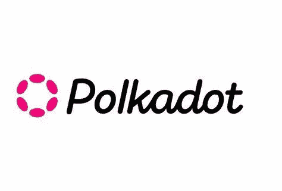

# 什么是波尔卡多？

> 原文：<https://medium.com/coinmonks/what-is-polkadot-b24bf90ff753?source=collection_archive---------46----------------------->

Source photo [polkadot (dot) — Bing images](https://www.bing.com/images/search?view=detailV2&ccid=1%2bkc488Z&id=FD2F405D475ADC2F206A355DEAC78B1690FE26C0&thid=OIF.oq%2bRqwbZq%2bPfW7h5XTYSbg&mediaurl=https%3a%2f%2fmotivationgrid.com%2fwp-content%2fuploads%2f2022%2f03%2fWhere-to-buy-polkadot.jpg&cdnurl=https%3a%2f%2fth.bing.com%2fth%2fid%2fR.d7e91ce3cf19ea257163babbd5c17c4f%3frik%3d%26pid%3dImgRaw%26r%3d0&exph=950&expw=1400&q=polkadot+(dot)&simid=6951460029647&FORM=IRPRST&ck=A2AF91AB06D9ABE3DF5BB8795D36126E&selectedIndex=55&ajaxhist=0&ajaxserp=0)

Polkadot 已经迅速发展成为整个加密货币行业中最受欢迎、也是迄今为止最大的加密货币区块链之一。

随着对 Polkadot 的热情不断增加，我们已经编写了一个完整的演练，以帮助那些不熟悉该项目的人。

## 简单来说，什么是波尔卡多特？