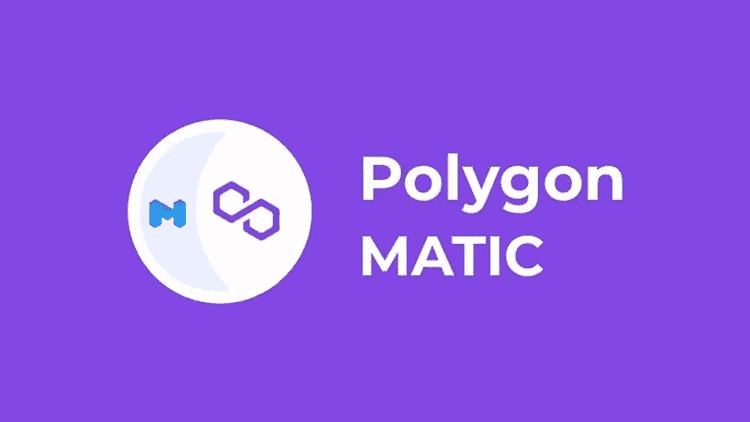

# 什么是多边形(MATIC)？

> 原文：<https://medium.com/coinmonks/what-is-polygon-matic-4dd6b2e9cb8d?source=collection_archive---------14----------------------->

[matic polygon — Bing images](https://www.bing.com/images/search?view=detailV2&ccid=8t%2fSuyzw&id=BE4AA9825B6E46D86041DA85D603DC713C0AB0F8&thid=OIP.8t_SuyzwlJhRP1FBhwhhygHaEK&mediaurl=https%3a%2f%2fstrapi.koshelek.ru%2fuploads%2fmedium_polygon_matic_logotip_logo_1163f77690.jpg&cdnurl=https%3a%2f%2fth.bing.com%2fth%2fid%2fR.f2dfd2bb2cf09498513f5141870861ca%3frik%3d%252bLAKPHHcA9aF2g%26pid%3dImgRaw%26r%3d0&exph=422&expw=750&q=matic+polygon&simid=608016688997814028&FORM=IRPRST&ck=5EBF01563DC401B5DE5541F9A42F62F9&selectedIndex=20&ajaxhist=0&ajaxserp=0)

Polygon 以前称为 MATIC network，是 2019 年开发的第二层扩展解决方案，旨在克服许多以太坊区块链限制，包括交易速度、吞吐量和天然气价格。

它是作为一个扩展解决方案创建的，但它很快成长为一个多用途的生态系统，引起了很多关注。它的原生硬币 MATIC 在 2019 年 IEO 繁荣时期出现在币安发射台。