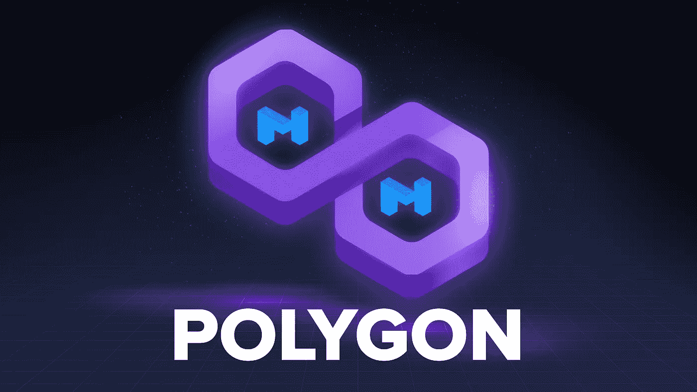

# 什么是多边形？它是如何工作的

> 原文：<https://medium.com/coinmonks/what-is-polygon-matic-and-how-does-it-work-220ec4643ca0?source=collection_archive---------5----------------------->

## 多边形解释

Polygon 是通过各种技术解决方案打破以太坊区块链局限性的网络。

在本文中，我们将了解 Polygon (MATIC)是什么，以及为什么它对加密货币世界如此重要。

