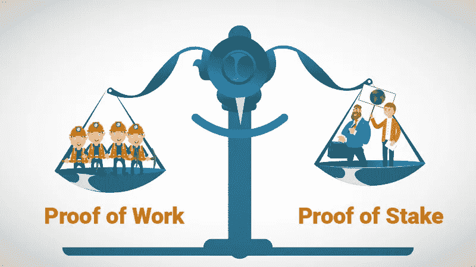

# 什么是 POS？

> 原文：<https://medium.com/coinmonks/what-is-pos-1be14eff98ee?source=collection_archive---------28----------------------->

# 什么是利益证明(POS)？

利害关系证明是区块链网络用来实现分布式共识的一种[共识机制](https://ethereum.org/en/developers/docs/consensus-mechanisms/)。

它要求用户将他们的 ETH 作为赌注，以成为网络中的验证者。在[的工作验证](https://ethereum.org/en/developers/docs/consensus-mechanisms/pow/)中，验证者负责与矿工相同的事情:排序事务和创建新的块，以便所有的节点都同意网络的状态。

# 利害关系证明、标桩和验证者

利害关系证明是在收到足够的利害关系时激活验证器的基础机制。对于以太坊，用户需要下注 32 ETH 才能成为验证者。验证器被随机选择来创建块，并负责检查和确认它们没有创建的块。

# 以太坊的股权证明是如何工作的？

与工作证明不同，验证器不需要使用大量的计算能力，因为它们是随机选择的，没有竞争。他们不需要开采区块；他们只需要在被选中时创建块，在没有被选中时验证建议的块。这种验证称为证明。你可以认为证明是在说“我觉得这个块看起来不错。”验证者会因为提出新的区块和证明他们已经看到的区块而获得奖励。

 [## Bartu Bozkurt -区块链开发者-私人 IT 公司| LinkedIn

### 查看巴图·博兹库尔特在全球最大的职业社区 LinkedIn 上的个人资料。巴图有 4 个工作列在他们的…

www.linkedin.com](https://www.linkedin.com/in/bartu-bozkurt/) 

> 加入 Coinmonks [电报频道](https://t.me/coincodecap)和 [Youtube 频道](https://www.youtube.com/c/coinmonks/videos)了解加密交易和投资

# 另外，阅读

*   [有哪些交易信号？](https://coincodecap.com/trading-signal) | [比特斯坦普 vs 比特币基地](https://coincodecap.com/bitstamp-coinbase)
*   [10 本最佳加密书籍](https://coincodecap.com/best-crypto-books) | [英国 5 个最佳加密机器人](https://coincodecap.com/uk-trading-bots)
*   [ko only 点评](https://coincodecap.com/koinly-review) | [Binaryx 点评](https://coincodecap.com/binaryx-review)|[Hodlnaut vs CakeDefi](https://coincodecap.com/hodlnaut-vs-cakedefi-vs-celsius)
*   [40 个最佳电报频道](https://coincodecap.com/best-telegram-channels) | [1xBit 回顾](https://coincodecap.com/1xbit-review) | [Keevo 钱包回顾](https://coincodecap.com/keevo-wallet-review)
*   [如何在印度购买以太坊？](https://coincodecap.com/buy-ethereum-in-india) | [如何在币安购买比特币](https://coincodecap.com/buy-bitcoin-binance)