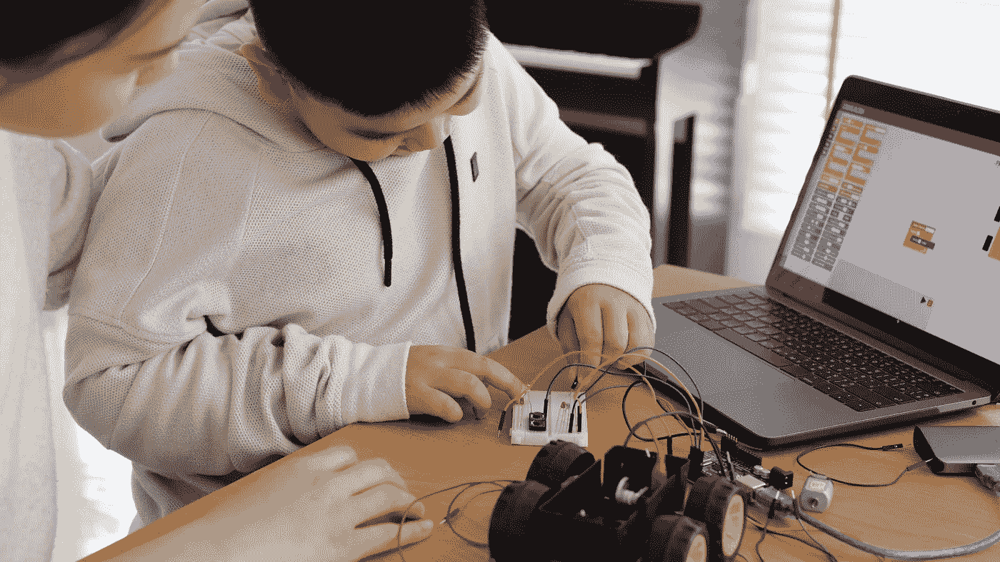
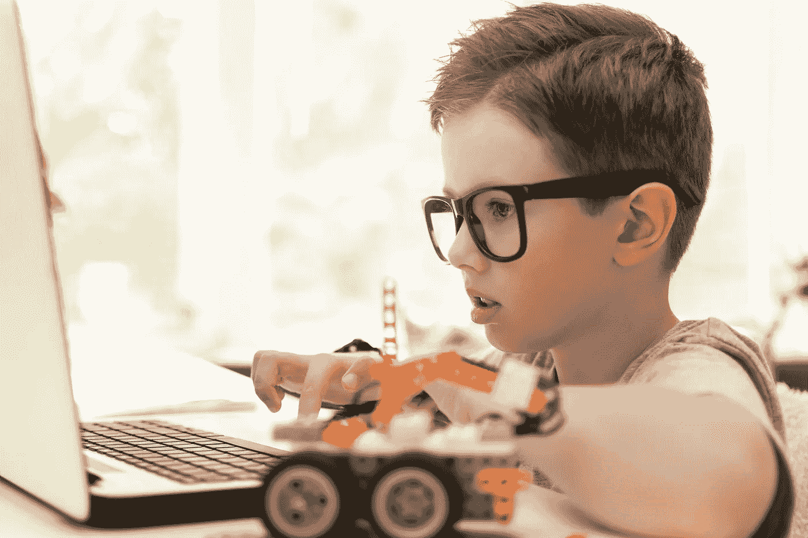

# 什么是编程，为什么要尽早学习？

> 原文：<https://medium.com/coinmonks/what-is-programming-and-why-should-you-learn-it-as-early-as-possible-d8ce3f35bad?source=collection_archive---------24----------------------->

编程是一种用来指导计算机执行特定任务的方法。在我们的数字经济中，这是一项非常有价值的技能。因此， [*早学编码*](http://wevun.com) *的孩子会比同龄人有很大优势。*

# **什么是编程？**

编程是给计算机下达指令的一种方式。从本质上讲，计算机有它们能理解的语言或代码。通过向[计算机提供此代码中的命令](/@sidpix/are-moocs-a-threat-or-an-opportunity-37130abfbfa0)，它可以执行计算任务，实现以下功能:

*   网站
*   [游戏开发](https://wevun.com/summer-camps/)
*   应用程序
*   软件

虽然许多人可以互换使用它们，但编程和编码是不同的技能。编码包括将概念分解成 1 和 0，以便计算机处理器能够解释它们。

编码是编程的一部分；然而，这只是几个步骤中的一部分。这些步骤包括:

*   规划
*   设计
*   测试
*   部署
*   维护

# 为什么学习编程是必不可少的？

我们的经济正变得越来越数字化。因此，近年来对程序员的需求大幅增加。[然而实际上存在编程技能短缺](https://enterprisetalk.com/featured/the-2022-state-of-developer-shortage/)。一些估计表明，只有 0.5%的美国人知道如何编码。

这些短缺的主要原因是没有足够的孩子学习编码。这种情况是一种耻辱，因为学习编码对所有年龄的孩子都非常有益。

[编码](https://wevun.com/our-curriculum/)需要学习一门计算语言。像任何语言一样，最好在年轻的时候学习。然而，一些父母担心编码可能太复杂或者是他们的孩子不感兴趣的东西。然而，进一步的研究表明，这种推理并不完全站得住脚。

孩子们对电子游戏非常感兴趣。他们喜欢玩游戏，观看其他人玩游戏是 YouTube 上最受欢迎的类别之一。

事实上，孩子们喜欢视频游戏的各个方面，包括游戏开发。近年来出现了像 Roblox 和《我的世界》这样的游戏，以抓住年轻观众的想象力。他们成功的很大一部分是他们如何鼓励用户建立和创造世界、游戏和其他元素。

孩子们对这些应用的明显兴趣提供了一个很好的机会。教孩子编程不会像拖着他们去上他们不想去的钢琴或舞蹈课一样。这将教会他们现在和将来可以使用的技能。

# 为什么孩子应该尽早学习编程

正如我们之前提到的，编程让孩子们最终进入了一个受欢迎的就业市场。应用程序、游戏、互联网等。，每天都在变得越来越受欢迎，经济迫切需要能够帮助设计下一代设备和想法的人。

此外，如果孩子们在年轻时学习编程，他们可以为成年后提高技能打下坚实的基础。当他们的同龄人正在与新的概念和实践角力时，学习编码的孩子可以向前推进。

然而，还有其他几个重要的原因让孩子们应该学习编码。

# #1.它促进了问题的解决

编码是帮助你的孩子发展解决问题技能的好方法。与创造力一样，解决问题一直是最受欢迎的职场技能之一。

编程要求人们以逻辑的方式分解任务。从编码的第一天起，你的孩子将会面临一些问题，他们需要解决这些问题来实现他们的成果。

这些技能可以转移到许多未来的职业中。

# #2.编码教授弹性

韧性和毅力是两种优秀的品质，在一个人的一生中都很有用。成功的编程需要人们养成坚持到底的精神。

问题和小故障是正常的，这意味着程序员必须学会解决和克服问题。

# #3.编码鼓励创造力

如前所述，创造力经常排在最需要的工作技能的首位。孩子们有丰富的创造力。编码可以驾驭这种力量，并确保它得到开发和维护。

如今一些最大和最受欢迎的游戏是 Roblox 和《我的世界》。Roblox 允许他们的社区编程和开发游戏，并相互分享和分发。另一方面，《我的世界》是一个开放世界的视频游戏，鼓励探索和建设。

构建游戏的本质——或者游戏或平台中的元素——需要创造力。通过鼓励孩子们与这些游戏互动，我们鼓励他们大胆梦想，尝试新事物，并提出解决方案。

# 孩子应该如何学习编码？

孩子学习编码最有效的方法是在结构化的环境中。虽然有些人只需要一台电脑，但大多数人受益于互动环境，在那里他们可以提出问题并获得反馈和支持。

在 Wevun Global，我们针对 7-14 岁的儿童开设有趣、有吸引力的课程。我们的课后编码学院提供了优秀的课程，将帮助您的孩子在编码方面建立坚实的基础和兴趣。

我们非常重视打破复杂的概念，通过开发一个有趣的环境来教授孩子们他们认为有价值的技能。

例如，[我们的课后课程](https://wevun.com/our-curriculum/)通过游戏开发教给孩子们各种技能。孩子们喜欢游戏，这种媒介利用这种兴趣教他们各种编码语言(比如 Python、JavaScript、Lua)和 Scratch 这样的开发平台。

此外，我们还围绕 Roblox 和《我的世界》等热门游戏开设了许多课程。我们的课程教孩子们如何构建游戏元素，甚至是他们可以和朋友一起玩的游戏。

通过专注于学习孩子们喜欢的东西，他们可以学会并坚持学习复杂的科目。

当然，尽管课后课程是我们工作的一大部分，我们也提供[夏令营。](https://wevun.com/summer-camps/)

Wevun 提供的一些很棒的夏季课程有:

●初学编码营

●《我的世界》结构发展

●《我的世界》改装

● Scratch 游戏开发

●无人机编程

这些课程最好的部分是它们在网上进行。没有必要开车来回，孩子们可以在他们喜欢的任何舒适的环境中学习编码技能。

[今天就注册 Wevun](https://wevun.com/register/) 吧，这样你就可以让你的孩子参加在线课程或暑期班，在一个有趣和令人鼓舞的环境中教会他们编程、创造力、适应力和解决问题等技能。

> 加入 Coinmonks [电报频道](https://t.me/coincodecap)和 [Youtube 频道](https://www.youtube.com/c/coinmonks/videos)了解加密交易和投资

# 另外，阅读

*   [5 款最佳加密交易终端](https://coincodecap.com/crypto-trading-terminals) | [最佳 DeFi 应用](https://coincodecap.com/best-defi-apps)
*   [最佳网上赌场](https://coincodecap.com/best-online-casinos) | [币安评论](/coinmonks/binance-review-ee10d3bf3b6e) | [BitMEX 评论](https://coincodecap.com/bitmex-review)
*   [麻雀交换评论](https://coincodecap.com/sparrow-exchange-review) | [纳什交换评论](https://coincodecap.com/nash-exchange-review)
*   [美国最佳加密交易机器人](https://coincodecap.com/crypto-trading-bots-in-the-us) | [经常性评论](https://coincodecap.com/changelly-review)
*   [在印度利用加密套利赚取被动收入](https://coincodecap.com/crypto-arbitrage-in-india)
*   [Godex.io 审核](/coinmonks/godex-io-review-7366086519fb) | [邀请审核](/coinmonks/invity-review-70f3030c0502) | [BitForex 审核](https://coincodecap.com/bitforex-review)