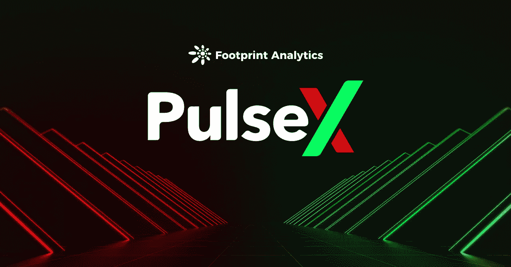
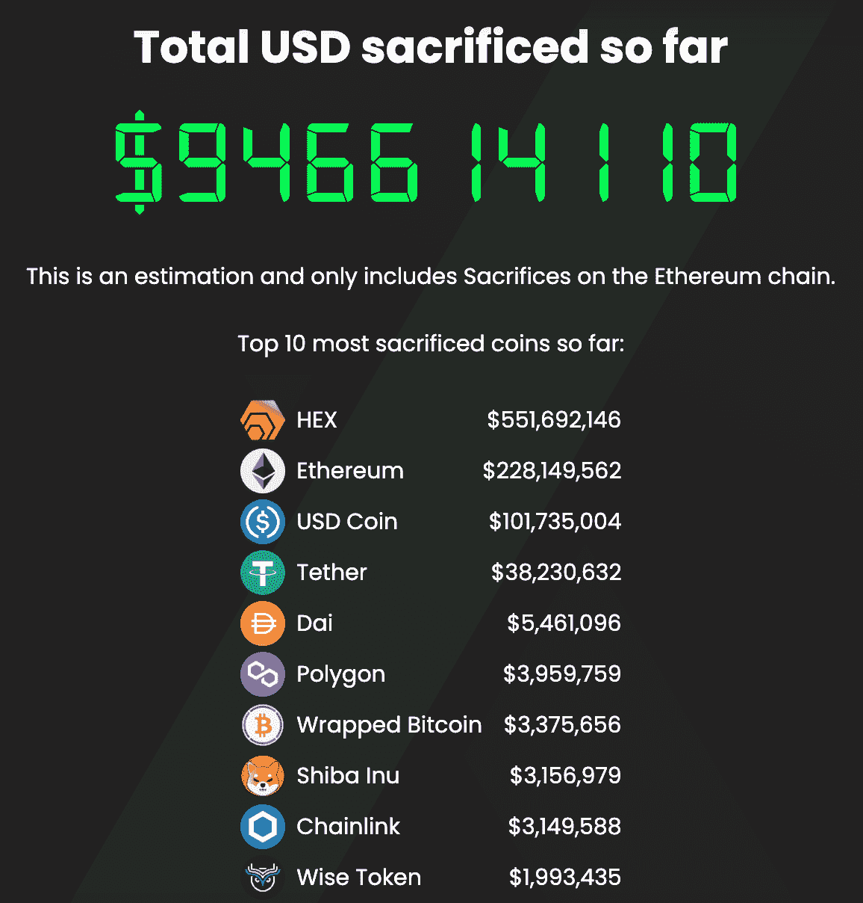
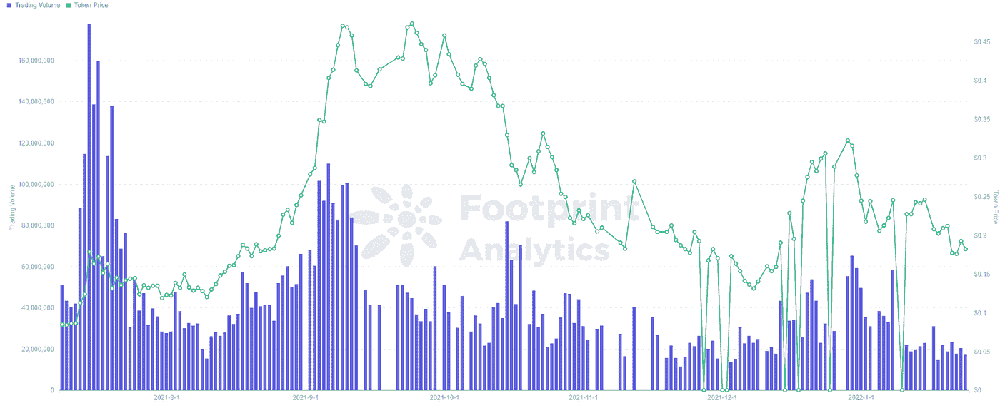

# PulseX 是什么，为什么人们给它十亿美元？

> 原文：<https://medium.com/coinmonks/what-is-pulsex-and-why-did-people-give-it-a-billion-dollars-a63d95e9541?source=collection_archive---------9----------------------->

1 月 26 日

1 月 10 日，PulseX“牺牲”的第一阶段结束，使该项目的总投资达到 10 亿美元，并成为加密史上最大的融资轮之一(尽管是非官方的)。

这是在 5 亿美元牺牲给 Pulsechain 之后的 4 个月，pulse chain 是一个未来的以太坊分支，PulseX 预计将成为它的主要指数。

PulseX 网站上的免责声明写道，“牺牲你的密码，你就买不到 PLSX。你可以放弃你的密码，牺牲它作为一个政治声明。”

取决于你问的是批评者还是支持者，这一条款要么是避免被 SEC 贴上证券标签的漏洞，要么是下一个 Bitconnect 的证据。

假设牺牲的大部分资金是出于利润预期而进行的实际投资，而不是来自与团队相关的钱包以扩大项目，那么由有争议的加密货币 Hex 的创始人 Richard Heart 领导的链条是如何成为加密史上最大的众筹活动之一的？

为什么讨论几乎完全局限于 Hex 社区？

本文将解释一些人认为 Pulsechain 和 PulseX 将会做什么。它还将列出一些人认为该项目是一个骗局的原因。

【Pulsechain 解决什么问题？

数百个成功的 DApps 已经在以太坊上推出，但该网络的普及使其使用昂贵且速度缓慢。2021 年，天然气费——交易生效的价格——偶尔会达到数百美元。

这使得开发人员意识到新的第 1 层链的潜力，如 Solana、币安智能链和 Polygon，它们托管自己的 DApps。其中一些链与以太坊不兼容，需要桥接解决方案来实现互操作。其他的，像 Polygon，兼容以太坊。

对于用户来说，使用 EVM 兼容链最明显的好处是，你可以在那个 DEX 上交换一个 ERC-20 令牌，或者在 Uniswap 这样的以太坊 DEX 上从你的链上购买一个项目令牌。

当构建第一层链时，开发者理论上可以复制以太坊的全部代码，创建一个完全不同的协议，或者像 T4 BSC 一样，对其进行一些改进。

在加密语言中，区块链的“分叉”意味着改进的版本，开发者对协议及其规则进行修改。当以太坊升级时，例如伦敦升级，它们也被称为叉子。

根据创始人 Richard Heart 的说法，Pulsechain 将是以太坊的一个分支。变化的程度还不清楚——还没有向公众发布任何代码。然而，主要的主张是:

*   4 倍吞吐量
*   利害关系证明
*   通货紧缩机制

此外，以太坊的所有主要 DApps 也将分叉。换句话说，目标是复制以太坊，并从一开始就有一个内置的生态系统。

**什么是 PulseX？**

由于以太坊生态系统将被复制到 Pulsechain，PulseX 将成为 Uniswap 的分叉。

它旨在成为 Pulsechain 生态系统的主要指标。作为参考，PancakeSwap 也是 Uniswap 的一个分支，并在币安智能链上实现了类似的功能。

像 SushiSwap 和 Uniswap 这样的 dex 有自己的治理令牌——分别是 SUSHI 和 UNI——授予持有者投票权。PLSX 将是 PulseX 的代币，牺牲的人根据贡献的大小和时间获得一定数量的“积分”。这些点数相当于交易所启动后空投到他们钱包里的 PLSX 数量。

同样，PLS——pulse chain 的本地加密货币——将被空投给那些为该项目做出牺牲的人。

PLSX 和 PLS 的价格将从 0 美元开始，随后的价格目标是任何人的猜测。

许多人认为 Pulse 将在 3 月或 4 月推出，PulseX 将在年底推出。

**脉冲会解决以太坊拥堵吗？**

理查德·哈特(Richard Heart)曾表示，Pulsechain 的目标不是与以太坊竞争，而是减轻网络负担。

除了分叉以太坊，该项目还将复制链的状态。每个钱包都将在 Pulsechain 上获得一个匹配的 ERC 20 代币。换句话说，这将是一次大规模空投。

比如你有 10 个 eHEX(以太坊网络十六进制)，你会在 Pulsechain 上额外得到 10 个 pHEX (Pulsechain [十六进制](https://www.footprint.network/guest/chart/hex-token-performance-fp-a6497e04-dde5-47e8-889f-08ce1488bffe?channel=u-apcVFj#secret=0C79DBC91FA7DEA28CA3F1CDA77462C8))。

但是，以太坊和 Pulsechain 代币上没有办法盯住同一个代币的价格，意味着后者可能一文不值，或者更贵。

**为什么有人相信脉脉是骗局**

对 Pulse 和 PulseX 最大的批评是，它们与 [Hex](https://www.footprint.network/guest/chart/hex-token-performance-fp-a6497e04-dde5-47e8-889f-08ce1488bffe?channel=u-apcVFj) 直接相关，这是一种有争议的令牌，在价格方面表现良好，但基本面可疑。

根据 Richard Heart 的说法，Hex 的目标是成为区块链的本地存单。

存款的实际凭证之所以存在，是因为金融机构利用这种存款在整个市场中获取回报。他们可以这样做，因为你存款的货币，例如美元，具有可销售性和可利用的价值，银行在利用它之后会这样做。换句话说，存单之所以有效，是因为银行用购买者的钱创造价值，即以贷款的形式；这些钱仅仅存在账户里不会产生价值，货币的稳健性先于它可以被存起来赚取利息这一事实。

换句话说，在传统意义上，锁定机制是 CDs 发挥作用的必要但非充分条件。

目前，加密赌注赚取的高 APY 来自促进交易所货币互换的代币，这是一项需求非常高的服务。目前，Hex 不提供任何服务，不通过贷款产生价值，也没有作为数字货币被广泛采用。

那么每年 40%的 APY 从何而来呢？高回报完全是通过购买没有赌注的新 Hex 来维持的，这就是经典的庞氏骗局。

此外，传统金融市场中的骗局和庞氏骗局也经常伪装成存单。表现明显优于市场的 CDs 往往会吸引监管机构的注意，而所谓的数字存款证，尤其是那些声称提供好得令人难以置信的回报的存单，应该受到严格审查。

**反驳观点**是 Hex 的智能合约是为了激励价格稳定而建立的。事实是，比特币的价值取决于它的感知价值，事实上，在它作为一种有风险但有利可图的投资资产被广泛接受之前，它的价值非常低。换句话说，致富的欲望催生了比特币，随之而来的是关于其基本面合理性的争论。

最终，比特币可能会成为一种广泛使用的货币，但它最初将是一种高度投机的资产，也经常被称为骗局。

Hex 声称采用了比特币的功能，但使用了股权证明，并增加了一个赌注机制，增加了那些完成任期的人的回报，与那些没有完成的人成反比。Hex 不是像比特币一样向矿工支付新铸造的货币，即通货膨胀，而是向提供稳定的赌注者支付通货膨胀。理想情况下，轻松获利的潜力将推动大规模采用，之后可以在其基础上建立一个高效的生态系统。Pulsechain 和 PulseX 应该是这个生态系统的初始步骤。

**什么是足迹**

足迹分析是一个一体化的分析平台，用于可视化区块链数据和发现见解。它清理和整合链上数据，因此任何经验水平的用户都可以快速开始研究令牌，项目和协议。凭借一千多个仪表板模板和一个拖放界面，任何人都可以在几分钟内构建自己的定制图表。发掘区块链数据，利用足迹进行更明智的投资。

*足迹网址:*[*https://www . Footprint . network/*](https://www.footprint.network/)

*不和:*[*https://discord.gg/3HYaR6USM7*](https://discord.gg/3HYaR6USM7)

*碎碎念:*[*【https://twitter.com/Footprint_DeFi】*](https://twitter.com/Footprint_DeFi)

*Youtube:*[*https://www.youtube.com/channel/UCKwZbKyuhWveetGhZcNtSTg*](https://www.youtube.com/channel/UCKwZbKyuhWveetGhZcNtSTg)

> *加入 Coinmonks* [*电报频道*](https://t.me/coincodecap) *和* [*Youtube 频道*](https://www.youtube.com/c/coinmonks/videos) *了解加密交易和投资*

# 另外，阅读

*   [3 商业评论](/coinmonks/3commas-review-an-excellent-crypto-trading-bot-2020-1313a58bec92) | [Pionex 评论](https://coincodecap.com/pionex-review-exchange-with-crypto-trading-bot) | [Coinrule 评论](/coinmonks/coinrule-review-2021-a-beginner-friendly-crypto-trading-bot-daf0504848ba)
*   [莱杰 vs n rave](/coinmonks/ledger-vs-ngrave-zero-7e40f0c1d694)|[莱杰 nano s vs x](/coinmonks/ledger-nano-s-vs-x-battery-hardware-price-storage-59a6663fe3b0) | [币安评论](/coinmonks/binance-review-ee10d3bf3b6e)
*   [Bybit Exchange 评论](/coinmonks/bybit-exchange-review-dbd570019b71) | [Bityard 评论](https://coincodecap.com/bityard-reivew) | [Jet-Bot 评论](https://coincodecap.com/jet-bot-review)
*   [3 commas vs crypto hopper](/coinmonks/3commas-vs-pionex-vs-cryptohopper-best-crypto-bot-6a98d2baa203)|[赚取加密利息](/coinmonks/earn-crypto-interest-b10b810fdda3)
*   最好的比特币[硬件钱包](/coinmonks/hardware-wallets-dfa1211730c6) | [BitBox02 回顾](/coinmonks/bitbox02-review-your-swiss-bitcoin-hardware-wallet-c36c88fff29)
*   [BlockFi vs 摄氏度](/coinmonks/blockfi-vs-celsius-vs-hodlnaut-8a1cc8c26630) | [Hodlnaut 审核](/coinmonks/hodlnaut-review-best-way-to-hodl-is-to-earn-interest-on-your-bitcoin-6658a8c19edf) | [KuCoin 审核](https://coincodecap.com/kucoin-review)
*   [Bitsgap 评审](/coinmonks/bitsgap-review-a-crypto-trading-bot-that-makes-easy-money-a5d88a336df2) | [Quadency 评审](/coinmonks/quadency-review-a-crypto-trading-automation-platform-3068eaa374e1) | [Bitbns 评审](/coinmonks/bitbns-review-38256a07e161)