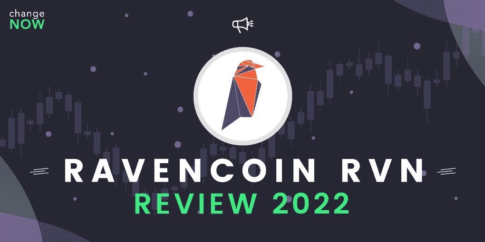
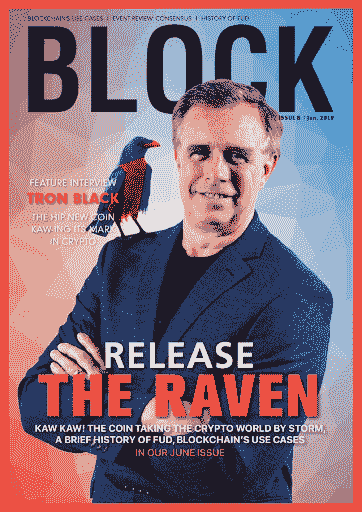
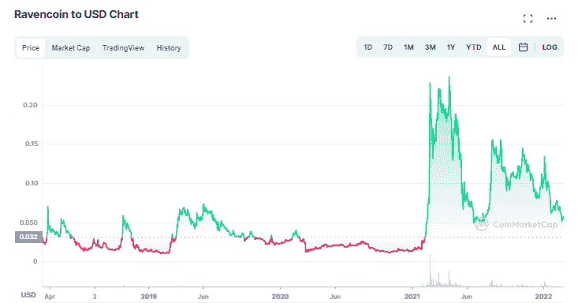

# 什么是 Ravencoin？RVN 审查 2022

> 原文：<https://medium.com/coinmonks/what-is-ravencoin-rvn-review-2022-906753b7e055?source=collection_archive---------6----------------------->

Ravencoin 是比特币的一个分支，它使用户能够创建和管理数字令牌，即时安全地转移它们，并通过公平分配奖励来挖掘。

这种硬币于 2018 年 1 月推出——在第一次大牛市的高峰期，也是比特币 9 周年纪念日。该资产的名称参考了《权力的游戏》:当乌鸦在维斯特洛传递真理的声明时，**传递了关于网络用户的真理声明。**

**在工作证明资产领域，Ravencoin 是被认为具有最佳前景的资产之一。2021 年，加密货币暴涨 8 倍。是什么让 Ravencoin 如此值钱，对 RVN 的价格预测是什么？**

# **什么是瑞文币(RVN)？**

**Ravencoin 是一个开源的点对点网络，于 2018 年上线。它的主要目标是在全球范围内简化资产的创建、管理和转移。**

**在 RVN 区块链上，任何人都可以构建为特定目的定制的令牌。这些可以是实用程序、安全性、游戏资产或 NFT。开发人员可以给它们命名，限制它们的供应量，并设置其他特征。**

**公平令牌分配在 Ravencoin 中是如何工作的，为什么这很重要？**

****交易会启动。**在 RVN 的早期，所有用户都可以平等地投资和开采金币。没有预挖掘、ICO、代币销售或对创始人的特殊奖励。**

****公平开采。**包括比特币在内的许多工作证明币因采矿集中化而受到批评——这对个体矿工来说成本太高，因此只有大型企业才能负担得起。Ravencoin 解决了这个问题。这种硬币是抗 ASIC 的——它偶尔会改变哈希算法(自 2018 年以来已经改变了两次)，并对不同的块使用不同的哈希函数。ASIC 生产商无法适应如此快速的变化，所以普通用户可以用 GPU 盈利挖矿。Ravencoin 就是这样实现采矿的去中心化和奖励的公平分配的。**

# **什么是乌鸦币(RVN)队？**

**Ravencoin 的创始人是开发者 [**Tron Black**](https://twitter.com/tronblack) 和商人 [**Bruce Fenton**](https://twitter.com/brucefenton) 。Black 也是 RVN 的首席开发人员——当 coin 刚刚推出时，该团队获得了来自 Medici Ventures 的融资，Black 是该公司的主要开发人员。目前，RVN 区块链由社区于 2020 年发起的 [**乌鸦币基金会**](https://ravencoin.foundation/) 指导。**

****

**Tron Black 在 BLOCK 杂志，2019 年 6 月。**

**Raven 不会公开透露任何关于其团队的信息。所有关于开源项目开发的工作都是由 Ravencoin 基金会的分散社区完成的，并由 Tron Black 管理。**

# **什么是乌鸦币(RVN)路线图？**

**Ravencoin 路线图可以在团队官方 [**GitHub**](https://github.com/RavenProject/Ravencoin/blob/master/roadmap/README.md) 上找到。它显示了 9 个阶段，其中一些已经在 2021 年 3 月完成(上次更新提交到 GitHub 页面的时间)。它们包括 Ravencoin 区块链启动、资产创建和管理工具的完成以及针对 ASICs 的措施。**

**在第 8 和第 9 阶段，团队实现了这样的功能，如使用种子短语作为受限资产的备份。阶段 6 和阶段 7 被认为是未完成的——它们包括投票和增加新创建资产的兼容性。**

# **乌鸦币网络**

**公平推出和奖励分配并不是 Ravencoin 相对于其前身比特币的唯一优势。以下是区块链的 4 项技术创新:**

*   ****最大供给量增加。**BTC 有 2100 万人，越南有 210 亿人。**
*   ****不同区块奖励大小。**比特币的奖励是 6.25 币，而在 Ravencoin 是 2500。这个总数也每 4 年翻一番——第一次 RVN 减半发生在 2022 年 1 月，将 5000 英镑的奖励减少了 50%。**
*   ****阻滞时间缩短。**在比特币是 10 分钟，在 Ravencoin 是 1 分钟。**
*   ****不同的哈希函数。** BTC 利用 SHA-256，而 RVN 使用 KAWPOW。之前币用的是 X16R 和 X16Rv2 功能，但为了防止 ASICs 适配而放弃了。因此，用户仍然可以在 GPU 上开采 Ravencoin 这对单枪匹马的矿工来说更实惠。**

# **如何开采拉文币(RVN)？**

**以下是开始的 4 个步骤:**

1.  ****购买采矿硬件。**你需要一个至少 4 GB 内存的 GPU (AMD 或 Nvidia 的 1070 Ti)。**
2.  **安装一个 Ravencoin 钱包。最好的选择是 [**瑞文芯**](https://ravencoin.org/wallet/) 钱包。**
3.  **获得允许你使用 KAWPOW 散列函数的软件。如果你有一个 Nvidia GPU，你可以利用开源的 [**Kawpowminer**](https://github.com/RavenCommunity/kawpowminer/releases) 以及 [**T-Rex Miner**](https://github.com/trexminer/T-Rex/releases) 或 [**Gminer**](https://github.com/develsoftware/GMinerRelease/releases) (他们分别收取 1%和 2%的费用)。对于 AMD GPU 来说， [**TeamRedMiner**](https://github.com/todxx/teamredminer/releases) 是最好的选择之一，收费 2%。 [**Nanominer**](https://github.com/nanopool/nanominer/releases) 和 [**NBMiner**](https://github.com/NebuTech/NBMiner/releases) (1%和 2%)适用于这两种类型的 GPU。**
4.  ****根据两个主要标准选择一个** [**矿池**](https://miningpoolstats.stream/ravencoin)——矿工多久确认一次区块(发生得越频繁，开采区块的概率越大，但如果是大矿池，奖励也会减少)，以及它的[奖励分配模式](https://changenow-io.medium.com/bitcoin-mining-pools-101-5beb713b68f1)是什么。**

# **拉文币价格变动**

**Ravencoin 展示了其推出到 2021 年 1 月之间的适度价格动态:有 3 个峰值，逐渐回到 1-2 美分的起始价格。后来，出现了 2021 年的大加密牛市和 GameStop 股票热潮，因此硬币在短短一个月内飙升至 0.285 美元，成为 11 倍。2022 年 2 月底，雷亚尔汇率为 0.057 美元。**

****

# **2022 年瑞文币(RVN)价格预测**

**Ravencoin 对 2022 年及以后的价格预测相当乐观。这是由于加密货币的基本价值——用户欣赏他们可以构建自定义令牌并公平地挖掘 RVN。再加上减半，这为 Ravencoin 的成长提供了良好的条件。**

**[**钱包投资者**](https://walletinvestor.com/forecast/ravencoin-prediction) 预测该资产一年后价值 1.21 美元，5 年后价值 0.35 美元。 [**数字币价格**](https://digitalcoinprice.com/forecast/ravencoin) 预计 2023 年 2 月越南盾为 0.089 美元。请记住，这些预测是用人工智能技术做出的，不应被视为投资建议。做你的研究，做出加权财务决策。**

# **购买和交易瑞文币(RVN)的最佳方式**

**你可以在所有主要的中央加密交易所(CEXes)购买 Ravencoin，如币安、比特币基地等。他们提供良好的交易体验，但需要注册、个人数据和身份检查。匿名购买 Ravencoin，使用[**change now**](https://changenow.io/currencies/ravencoin)——在我们的兑换服务中，你不需要通过注册或 KYC。只需几分钟，你就可以用 350+的数字资产购买 [**Ravencoin**](https://changenow.io/currencies/ravencoin) ，没有任何隐藏费用。你也可以用 50 多种法定货币的信用卡或借记卡购买 RVN。**

# **最佳瑞文硬币钱包**

*   **[**渡鸦核心**](https://ravencoin.org/wallet/) 。这是一个官方的 Ravencoin 钱包，它是开源的，支持所有的网络功能。在这里，您可以创建代币，自定义代币，在所有基于 Ravencoin 的资产中发送和接收付款，等等。**
*   **[**NOW Wallet**](https://walletnow.app/) 灵感来自 ChangeNOW 即时加密交换服务社区，并基于我们在硬币交换领域的多年经验。作为一个非保管钱包，现在不会收集任何私人数据，也无法访问您的私钥(它们存储在您的本地设备上)。现在 Wallet 内置了代币兑换工具，包括菲亚特购买。界面清晰直观。**

# **摘要**

**[**Ravencoin**](https://changenow.io/currencies/ravencoin) 是一个工作证明网络，用户可以在其中发布公用事业、安全资产和收藏品。该资产是一个比特币叉子，有 4 项创新，使其网络更快、更安全。Ravencoin 是抗 ASIC 的，去中心化的，给矿工提供公平的奖励分配。所有这些都让投资者能够积极看待资产的未来。如果你也看好瑞文，就去 [**ChangeNOW**](https://changenow.io/currencies/ravencoin) 买硬币吧。**

> **加入 Coinmonks [电报频道](https://t.me/coincodecap)和 [Youtube 频道](https://www.youtube.com/c/coinmonks/videos)了解加密交易和投资**

# **另外，阅读**

*   **[币安收费](/coinmonks/binance-fees-8588ec17965) | [僵尸加密审查](/coinmonks/botcrypto-review-2021-build-your-own-trading-bot-coincodecap-6b8332d736c7) | [热点审查](/coinmonks/hotbit-review-cd5bec41dafb)**
*   **[my constant Review](https://coincodecap.com/myconstant-review)|[8 款最佳摇摆交易机器人](https://coincodecap.com/best-swing-trading-bots)**
*   **[我的加密副本交易经历](/coinmonks/my-experience-with-crypto-copy-trading-d6feb2ce3ac5) | [AAX 交易所评论](/coinmonks/aax-exchange-review-2021-67c5ea09330c)**
*   **[逐位融资融券交易](/coinmonks/bybit-margin-trading-e5071676244e) | [币安融资融券交易](/coinmonks/binance-margin-trading-c9eb5e9d2116) | [超位审核](/coinmonks/overbit-review-9446ed4f2188)**
*   **[有哪些交易信号？](https://coincodecap.com/trading-signal) | [比特斯坦普 vs 比特币基地](https://coincodecap.com/bitstamp-coinbase)**
*   **[10 本关于加密的最佳书籍](https://coincodecap.com/best-crypto-books) | [英国 5 个最佳加密机器人](https://coincodecap.com/uk-trading-bots)**
*   **[Koinly 回顾](https://coincodecap.com/koinly-review) | [Binaryx 回顾](https://coincodecap.com/binaryx-review) | [Hodlnaut vs CakeDefi](https://coincodecap.com/hodlnaut-vs-cakedefi-vs-celsius)**
*   **[40 个最佳电报频道](https://coincodecap.com/best-telegram-channels) | [1xBit 回顾](https://coincodecap.com/1xbit-review) | [Keevo 钱包回顾](https://coincodecap.com/keevo-wallet-review)**