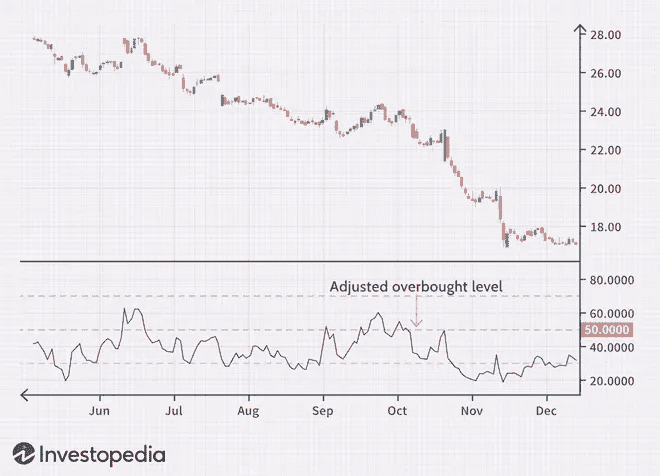

# 什么是相对实力指数？加密和外汇

> 原文：<https://medium.com/coinmonks/what-is-relative-strength-index-crypto-forex-5f6376b32dd9?source=collection_archive---------13----------------------->

在我们的 YouTube 上观看视频的同时，享受这个流的资源！

YouTube:[https://youtu.be/Or0ws0V5V7M](https://youtu.be/Or0ws0V5V7M)

不和:【https://discord.gg/J73qhkj7kr】T2

推特:【https://twitter.com/CryptoverseDAO】

linktree:[https://linktr.ee/cryptoversedao](https://linktr.ee/cryptoversedao)

-

什么是相对强弱指数(RSI)？

相对强弱指数(RSI)是技术分析中使用的一种动量指标，用于衡量最近价格变化的幅度，以评估股票或其他资产价格的超买或超卖情况。RSI 显示为一个振荡器(在两个极端之间移动的线形图),读数可以从 0 到 100。该指标最初是由 J. Welles Wilder Jr .提出的，并在他 1978 年的开创性著作《技术交易系统新概念》中介绍。一

RSI 的传统解释和用法是，70 或以上的值表明证券正在超买或高估，可能预示着价格的趋势反转或回调。RSI 读数为 30 或以下表明超卖或低估。

相对强度指数(RSI)是 1978 年开发的一个流行的动量振荡器。
RSI 为技术交易者提供了看涨和看跌价格动量的信号，它通常绘制在资产价格图的下方。
当 RSI 高于 70%时，通常认为资产超买，当 RSI 低于 30%时，通常认为资产超卖。

RSI 的公式是:

RSI 的计算分为两部分，从以下公式开始:

计算中使用的平均收益或损失是回顾期内收益或损失的平均百分比。该公式使用正值表示平均损失。在计算平均收益时，价格亏损的期间被计为 0，而在计算平均亏损时，价格上涨的期间被计为 0。

标准是使用 14 个周期来计算初始 RSI 值。例如，假设市场在过去 14 天中有 7 天收盘上涨，平均涨幅为 1%。其余七天均以 0.8%的平均跌幅收盘。

RSI 第一部分的计算类似于以下扩展计算:

一旦有 14 个时间段的数据可用，就可以计算 RSI 公式的第二部分。计算的第二步是平滑结果。

RSI 的计算:

使用上面的公式，可以计算 RSI，然后在资产的价格图表下绘制 RSI 线。

RSI 会随着正面平仓的数量和规模的增加而上升，随着亏损的数量和规模的增加而下降。计算的第二部分平滑了结果，所以在一个强趋势市场中，RSI 只会接近 100 或 0。

正如你在上面的图表中看到的，当股票处于上升趋势时，RSI 指标可以长时间停留在超买区域。当股票处于下跌趋势时，该指标也可能长时间处于超卖区域。这可能会让新分析师感到困惑，但学会在主流趋势的背景下使用该指标将会澄清这些问题。

RSI 告诉你什么？

股票或资产的主要趋势是确保正确理解指标读数的重要工具。例如，著名的市场技术专家康斯坦斯·布朗(Constance Brown，CMT)提出了一种观点，即在上升趋势中 RSI 的超卖读数可能远高于 30%，而在下降趋势中 RSI 的超买读数远低于 70%的水平。2

正如你在下图中看到的，在下跌趋势中，RSI 将在 50%附近而不是 70%见顶，这可以被投资者用来更可靠地发出熊市信号。许多投资者会在 30%和 70%之间的水平趋势线，当一个强大的趋势出现时，更好地识别极端。当股票或资产的价格处于长期水平通道时，通常没有必要修改超买或超卖水平。

使用适合趋势的超买或超卖水平的一个相关概念是关注符合趋势的交易信号和技术。换句话说，当价格处于看涨趋势时使用看涨信号，当股票处于看跌趋势时使用看跌信号，将有助于避免 RSI 可能产生的许多错误警报。

RSI 和 RSI 范围的解释:

一般来说，当 RSI 超过水平 30 参考水平时，是看涨信号，当它滑到水平 70 参考水平以下时，是看跌信号。换句话说，人们可以解读为 RSI 值为 70 或以上，表明一种证券正在超买或高估，可能是趋势反转或价格回调的前兆。RSI 读数为 30 或以下表明超卖或低估。

在趋势中，RSI 读数可能会落入一个波段或范围。在上升趋势中，RSI 往往保持在 30 以上，应该经常达到 70。在下跌趋势中，很少看到 RSI 超过 70，该指标经常达到 30 或以下。这些指导方针可以帮助确定趋势强度和发现潜在的反转。例如，如果在上升趋势中，RSI 在连续几次价格波动中不能达到 70，但随后下降到 30 以下，趋势已经减弱，可能会反转走低。

下跌趋势则相反。如果下跌趋势无法达到 30 或以下，然后反弹到 70 以上，则下跌趋势已经减弱，可能会反转向上。以这种方式使用 RSI 时，趋势线和移动平均线是有用的工具。

RSI 背离的示例:

当 RSI 创造了一个超卖读数，随后是一个更高的低点，与价格中相应的更低的低点相匹配时，就出现了看涨背离。这表明看涨势头上升，突破超卖区域可以用来触发新的多头头寸。

当 RSI 产生超买读数，随后出现与相应的价格高点匹配的较低高点时，出现看跌背离。

正如你在下图中看到的，当 RSI 形成更高的低点，价格形成更低的低点时，多头背离被确认。这是一个有效的信号，但当一只股票处于稳定的长期趋势时，背离可能是罕见的。使用灵活的超卖或超买读数将有助于识别更多的潜在信号。

RSI 摆动拒绝示例:

另一种交易技术检查 RSI 从超买或超卖区域重新出现时的行为。这个信号被称为看涨“摆动拒绝”，有四个部分:

RSI 跌入超卖区域。相对强弱指标在 30%以上重新交叉。
RSI 形成另一次下跌，但没有回到超卖区域。
RSI 随后突破最近的高点。

下图可以看到，RSI 指标超卖，突破 30%，形成反弹走高时触发信号的拒绝低点。以这种方式使用 RSI 非常类似于在价格图上画趋势线。

RSI 的局限性:

RSI 比较看涨和看跌的价格势头，并在可以放在价格图表下面的振荡器中显示结果。像大多数技术指标一样，它的信号在符合长期趋势时是最可靠的。

真正的反转信号很少，很难与假警报区分开来。例如，一个假阳性将是一个看涨交叉，随后是股票的突然下跌。假阴性是指出现空头交叉，但股价突然加速上涨的情况。

由于指标显示动量，当资产在两个方向都有显著动量时，它可以长时间保持超买或超卖。因此，RSI 在资产价格在看涨和看跌之间波动的振荡市场中最有用。

相对强弱指数(RSI)衡量的是什么？

相对强弱指数(RSI)是交易者用来评估股票或其他证券的价格势头的一种衡量方法。RSI 背后的基本思想是衡量交易者对证券价格的涨跌速度。RSI 在 0 到 100 的范围内绘制了这个结果。读数低于 30 一般表示股票超卖，读数高于 70 则表示超买。交易者通常会将 RSI 图放在价格图的下方，这样他们就可以将最近的趋势和市场价格进行比较。

什么是 RSI 买入信号？

一些交易员会认为，如果一只证券的 RSI 读数低于 30，这是一个“买入信号”，因为他们认为这只证券已经超卖，因此准备反弹。然而，这一信号的可靠性将部分取决于整体背景。如果该证券陷入显著的下跌趋势，那么它可能会在相当长的一段时间内继续以超卖水平交易。在这种情况下，交易者可能会推迟买入，直到他们看到其他确认信号。

RSI 和均线收敛背离(MACD)有什么区别？

RSI 和移动平均线收敛背离(MACD)都是试图帮助交易者理解证券最近交易活动的测量方法，但它们以不同的方式实现这一目标。本质上，MACD 的工作原理是平滑证券最近的价格运动，并将中期趋势线与另一条显示最近价格变化的趋势线进行比较。然后，交易者可以根据短期趋势线是高于还是低于中期趋势线来做出买卖决定。

> 加入 Coinmonks [电报频道](https://t.me/coincodecap)和 [Youtube 频道](https://www.youtube.com/c/coinmonks/videos)了解加密交易和投资

# 另外，阅读

*   [氹欞侊贸易评论](https://coincodecap.com/anny-trade-review) | [CoinSpot 评论](https://coincodecap.com/coinspot-review)
*   [新加坡十大最佳加密交易所](https://coincodecap.com/crypto-exchange-in-singapore) | [购买 AXS](https://coincodecap.com/buy-axs-token)
*   [投资印度的最佳加密软件](https://coincodecap.com/best-crypto-to-invest-in-india-in-2021) | [WazirX P2P](https://coincodecap.com/wazirx-p2p)
*   [西班牙 5 大最佳文案交易平台](https://coincodecap.com/copy-trading-spain)
*   [Pionex 双投](https://coincodecap.com/pionex-dual-investment) | [AdvCash 审核](https://coincodecap.com/advcash-review) | [秉持审核](https://coincodecap.com/uphold-review)
*   [面向开发者的 8 个最佳加密货币 APIs】](https://coincodecap.com/best-cryptocurrency-apis)
*   [7 个最佳零费用加密交易平台](https://coincodecap.com/zero-fee-crypto-exchanges)