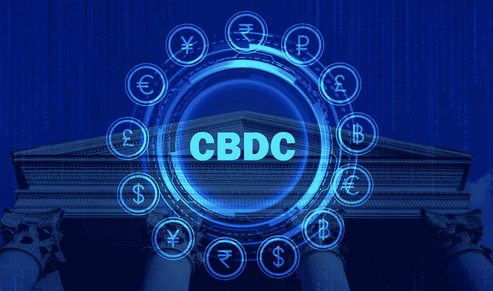

# Ripple 的 CBDC 是什么？

> 原文：<https://medium.com/coinmonks/what-is-ripples-cbdc-64c168b99e5a?source=collection_archive---------42----------------------->

Image by: [https://venturesafrica.com/what-you-need-to-know-about-cbns-digital-currency-e-naira/](https://venturesafrica.com/what-you-need-to-know-about-cbns-digital-currency-e-naira/)

Ripple 利用区块链技术，让央行、金融机构、政府和企业的全球交易变得更快、更便宜。

与比特币的区块链和以太网等其他网络相比，它使用不同的方法来验证交易。XRP 分类帐使用被允许审查交易的参与者的节点列表。有些人会说这仍然是集中的，因为不是任何人都可以…