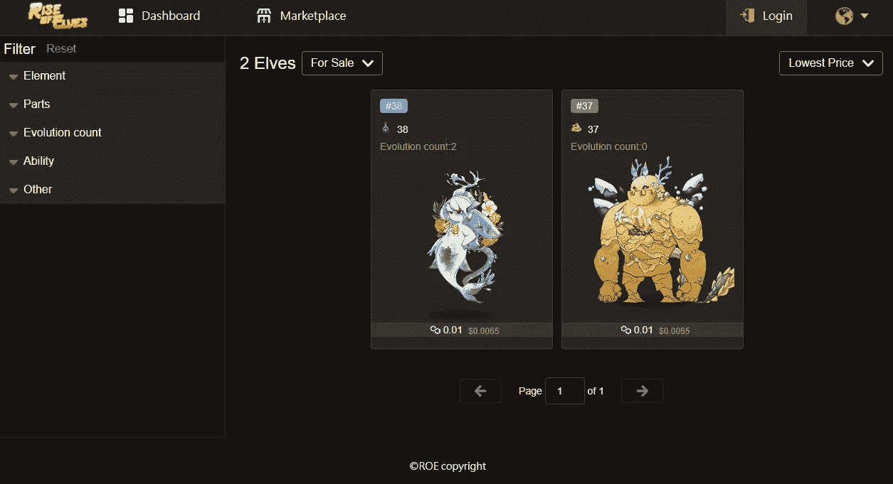

# 什么是精灵崛起？

> 原文：<https://medium.com/coinmonks/what-is-rise-of-elves-22273fdced09?source=collection_archive---------9----------------------->

Image by: [https://www.riseofelves.com](https://riseofelves.com)

区块链游戏的崛起让玩家而不是开发者成为了主要的财务决策者，从而扭转了游戏产业的局面。玩赚(P2E)加密游戏是一个不容忽视的趋势。但是在我们进入细节之前，有必要了解一下它是如何工作的。——(引自《最佳区块链游戏》——https://sensoriumxr.com/[博客](https://sensoriumxr.com/)

# 什么是精灵崛起？

这个游戏充满了可怕而有趣的被称为精灵的生物。精灵可以被战斗、聚集，甚至用来产生现实世界的现金。

# 作为 NFT 区块链游戏的精灵崛起

游戏在多边形边链上运行，边链允许快速交易和低费用。这主要是集中使用精灵攻击其他玩家或参与不同的活动，其中赢家和参与者将获得加密货币作为奖励。

为了玩这个游戏，玩家需要一个 NFT。在《精灵的崛起》中，一个精灵由 NFT 或者不可替代的标记来代表。反过来，拥有一个精灵 NFT 会将所有权给予《精灵崛起》的购买者或玩家。

# 《精灵崛起》是如何运作的？

Beta Rise of Elves Marketplace

《精灵的崛起》是一款 NFT 游戏。有必要在市场上购买精灵 NFT。与此同时，在撰写这篇博客时，这款游戏正在进行封闭测试，discord 成员可以进行测试，并获得免费的测试版精灵和彩蛋，以感受和享受游戏。一旦游戏开始，一个 Elf 可以通过使用 MATIC(多边形网络的一个管理令牌)来购买。

https://discord.gg/VzBk3KkHgX[的不和谐链接](https://discord.gg/VzBk3KkHgX?fbclid=IwAR2WGQol6u7UpkCh9V5xUSBr8YT80Wd1ljiy0HW-WVfrCtUMqmjejLSOUdA)将会让你置身于精灵崛起的社区中，并对游戏有更多的了解。

# 一场赚钱的游戏

***玩赚游戏使用加密货币奖励玩家具有实际价值和虚拟价值的东西。****(*[https://www . the sun . co . uk/tech/17534658/play-to-earn-games-money/](https://www.thesun.co.uk/tech/17534658/play-to-earn-games-money/))

在《精灵的崛起》的白皮书中，强调了他们选择使用该游戏来赚取机械师的原因，原因如下:

*   *游戏需要玩家。通过玩游戏，玩家也将增加对整个社区的价值，这应该得到回报。*
*   *精灵崛起的生态系统是多元的，像新的冒险一样探索这个世界的各种未知和挑战，而持有 ROE 币的人将成为决定方向的决策者，拥有这个全新的生态系统。*
*   在过去的游戏中，如 MMORPG，生产出来的资源或稀有物品不属于玩家，不能轻易交易或交换。但是，通过区块链的特点和游戏的设计来赚取，它将被颠覆。我们现在正在寻找有相同愿景的玩家，通过玩游戏来分享结果。

Play to Earn 的目的是引诱希望赚取大奖的玩家加入精灵崛起生态系统，并给予最活跃的社区成员在整个生态系统中的所有权和股份。

他们将分发 ROE 币作为一些关键活动的奖励，通过玩赚取机械，例如:

*   在竞技场上竞争并获胜，
*   在锦标赛中名列前茅，
*   使用精灵官方市场的崛起，和
*   进化精灵。

玩赚的分配可以认为是精灵生态圈崛起的营销预算。当有一个新的游戏模式或产品即将推出时，这些游戏赚取的比例可能会增加。

随着时间的推移，ROE 硬币的持有者将决定分配。通过 Play to Earn 发行版获得的 ROE 币可立即交易，但开发团队将密切监控情况，以确定是否需要锁定奖励。

# 最后的想法

“玩到赚”仍处于起步阶段，并已成为游戏领域的一个领先市场。

引用世界经济论坛的一篇文章，*“我们认为它有可能改变人们与金融机构、市场和政府等传统社会经济结构的互动和感知方式。这是因为“玩即赚”游戏为自我主权金融体系、开放的创造者经济以及普遍的数字表现和所有权提供了概念证明，这些都有助于各种新兴的数字环境和价值创造形式。”*

因此，像《精灵崛起》这样的游戏需要通过流行度测试，为游戏市场创造经济和社会价值，并最终为社区带来持久回报。

来源:

【https://whitepaper.riseofelves.com/economy/play-to-earn 

 [## “玩即赚”游戏对经济和元宇宙意味着什么

### 随着游戏行业的发展，玩赚游戏可以将数字身份、资产和所有权带到玩家手中…

www.weforum.org](https://www.weforum.org/agenda/2021/11/what-play-to-earn-games-mean-for-the-economy-and-metaverse/) 

***免责声明:*** *本博客仅用于一般教育目的。此处提供的信息不构成投资或交易建议。在承担财务风险之前，请寻求专业建议。*

***关于作者***

Brayan Nelson 是一名业余爱好作家，目前是一名大学讲师，同时是 Elemints NFT 项目的实习生和精灵不和服务器崛起的总版主。在 Medium 上，他写了他在 NFT 和元宇宙的联系和教育之旅。订阅他的时事通讯，成为第一个阅读他的博客故事的人。你也可以在 bnelsonsep3@gmail.com 通过电子邮件联系他

https://www.linkedin.com/in/bnelsonsep3

> 加入 Coinmonks [电报频道](https://t.me/coincodecap)和 [Youtube 频道](https://www.youtube.com/c/coinmonks/videos)了解加密交易和投资

# 另外，阅读

*   [BigONE 交易所评论](/coinmonks/bigone-exchange-review-64705d85a1d4) | [电网交易机器人](https://coincodecap.com/grid-trading)
*   [氹欞侊贸易评论](https://coincodecap.com/anny-trade-review) | [CoinSpot 评论](https://coincodecap.com/coinspot-review)
*   [新加坡十大最佳加密交易所](https://coincodecap.com/crypto-exchange-in-singapore) | [购买 AXS](https://coincodecap.com/buy-axs-token)
*   [投资印度的最佳加密软件](https://coincodecap.com/best-crypto-to-invest-in-india-in-2021) | [WazirX P2P](https://coincodecap.com/wazirx-p2p)
*   [西班牙 5 大最佳文案交易平台](https://coincodecap.com/copy-trading-spain)
*   [Pionex 双投](https://coincodecap.com/pionex-dual-investment) | [AdvCash 审核](https://coincodecap.com/advcash-review) | [支持审核](https://coincodecap.com/uphold-review)
*   [面向开发者的 8 个最佳加密货币 API](https://coincodecap.com/best-cryptocurrency-apis)