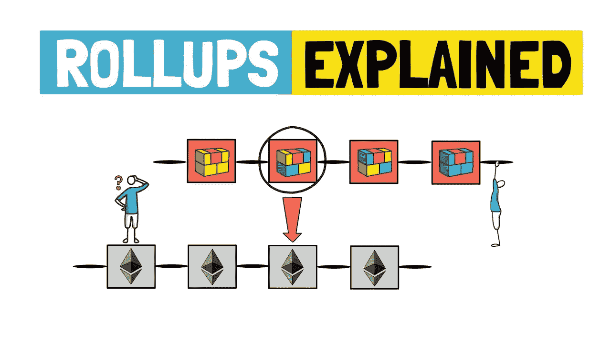

# 什么是 roll up 以太坊(Rollups)？降低交易成本的可扩展解决方案

> 原文：<https://medium.com/coinmonks/what-is-roll-up-ethereum-rollups-scalable-solution-to-reduce-transaction-costs-50e32f28900c?source=collection_archive---------19----------------------->

累计通过将交易批次“合并”为一个批次来降低区块链中的交易成本。在本文中，我们将解释它们是如何工作的。

## 简而言之:

☑️以太坊汇总将一堆交易“折叠”成一个。☑️它们有两种主要形式:乐观总结和零知识总结。

即使在最近的加密货币崩溃之后，以太坊对许多人来说仍然很昂贵。这是因为以太坊区块链的速度很慢，并且已经耗尽了它的能力。现在，如果你想购买下一个“强制”NFT，你必须为每一个额外字节的块空间支付一大笔钱。

在以太坊区块链的下一代“以太坊 2.0”解决所有这些问题之前，社区必须依赖所谓的扩展解决方案:一种加速以太坊区块链的技术。

扩展解决方案各不相同，但通常情况下，在向以太坊主链提供有关其计划发送的交易的信息之前，交易的一部分在另一个网络上处理——比以太坊更快、更便宜。

## 什么是汇总？

[汇总](https://docs.ethhub.io/ethereum-roadmap/layer-2-scaling/zk-rollups/)就是这样一种扩展解决方案。它们涉及到事务集合的折叠(因此得名)。最终汇总的交易在以太坊区块链上显示为单一交易。

> 合并降低了成本:以太坊交易的成本加上合并批量交易的少量成本由用户分担。他们还加快了工作速度:合并非常快，以太坊区块链只需要处理一笔交易，而不是很多。当以太坊在没有帮助的情况下达到每秒大约 [15 次交易](https://ethtps.info/)时，这是非常有用的。

[以太坊](https://coinmarketcap.com/currencies/ethereum/)的联合创始人 Vitalik Buterin 认为，即使在以太坊 2.0 推出后，rollups 等扩展解决方案仍将在区块链中发挥重要作用。(注:以太坊基金会已经放弃了 2.0 标签，以表明网络向 PoS 的过渡和碎片链的采用。)

## 汇总是如何工作的？

有两种主要类型的汇总:乐观汇总和零知识汇总。

> **乐观汇总基于以下假设:所有这些汇总都是有效的，并且没有人试图通过在汇总中隐藏虚假交易来欺骗区块链。**

这个想法是假设确定性，事件会加速。为了防止欺诈性交易，乐观池协议允许人们挑战无意义的交易。

欺诈交易被直接发送到以太坊网络，以验证其合法性并解决争议。双方都押了赌注，如果他们出错或撒谎，就会赔钱。

> 零知识汇总(也称为 zk 汇总)的工作方式非常不同。他们依赖于一种称为零知识证明的密码学，这种方法允许某人从数学上证明某个陈述是真实的(比如说，某人是希腊人)，而无需透露关于该陈述的进一步信息(比如护照)。

在密码学中，它们被称为 zk-SNARKs，指的是密码学中一个叫做“简明非交互知识论证”的附加部分。

这种方法绕过了乐观汇总中固有的争议解决系统，因为“SNARK”位只允许将有效的事务加载到汇总中。

# 谁参与了汇总的创建？

## 乐观汇总:

☑️乐观主义:以太坊的廉价二级系统
☑️仲裁:以太坊的二级协议
☑️波霸网络:下一代 OMG 网络

## 零知识汇总:

☑️环:一种协议，也可以实现无气体分散交换。
☑️不可变 x:L2 nfts 协议
☑️ ZKSync:以太坊零知识 L2

# 如何购买易拉宝？

您不能“购买”扩展解决方案，但您可以投资基于技术的令牌。Loopring 和 Boba 是卷积技术的常见例子。

> 你可以在基于以太坊的分散交易所或集中交易所购买他们的代币。访问 CoinMarketCap 或 CoinGecko 等网站，找到列出这些代币的最大平台。

您还可以使用这些第 2 层网络创建的 DeFi 服务和交换来降低交易成本。

例如，Loopring 运营自己的二级交换机，也称为 Loopring。在那里，你可以利用累积技术的所有魅力:不用汽油，20 ERC 硬币的即时交易。

# 卷纸的未来:时代的技术还是问题的临时解决方案？

短期内，两种相互竞争的卷积形式之间的战斗将会继续:乐观卷积和零知识卷积。

一些人认为零知识证明更好，因为它们不需要争端解决机制。

汇总的长期未来取决于以太坊 mainnet 升级的成功程度。

> 有一天，以太坊可能会变得如此之快，以至于对于快如闪电的区块链来说，上卷看起来就像是不必要的速度提升。相反，竞争 L1 区块链如索拉纳和雪崩可能会变得如此受欢迎，他们完全篡夺以太坊。

如果大部分 DeFi 流量是在区块链而不是以太坊，那么汇总将变得多余。

另一方面，如果以太坊变得更强大的话，总收入可能会继续上升。他们可能会集成即将到来的更新，使以太坊更容易和更便宜地批量使用。

📰 ***订阅*** [***斐波那契***](/@unclefibonacci) ***我来保持最新***

> 加入 Coinmonks [电报频道](https://t.me/coincodecap)和 [Youtube 频道](https://www.youtube.com/c/coinmonks/videos)了解加密交易和投资

# 另外，阅读

*   [3 商业评论](/coinmonks/3commas-review-an-excellent-crypto-trading-bot-2020-1313a58bec92) | [Pionex 评论](https://coincodecap.com/pionex-review-exchange-with-crypto-trading-bot) | [Coinrule 评论](/coinmonks/coinrule-review-2021-a-beginner-friendly-crypto-trading-bot-daf0504848ba)
*   [莱杰 vs n rave](/coinmonks/ledger-vs-ngrave-zero-7e40f0c1d694)|[莱杰 nano s vs x](/coinmonks/ledger-nano-s-vs-x-battery-hardware-price-storage-59a6663fe3b0) | [币安评论](/coinmonks/binance-review-ee10d3bf3b6e)
*   [Bybit Exchange 审查](/coinmonks/bybit-exchange-review-dbd570019b71) | [Bityard 审查](https://coincodecap.com/bityard-reivew) | [Jet-Bot 审查](https://coincodecap.com/jet-bot-review)
*   [3 commas vs crypto hopper](/coinmonks/3commas-vs-pionex-vs-cryptohopper-best-crypto-bot-6a98d2baa203)|[赚取加密利息](/coinmonks/earn-crypto-interest-b10b810fdda3)
*   最好的比特币[硬件钱包](/coinmonks/hardware-wallets-dfa1211730c6) | [BitBox02 回顾](/coinmonks/bitbox02-review-your-swiss-bitcoin-hardware-wallet-c36c88fff29)
*   [block fi vs Celsius](/coinmonks/blockfi-vs-celsius-vs-hodlnaut-8a1cc8c26630)|[Hodlnaut 审核](/coinmonks/hodlnaut-review-best-way-to-hodl-is-to-earn-interest-on-your-bitcoin-6658a8c19edf) | [KuCoin 审核](https://coincodecap.com/kucoin-review)