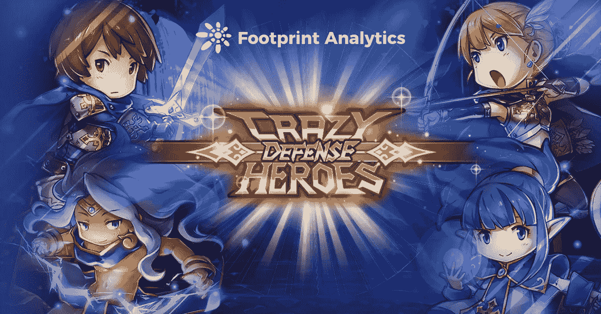
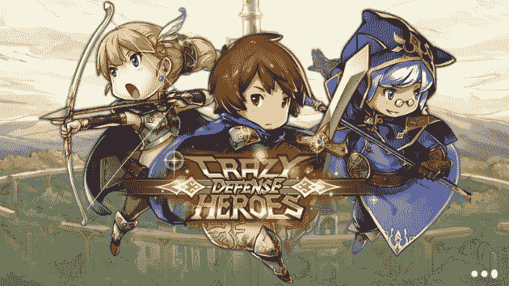
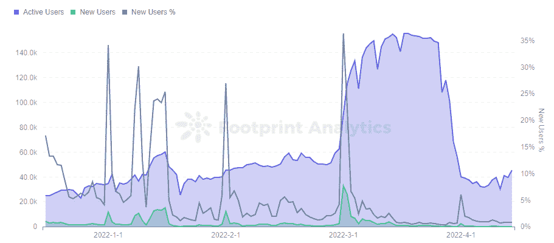
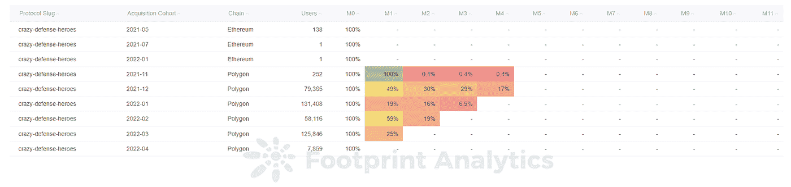
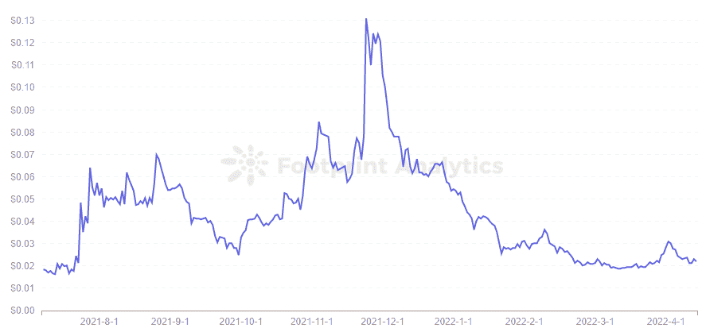

# 疯狂防御英雄有什么创新之处？

> 原文：<https://medium.com/coinmonks/what-is-so-innovative-about-crazy-defense-heroes-47704e230c41?source=collection_archive---------68----------------------->

疯狂防御英雄不仅是一个区块链塔防御游戏，但显示了链外启动的优势。

2022 年 4 月

数据来源:[足迹分析狂防御英雄仪表盘](https://www.footprint.network/guest/dashboard/Crazy-Defense-Heroes-Address-Analysis-of-GameFi-Project-fp-5bdb6c72-c9c1-4667-84cb-2bb3ccf38b26?gamefi_name=crazy-defense-heroes&date=past120days&channel=ENG-239)

虽然塔防游戏是手机上的一种主要游戏，但这种类型在 [GameFi](https://www.footprint.network/guest/dashboard/dashboard-for-game-fi-industry-fp-f7d88ee8-9341-49ae-b497-088bee7ec038?date=past60days&channel=ENG-239#secret=2E95108712AF5CB1949BCFBB804F139C) 中并未获得成功。也就是说，除非[疯狂防御英雄](https://www.footprint.network/guest/dashboard/Crazy-Defense-Heroes-Address-Analysis-of-GameFi-Project-fp-5bdb6c72-c9c1-4667-84cb-2bb3ccf38b26?gamefi_name=crazy-defense-heroes&date=past120days&channel=ENG-239)(CDH)——已经上升为 [Polygon](https://www.footprint.network/guest/dashboard/Polygon-Dashboard-fp-9aefaa6b-c76c-4672-a572-cfbf3e92b935?date_filter=2021-04-30~&channel=ENG-239) 上用户数量第四大的游戏——继续增长。

# 什么是疯狂防御英雄？

[CDH](https://www.footprint.network/guest/dashboard/Crazy-Defense-Heroes-Address-Analysis-of-GameFi-Project-fp-5bdb6c72-c9c1-4667-84cb-2bb3ccf38b26?gamefi_name=crazy-defense-heroes&date=past120days&channel=ENG-239) 是 Animoca Brands 的一款塔防游戏，玩家必须使用防御道具阻止一系列敌人从 A 点移动到 B 点。玩家将在游戏中获得 tokens TOWER。

与许多加密游戏不同，CDH 于 2017 年底首次推出常规手机游戏，拥有庞大的用户群，并于 2020 年 5 月加入了连接钱包的功能。Animoca 将此称为“塔楼实验”，这是区块链游戏中传统免费游戏和 P2E 的结合，目标是将区块链的 NFT、DeFi 和治理功能引入游戏，同时保持传统游戏的平衡和公平。

*Crazy Defense Heroes*

**疯狂防御英雄们做得对的事情**

*   从一个离线游戏开始

CDH 以手机游戏起家，已经积累了超过 200 万的下载量。CDH 游戏比目前区块链本地的 GameFi 项目有漂亮的图形和更多的内容。游戏有更复杂的卡牌升级系统，资源收集，以及各种英雄，建筑和法术，还有加入公会的能力。

CDH 的商业模式已经被证明是链外的，即使没有 P2E 属性的额外好处，也吸引了大量的忠实玩家，尤其是付费玩家。

已经拥有账号的玩家只需要创建一个带有官网链接的 MetaMask 钱包，然后登录自己的 CDH 账号，就可以每天领取代币奖励。

*   没有进入游戏的障碍

与许多要求玩家在玩游戏前购买 NFT 的 GameFi 程序相比，CDH 不需要预付款，降低了游戏门槛。

即使是非加密玩家也能轻松上手，完成任务后连接钱包领取代币也是一件乐事。相比链上的本土项目，CDH 似乎实现了更现实的玩赚。

CDH 还发起了一项收入分享比赛，邀请玩家在 Instagram 上推广游戏，以赢得 500 万美元的塔。来自 [Footprint Analytics](https://www.footprint.network/?channel=ENG-239) 的数据显示，该项目在 3 月初的活跃用户增加了 2 至 3 倍，但在 4 月初再次下降，当时每天可以赚取代币的每日 star chest 活动被暂停。

*Footprint Analytics — Daily Users*

游戏的日新增用户比例并不突出，多来自于维持日活跃用户的老用户。这从留存率上也能看出来，一个月后新用户高达 59%，两个月后平均超过 20%。

*Footprint Analytics — Monthly Retention Analysis*

**令牌组学**

CDH 只发行了一枚 TOWER，固定总供应量为 100 亿，于 2021 年 2 月 25 日一次性铸造。这一供应量的 30%已分配给玩家赚取，随后 15%用于营销，另外 15%用于流动资金池，同样数额用于团队和公司储备，10%用于社区发展基金。

玩家可以通过以下方式获得高塔:

*   游戏赚取:在每日明星宝箱活动期间，玩家可以收集 16 颗星星，并以每天 1 塔的增量获得每日令牌奖励。用户赚 XP 赚塔；并通过赢得锦标赛赢得塔和 NFT。
*   购买 DEX 上的令牌，如 Uniswap
*   下注 NFTs 赢得 TOWER

CDH 还为 TOWER 设计了不同的使用场景。

*   购买游戏中的非战斗堡垒，除了在游戏中有用之外，还可以下注来获得高塔奖励
*   为即将到来的锦标赛支付入场费
*   参与游戏的管理，培养创建游戏提案的能力，并对游戏功能、营销活动和整体游戏目标等事项进行投票。

正如你所看到的，CDH 仍然处于上线的早期阶段，塔并不难获得，但象征性的价格也不是很高。根据 [Footprint Analytics](https://www.footprint.network/?channel=ENG-239) 的数据，最高价格仅为 0.13 美元，截至 4 月 14 日，价格已降至 0.022 美元。虽然该团队正在改进链上游戏系统，但需要对 tokenomices 进行更多的设计以使其工作。

*Footprint Analytics — TOWER Daily Price Trend*

# 摘要

CDH 走了一条不同于大多数 GameFi 项目的道路，因为它已经从链外发展到链内。它的可玩性不言而喻，也因此它的高留存率在众多 GameFi 项目中脱颖而出。

然而，与区块链的结合在整体经济模式上需要更多的润色和改进。也有玩家表示，在连接游戏账号和领取奖励时经常出现问题。以现在的塔价，获得的奖励可能还不够付油钱。

本文由[足迹分析](https://www.footprint.network/?channel=ENG-236)社区提供。

Footprint 社区是一个世界各地的数据和加密爱好者相互帮助了解和获得关于 Web3、元宇宙、DeFi、GameFi 或区块链新兴世界任何其他领域的见解的地方。在这里，你会发现活跃的、不同的声音相互支持，推动着社区向前发展。