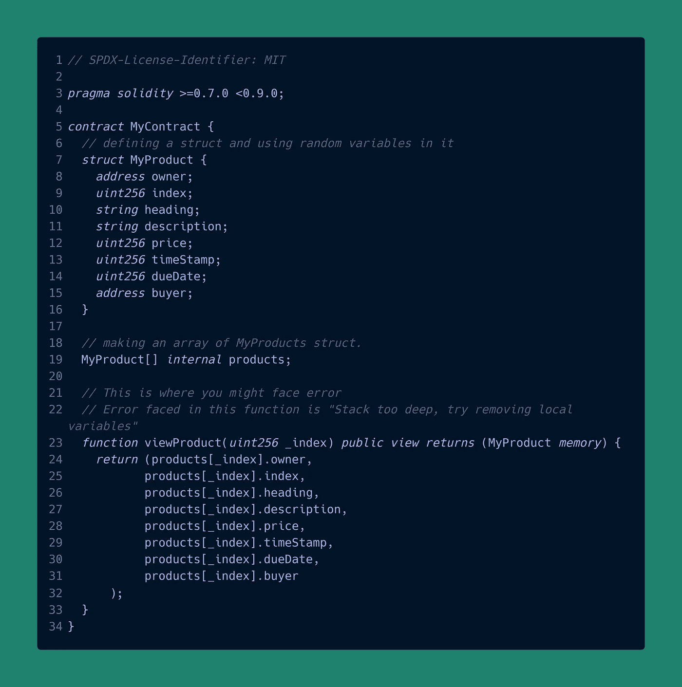
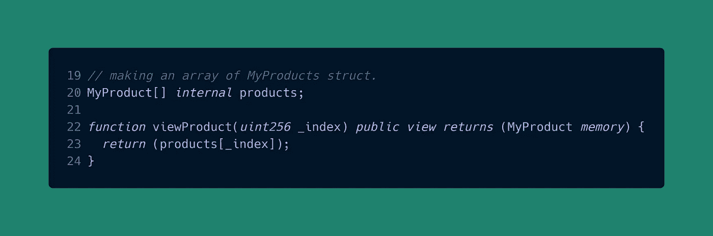

# 什么是坚实度上的“叠得太深”？

> 原文：<https://medium.com/coinmonks/what-is-stack-too-deep-in-solidity-23d105064d42?source=collection_archive---------15----------------------->

使用 Solidity 已经有一段时间了，你一定注意到了这个**编译错误**，如下所示。

```
CompilerError: Stack too deep, try removing local variables.
```

那么，这是什么，为什么会发生？

让我在这里与你分享一段代码，这样你就知道你可能会在哪里遇到这种类型的错误，以及我们正在做什么。这是你会得到这个错误的代码—



没错。在第 24 行，在视图函数 viewProduct 中，你的编译器将抛出这个错误，即**栈太深**。现在，我们不要把这个错误归咎于可靠性，即使有办法解决它，我们也要理解这一点。

这个错误是由**以太坊虚拟机(EVM)给出的。**

EVM 不是收银机，但它是一个堆栈机。这意味着所有的计算都发生在名为**栈**的数据区(参见 Solidity [docs](https://docs.soliditylang.org/en/v0.8.12/introduction-to-smart-contracts.html?highlight=stack#storage-memory-and-the-stack) )。在 EVM，您可以访问这个堆栈的方式是有限的。堆栈的最大大小为 1024 个元素。很有可能从堆栈中复制 16 个最顶层元素中的一个，并将其放在顶部。换句话说，你可以把栈顶的元素和它下面 16 个元素中的任何一个交换。我们还可以访问堆栈中第 16 个元素以外的更深层次的元素，但必须先移除顶部。

所以无论我们做什么，我们都有 16 个变量，包括函数参数和返回变量。给函数的每个输入参数取 1 个变量，每个返回值也取 1 个变量。除此之外，局部声明还会占用另一个变量空间，任何对存储的引用都会占用一些空间。所以你的 16 个限制在栈中访问，因为局部变量被存储在栈中被填满。

这是 EVM 强加的，因为只能到达堆栈中的特定深度。

至于解决这个问题的方法，如果你愿意的话，有很多。你可以把你的函数分成几个部分，然后让它们调用其他函数，或者你可以完全返回这个结构，然后用 JavaScript 或者你正在使用的任何东西来处理它，把它呈现在你的网站上。像这样修改回报—



我希望你能理解这一点。懂了就简单了。

谢谢你读到这里。✌

> 加入 Coinmonks [电报频道](https://t.me/coincodecap)和 [Youtube 频道](https://www.youtube.com/c/coinmonks/videos)获取每日[加密新闻](http://coincodecap.com/)

## 另外，阅读

*   [复制交易](/coinmonks/top-10-crypto-copy-trading-platforms-for-beginners-d0c37c7d698c) | [加密税务软件](/coinmonks/crypto-tax-software-ed4b4810e338)
*   [网格交易](https://coincodecap.com/grid-trading) | [加密硬件钱包](/coinmonks/the-best-cryptocurrency-hardware-wallets-of-2020-e28b1c124069)
*   [密码电报信号](http://Top 4 Telegram Channels for Crypto Traders) | [密码交易机器人](/coinmonks/crypto-trading-bot-c2ffce8acb2a)
*   [最佳加密交易所](/coinmonks/crypto-exchange-dd2f9d6f3769) | [印度最佳加密交易所](/coinmonks/bitcoin-exchange-in-india-7f1fe79715c9)
*   [开发人员的最佳加密 API](/coinmonks/best-crypto-apis-for-developers-5efe3a597a9f)
*   最佳[密码借贷平台](/coinmonks/top-5-crypto-lending-platforms-in-2020-that-you-need-to-know-a1b675cec3fa)
*   杠杆代币的终极指南